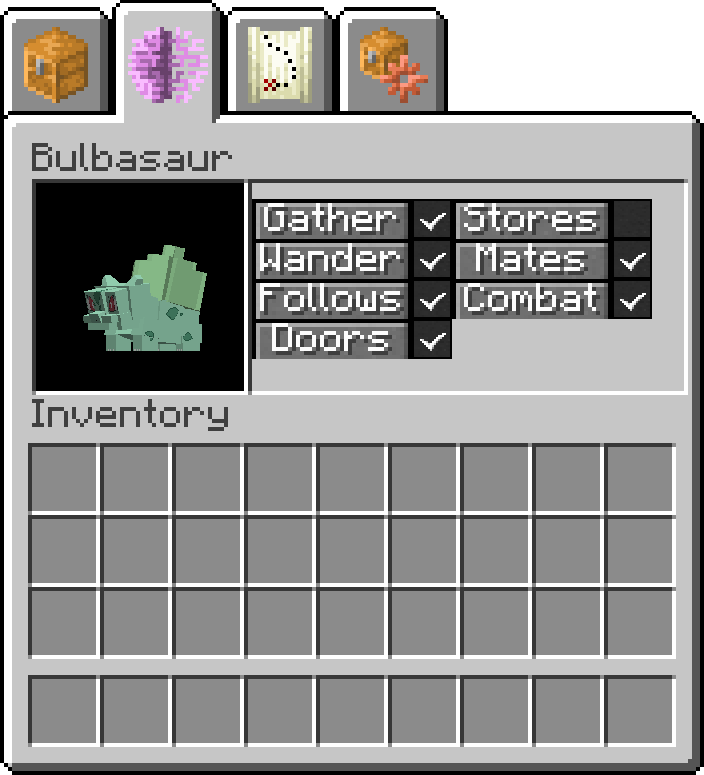
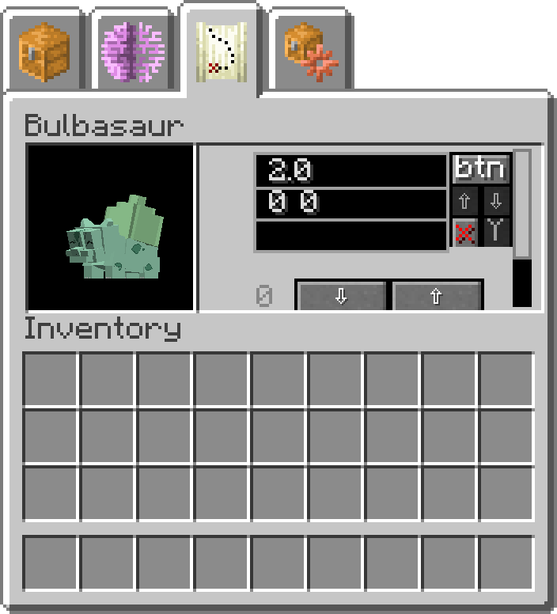

.. _pokemob_gui:

*******************
The |Pokemob|'s Gui
*******************

You're |pokemob| can be interacted with via right click. Doing so should display its gui in most cases. Exceptions include:

-  while the pokemob is wearing a saddle - sneaking will allow access to the gui.
-  you are holding an item that is used on the |pokemob|, such as a pokedex

|Pokemob| Gui Tabs
##################

The |pokemob| gui is separated into a variety of tabs. The main tab is the :ref:`Inventory Tab<poke_inv_tab>`. The gui generally has buttons along the top right side of the screen, which allow changing to different tabs.

Screens where the |pokemob|'s name is visible can be used to change the nickname of the |pokemob|. This can be done by typing a different name into the box, and pressing Enter.

.. _poke_inv_tab:

|Pokemob| Inventory
-------------------

.. figure:: ../_images/pokemob_gui/pokemob_inventory.png
   :alt: |Pokemob| Inventory
   :name: pokemob_inventory
   :width: 600
   
   A |pokemob|'s main inventory screen

This tab is selected via the buttons labelled ``inv``.

The |pokemob|'s main inventory screen consists if several important buttons and slots for interacting with it. These are in three main sections. 

On the left side of the |pokemob|'s picture are 2 slots. The upper of these is the Saddle Slot, and placing a saddle in this slot may allow riding the |pokemob|, so long as it is large enough (or you are small enough). Below the Saddle Slot is the Held Item Slot. This slot is used for held items for use in battle, or for special held item effects such as form changing.

On the right side of the |pokemob|'s picture are 5 slots, separated from 3 buttons by a coloured bar. The coloured bar is the hunger bar for the |pokemob|. Once this bar gets sufficiently low, the |pokemob| will want to find food to eat. If the bar gets too low, the |pokemob| will start to take damage, and eventually it may get too low for the |pokemob| to even eat, and it will die. The hunger bar can be re-filled in three main ways:

-  feeding your |pokemob| berries by placing them in the 5 slots above
-  letting your |pokemob| find food by itself (some may eat nearby plants, etc)
-  healing your |pokemob| at a pokecenter

Above the hunger bar are the 5 slots of your |pokemob|'s main inventory. These slots are used for a variety of items, primarily for food for the |pokemob|.

Other uses of these slots include:

-   temporary storage while gathering items
-   holding ender pearls for use with teleport

Below the hunger bar are the main stance buttons for your pokemob. Red text indicates the "off" state for this stance. These buttons are as follows:

-   Sitting button - toggles sit/stand. A sitting |pokemob| will not follow you unless attacked
-   Staying button - toggles stay/follow. A staying |pokemob| will act like a wild pokemob in the general area told to stay. It will not protect you in battle, and you will not be able to see the HUD for its attacks.
-   Guarding button - toggles guard mode. Guard mode will make the |pokemob| attack anything nearby that it decides is not friendly. If the pokemob is Staying, it will select targets near where it was told to stay, otherwise it will select targets near you. Guarding pokemobs will always select their own attacks, and will not care about hitting allies.

A |pokemob| set to ``Stay`` will follow the rules defined in the :ref:`Routes Tab<poke_rt_tab>`. If your mob is rubberbanding or teleporting somewhere, it is most likely a mis-configuration of that tab!

.. _poke_ai_tab:

|Pokemob| AI Toggles
--------------------

   
   A |pokemob|'s AI toggle screen

This tab is selected via the buttons labelled ``AI``.

This screen is used to enable/disable various AI routines for the |pokemob|.

Enabled routines have a green bar, and disabled ones have a red bar. If your flying |pokemob| refuses to fly, it is probably because of a setting in here! The names of the routines may be cut off due to lack of space.

AI Routines are as follows:

-   ``GATHER`` - if enabled, the |pokemob| might try to collect items if configured correctly
-   ``BEEAI`` - Bees only. If enabled, the |pokemob| will act somewhat like a vanilla bee
-   ``ANTAI`` - Ants only. If enabled, the |pokemob| may try to build ant nests
-   ``BURROWS`` - Burrowers only. If enabled, the |pokemob| might try to make burrows for nests
-   ``STORE`` - If enabled, the |pokemob| will try to store items in its configured inventory
-   ``WANDER`` - If enabled, the |pokemob| will occasionally try to walk to a random location nearby
-   ``MATE`` - If enabled, the |pokemob| will ocassionaly try to mate with another |pokemob|
-   ``FOLLOW`` - If enabled, the |pokemob| will path to its owner while not set to sit or stay
-   ``AGRESSIVE`` - If disabled, the |pokemob| will not try to fight anything.
-   ``AIRBORNE`` - If disabled, the |pokemob| will not be able to fly
-   ``USEDOORS`` - If enabled, the |pokemob| will be able to use doors like a villager

The ``GATHER`` and ``STORE`` routines are related to the :ref:`Storage Tab<_poke_st_tab>` for the pokemob

.. _poke_st_tab:

|Pokemob| Storage
--------------------

.. figure:: ../_images/pokemob_gui/pokemob_storage.png
   :alt: |Pokemob| Storage tab
   :name: pokemob_storage
   :width: 600
   
   A |pokemob|'s Storage configuration screen

This tab is selected via the buttons labelled ``ST``.

The main feature of this tab are the 5 input boxes to the right of the |pokemob|'s picture. These are as follows:

-   ``BERRRY`` - This takes a coordinate set for an inventory to look for berries in
-   ``STORE`` - This takes a coordinate set for an inventory to put items in
-   ``SIDE`` - The side to try to place the items in the  ``STORE`` block
-   ``EMPTY`` - This takes a coordinate set for an inventory to take items out of
-   ``SIDE`` - the side to try to take the items from in the ``EMPTY`` block

Most of the features for this gui require the |pokemob| to be set to Stay, and to have a proper wandering range setup in the :ref:`Routes Tab<poke_rt_tab>`. The coordinates for these options can be obtained via the :ref:`location_linker`.

.. _poke_rt_tab:

|Pokemob| Routes
--------------------

   
   A |pokemob|'s Routes configuration screen

This tab is selected via the buttons labelled ``RT``.

This screen consists of a list of waypoints for the |pokemob|. It has the same format as the Guard Locations in the :ref:`Trainer Editor<edit_npc_ai>`. The button labelled ``btn`` is used to apply changes to this list. To delete an entry, press the ``X`` button followed by the ``Y`` button. To re-order entries, use the up and down arrow buttons below the ``btn``.

These can be scrolled through with the larger up and down arrow buttons.

Each entry consists of 3 text boxes. They are as follows:

-   ``allowed distance`` - How far the mob is allowed to be from the stay location
-   ``Active times`` - Start and end times for staying near the location
-   ``stay location`` - coordinate set of where to stay.

The coordinates for the ``stay location`` can be obtained via the :ref:`location_linker`. The ``Active times`` times are in day ticks, so ``0 24000`` would be the entire day. If your |pokemob| is rubberbanding back to a location, it is most likely that you have ``allowed distance`` too small for what it wants to do.

.. include:: ../.shared.rst