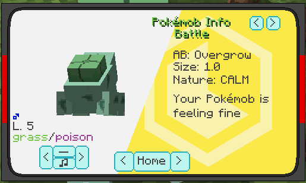
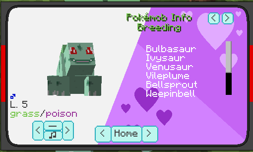
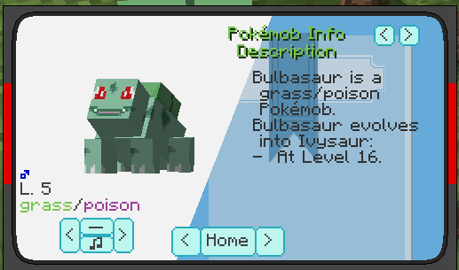
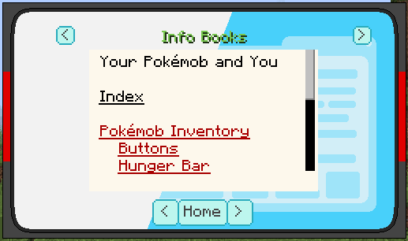
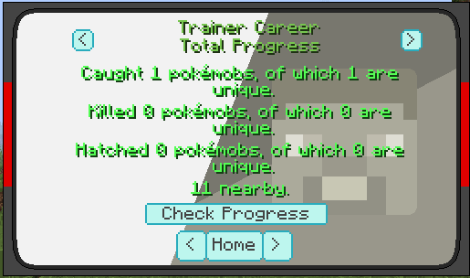
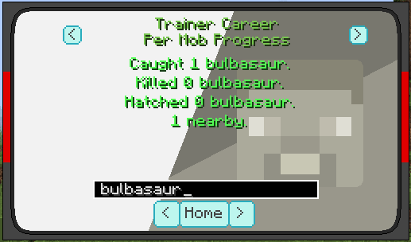
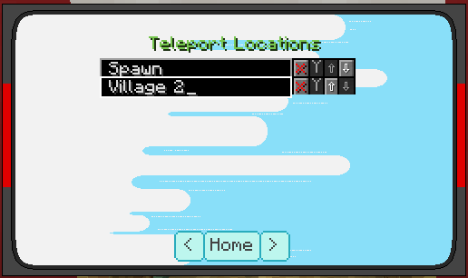
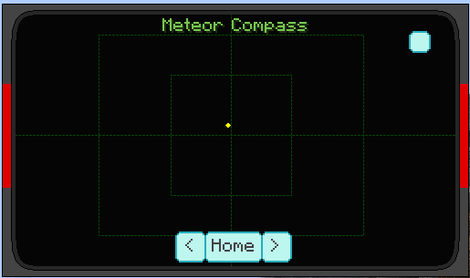

.. _pokewatch:

*******************
Using the Pokewatch
*******************

The primary utility for information in |Pokecube| is the pokewatch. You should get one when you first select a starter, or you may craft one.

Watch Pages
###########

.. _watch_home:

Home Page
---------

.. figure:: ../_images/watch/watch_home.png
   :alt: Watch Home
   :name: watch_home
   :width: 600
   
   Home Page of the watch (Day Mode)

The Home page of the watch is the first page that opens up when you right click (or use the hotkey while worn). This page can also be accessed by clicking the ``Home`` button on other pages.

The arrow buttons next to the ``Home`` button will cycle through the main pages described here. The small button in the lower left of the Home Page will toggle the watch between day and night modes.

The rest of the buttons on this page will take you to the various subpages, as described below. They will display the name of the subpage when you move your mouse over the button.

.. _watch_pokeinfo:

|Pokemob| Info
--------------

This page contains information about |pokemobs|. It has two display modes, one for if used on a live |pokemob| (Live Mode), and one for looking up information about |pokemobs| (Lookup Mode), so some of the sections below will be split into those two modes.

Common to all of these pages are the following:

The upper left has a Lookup bar for the name of the |pokemob|. This bar will take the same name as used in :ref:`pokemake`. Typing into this bar, and pressing ente will attempt to change page to the |pokemob| name typed in. In the case of an invalid name, it will reset the name to the currently selected |pokemob|.

To the left of the rendered |pokemob|, the gender of the displayed mob is shown. Clicking this in Lookup Mode will change the gender of the displayed poekmob. Clicking on the displayed |pokemob| in Lookup Mode will toggle between normal and shiny rendering for the mob. Below the |pokemob| the types are displayed, and then below that are 4 control buttons. These buttons are as follows:

-   ``<``   - Cycle to the previous pokedex entry
-   ``>``   - Cycle to the next pokedex entry
-   ``♫``   - Play the cry of the |pokemob|
-   ``-``   - Cycle possible alternate formes of the |pokemob|

To the top left of the screen, there are two arrow buttons, these will cycle between the various subpages for |Pokemob| Info.

Stats
~~~~~

This page shows the Stats for the |pokemob|, it differs between Lookup Mode and Live Mode.

Lookup Mode
^^^^^^^^^^^

.. figure:: ../_images/watch/pokemob_stats_1.png
   :alt: Stats Page
   :name: pokemob_stats_1
   :width: 600

In Lookup Mode, this will displayed only the base stats of the |pokemob|.

Live Mode
^^^^^^^^^

.. figure:: ../_images/watch/pokemob_stats_2.png
   :alt: Stats Page
   :name: pokemob_stats_2
   :width: 600

   Calm Natured :ref:`bulbasaur`, displaying the reduced ``ATT`` and raised ``DEFSP`` 

In live mode, this displays the actual stats of the |pokemob|. The column ``TV`` shows the actual value of the stat, and the ``IV`` and ``EV`` columns show the IVs and EVs of the |pokemob| respectively. If your |pokemob|'s nature affects stats, then the raised stat will have a red highlighted bar over it, and the lowered stat will have a green one.

Battle
~~~~~~

This page is only relevant in Live Mode, as it displays no relevant information in Lookup Mode.

Live Mode
^^^^^^^^^

Here we display some specific information about the selected |pokemob|. The first section includes the Ability, Size and Nature of your |pokemob|. Below that is a description of the current happiness state of your |pokemob|.

Moves
~~~~~

This page differs between Lookup Mode and Live Mode. Placing your mouse over a listed move will display the expected attack power of that move.

Lookup Mode
^^^^^^^^^^^

.. figure:: ../_images/watch/pokemob_moves_1.png
   :alt: Moves Page
   :name: pokemob_moves_1
   :width: 600

Here we can see the various moves that this |pokemob| is capable of knowing. The displayed list can be scrolled through. The top of the list will show the moves learned naturally via lvl up, and the bottom of the list will show all other possible moves for this |pokemob|, listed as TM moves.

Live Mode
^^^^^^^^^

.. figure:: ../_images/watch/pokemob_moves_2.png
   :alt: Moves Page
   :name: pokemob_moves_2
   :width: 600

Here we see the currently known moves of the selected |pokemob|. The moves listed here can be clicked on and dragged around to change your mob's move order. If your |pokemob| has learned any moves due to lvl up, and it has exceeded 4 total moves, then the remainder will be added as a 5th move in this display. Clicking the entry of the 5th move will cycle between the available options, and this can be dragged in to replace an existing move. Doing this will remove it from the list of options, and will make the |pokemob| forget the replaced move.

Spawns
~~~~~~

.. figure:: ../_images/watch/pokemob_spawns.png
   :alt: Spawns Page
   :name: pokemob_spawns
   :width: 600

This page does not differ between Lookup and Live modes. This is the first place you should look for where to find a |pokemob|. This will give general information about where the |pokemob| spawns. Take careful note of any subbiomes listed on this page. Once you have gone to the listed area, you will need to check :ref:`watch_local_spawns` to identify a specific location this |pokemob| can spawn.

Breeding
~~~~~~~~

This page also does not differ based on the mode. This shows a list of |pokemobs| which, so long as not disabled via some other means (such as legendary, etc), this |pokemob| will attempt to breed with. This list does not specifically include things that transform such as :ref:`ditto`, as the breeding for that is handled by the move. Click a name in here will take you to the page for that |pokemob|.

.. _watch_description:

Description
~~~~~~~~~~~

This page also does not differ based on the mode. This page gives a general indication of how this |pokemob| evolves. It contains mostly the same information as the equivalent page on this site, however is generally more updated. Clicking a name on this page will take you to the page for that |pokemob|.

In the case where this is used on a |pokemob| with capture requirements, then there will be a button to check the status of this requirement. It will print a message in chat when clicked, notifying you about what you need to do to catch the |pokemob|, or letting you know that you can catch it. More information about this is discussed in :ref:`legend_quests`.

.. _watch_wiki:

Info Books
----------

These are a set of ingame documentation for various aspects of the mod. The main ones of note in here are ``Your Pokemob and You``, and the ``Pokemob Genetics Guide``. The arrows at the top of the screen will change between the books, and clicking on headers in the books will generally link to sections. The ``Pokemob Genetics Guide`` describes the mechanics of breeding in |Pokecube|.

.. _watch_local_spawns:

Local Spawns
------------

.. figure:: ../_images/watch/local_spawns.png
   :alt: Local Spawns
   :name: local_spawns
   :width: 600

This page will list the |pokemobs| which can spawn at your current location. It is sorted by most common at the top. The entries shown are specific to your exact location, including things such as material you are standing in, the amount of light, and the weather. It should be noted that for a legendary to be summoned via a :ref:`Quest <legend_quests>`, it will generally need to show as a ``0.0%`` spawn on this page.

.. _watch_career:

Trainer Career
--------------

This page will display the tracked statistics for your captured |pokemobs|. It will also provide an indication of whether certain |pokemobs| are "nearby". It has 3 different subpages, these are found by using the arrow buttons on the top of the page.

Total Progress
~~~~~~~~~~~~~~

This is the initial page for Trainer Career. It displays your total number of |pokemobs| captured, caught and killed. It also shows the number of nearby |pokemobs|, and has the ``Check Progress`` button. Clicking this button may give rewards based on the total unique number of |pokemobs| you have caught.

Per Type Progress
~~~~~~~~~~~~~~~~~

.. figure:: ../_images/watch/career_type.png
   :alt: Per Type Progress
   :name: career_type
   :width: 600

This page shows the number of the specific type that you have captured. The text bar at the bottom can be typed in, and pressing enter will attempt to look up the type you enter. This page is useful for determining your current number of captures used in specific :ref:`Quests <legend_quests>`.

Per Mob Progress
~~~~~~~~~~~~~~~~

This is the stats for a particular |pokemob|, you can use this to check if you have caught and hatched the particular |pokemob|. This page will default to the last entry viewed in :ref:`watch_pokeinfo`, and has a similar search bar for looking up a |pokemob|. This can also be used to determine if a specific |pokemob| has spawned nearby, as it will display the number currently near.

.. _watch_teleports:

Teleport Locations
------------------

This page displays your currently registered teleport locations. You can register a pokecenter as a teleport location by shift right clicking the healing table with the watch. By default, the name will just be a long coordinate, you can change this by typing in the name box, and then pressing enter. These teleports can also be re-arranged or deleted via the buttons next to the name.

Secret Base Radar
-----------------

This page has 2 modes, Base Radar and Meteor Compass mode. You can cycle between the modes with the small button on the upper right.

Base Radar
~~~~~~~~~~

.. figure:: ../_images/watch/bases.png
   :alt: Base Radar
   :name: base_radar
   :width: 600

This displays secret bases nearby, they show up as red dots on the display, as you get closer to them, they get closer to the center of the display.

Meteor compass
~~~~~~~~~~~~~~

This displays nearby explosive meteor impact sites. They show up as yellow dots, and behave similarly to secret base dots. These might not exist if you do not have explosive meteors enabled, and have not used :ref:`meteor_cmd` to create one.

.. include:: ../.shared.rst