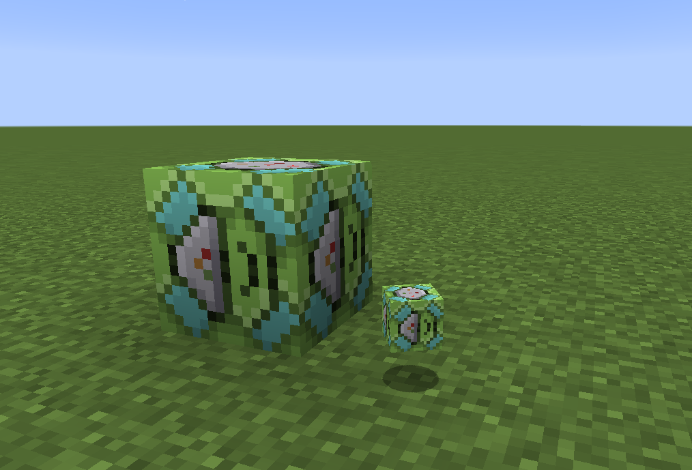

.. _afa:
.. role:: raw-html(raw)
    :format: html

***********************
Ability Field Amplifier
***********************

This block uses Forge Energy to work, and can be powered with the :ref:`siphon`.

.. grid:: 1

   .. grid-item-card:: Uses

      .. figure:: ../_images/machines_items/afa_gui.gif
         :alt: AFA Gui
         :name: afa_no_set
         :width: 600

      - Broadcast an Ability over a volume around the block
      - Broadcast the Shiny Charm effect around the block 
         - second worst use for shiny charm
         
      The Empty GUI for the AFA shows the item slot, as well as the ``<`` and ``>`` buttons used for selecting the range of effect. :raw-html:` `
      The Power display is read as ``required/provided``. If the power is colored red, then more power is required for it to function.

.. grid:: 1

   .. grid-item-card:: Abilities

      .. figure:: ../_images/machines_items/afa_ability_set.png
         :alt: AFA Gui with Honey Gather
         :name: afa_ability_set
         :width: 600

      To broadcast an ability over an area, you must first capture a |pokemob| which has the desired ability. :raw-html:` `
      Below are some example abilities, and their effects:

      -   ``Honey Gather``: Applies bonemeal effect on random blocks in range
      -   ``Damp``: Prevents explosions from detonating in the range
         
      Here is an example of setting the ability to Honey Gather. :raw-html:` `
      The range is set to 4 blocks, which requires 4 energy per tick, 0 of which has been provided.

.. grid:: 1

   .. grid-item-card:: Shinies

      .. figure:: ../_images/machines_items/afa_shiny_set.png
         :alt: AFA Gui with Shiny Charm
         :name: afa_shiny_set
         :width: 600

      For the use with a shiny charm, place the charm in the slot, and then select the range in a similar manner. :raw-html:` `
      Here is the second worst application of the shiny charm displayed.

      .. include:: ../.shared.rst