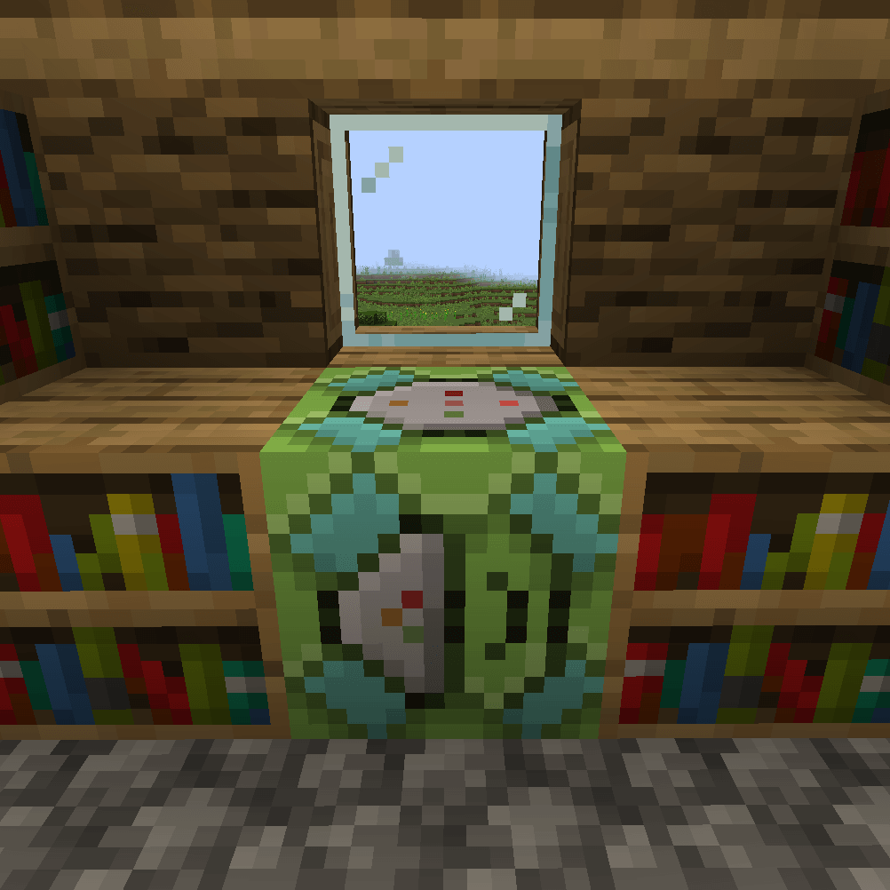
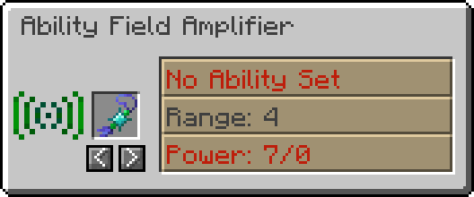

.. _afa:

***********************
Ability Field Amplifier
***********************

This block uses Forge Energy to work, and can be powered with the :ref:`siphon`.

The Ability Field Amplifier (AFA) has two uses:

1.  Broadcast an Ability over a volume around the block
2.  Broadcast Shiny Charm effect around the block (second worst use for shiny charm)

.. figure:: ../_images/machines_items/afa_no_set.png
   :alt: AFA Gui
   :name: afa_no_set
   :width: 600
   
   The Empty GUI for the AFA, this shows the item slot, as well as the ``<`` and ``>`` buttons used for selecting the range of effect. 
   The Power display is read as ``required/provided``, so if the power is in red, then you need to provide more power for the block to work.

To broadcast an ability over a volume, you must first capture a |pokemob| which has the required ability, below are some example abilities, and their effects:

-   ``Honey Gather`` - Applies bonemeal effect on random blocks in range
-   ``Damp`` - Prevents explosions from detonating in the range

   
   Here is an example of setting the ability to Honey Gather, the range is set to 4 blocks, and it currently requires 4 energy per tick, 0 of which is provided.

For the use with a shiny charm, place the charm in the slot, and then select the range in a similar manner.

   
   Here is the second worst application of the shiny charm displayed.

.. include:: ../.shared.rst