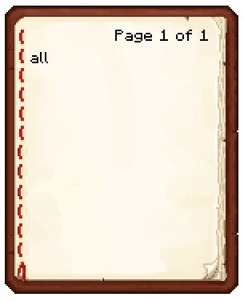
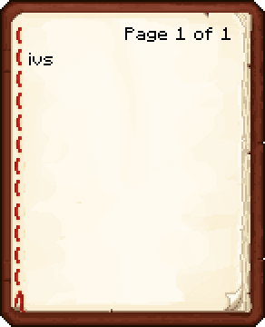

.. _gene_machines:

*****************
Genetics Machines
*****************

These blocks allow for extensive genetic manipulation of |pokemobs|, as well as reviving fossils, and cloning of non-legendary |pokemobs|. These blocks are very dangerous, and should be used with great care.

.. warning:: Failure to properly use these devices can result in the complete loss of |pokemobs| and items!

These blocks require energy to run, this can be provided via the :ref:`siphon`.

.. _gene_extractor:

##############
Gene Extractor
##############

.. image:: ../_images/machines_items/gene_extractor.*

This block is used to extract DNA from various sources, including:

1.  Filled |pokecubes|
2.  Fossils - contain species genes
3.  Bottles of DNA

.. warning:: The Gene Extractor can delete |pokemobs| when used on a filled |pokecube|!

.. image:: ../_images/machines_items/gene_extractor_gui.*

To use the extractor, place the source of the DNA in the left most slot (source slot), and then a bottle of water in the bottle slot (top slot). Next place the required selector in the book slot (bottom slot). The machine will then consume Forge Energy, and attempt to extract the selected DNA from the Source into the bottle.

.. warning:: Use with Legendary |pokemobs| is not advised, their DNA is volatile, and liable to be destroyed on extraction!

.. _cloner:

##############
Cloning Device
##############

.. image:: ../_images/machines_items/cloning_device.*

The Cloning Device allows reviving most sources of species DNA. In the case of Fossils, the DNA must first be :ref:`extracted <gene_extractor>`.

.. warning:: Placing a filled |pokecube| in the DNA slot of the cloner will destroy it when revived, and in the case of a legendary, it will revive wild, so you cannot re-capture it!

.. image:: ../_images/machines_items/cloner_gui.*

The Cloning Device gui has 3 main sections, the Egg/Material slot (Lower Left), the DNA Source slot (Upper Left), and the Other Items slots (Hexagon).

An Egg of some form is always required in the Egg/Material slot!

In the case of general DNA reviving, the DNA source goes in the DNA Source slot. For custom Recipes, such as :ref:`make_type_null`, the Other Items slots are used instead.

.. warning:: DO NOT place the egg in the DNA Source slot when using Other Items slots recipes, the egg's DNA will be spliced into the resulting mob, often resulting in un-wanted mutations and the loss of items!

.. _gene_splicer:

############
Gene Splicer
############

This thing is cheaty and overpowered.

.. _gene_selector:

###################
Gene Selector Books
###################

The :ref:`gene_extractor` and :ref:`gene_splicer` require a selector to function.

Selectors have 3 main sets of properties:

1. List of genes to selector for
2. Chance for selector to be lost on use
3. Chance for DNA source to be lost on use

.. warning:: Default selectors have 90% chance of DNA source loss.

Making a Selector
^^^^^^^^^^^^^^^^^

Selectors are made via vanilla written books. You can place each required gene on a separate line of the first page of the book, and then when the book is signed, it can be used as a DNA selector. Valid genes can be found in the :ref:`Genetics Guide <watch_wiki>` in the watch, or via the tooltip of a filled |pokecube| in the GUI of any of the :ref:`gene_machines`. To select all genes, you can just use ``all``, instead of a specific gene name.

Crafting a selector with a nether star will reduce the DNA loss chance to 0%, however will result in an increase in the selector loss chance.

   
   An example of a selector for All genes

   
   An example of a selector for the IVs gene

.. include:: ../.shared.rst