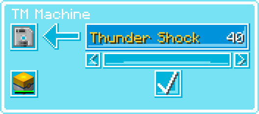

.. _tm_machine:

**********
TM Machine
**********

.. image:: ../_images/machines_items/tm_machine.*

The TM Machine is a block which allows creating TMs for moves which your |pokemob| already knows, or should have known at a lower level. This acts as a way to both copy TMs, as well as a move relearner.

   
   GUI of the TM Machine, with no items in it.

To use the TM Machine, you need a TM, and a filled |pokecube|.
When you first open the GUI, there are no displayed moves. To add moves to the list, you can place a filled |pokecube| into the |pokecube| slot of the machine.

   
   GUI of the TM Machine, after placing a |pokemob|

The ``<`` and ``>`` buttons can be used to cycle through the list of available moves, and then the checkmark button will mapplyap the selected move onto the TM in the TM slot. The TM used does not need to be blank, and this can be used to overwrite any un-wanted TMs.

.. include:: ../.shared.rst