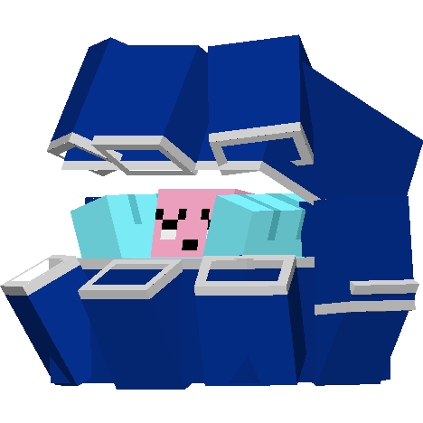
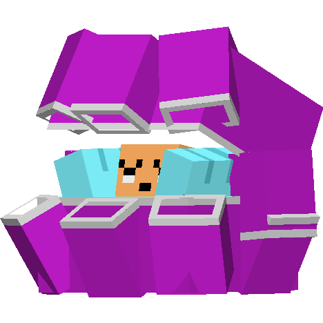

.. _clamperl:

Clamperl
---------

Description
============
| Clamperl is a water Pokémob.
| Clamperl evolves into :ref:`huntail`:
|  -  After being traded.
|  -  When given a Flint.
| 
| Clamperl evolves into :ref:`gorebyss`:
|  -  After being traded.
|  -  When given a Feather.
| 