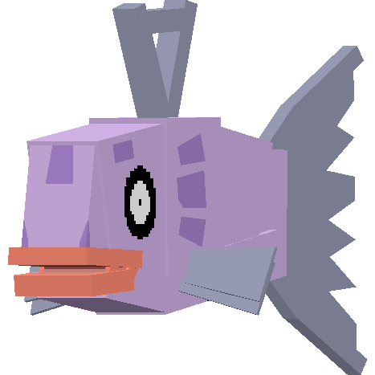

.. _feebas:

Feebas
-------

.. image:: ../../_images/pokemobs/gen_3/entity_icon/textures/feebas.png
    :width: 400
    :alt: Feebas

Description
============
| Feebas is a water Pokémob.
| Feebas evolves into :ref:`milotic`:
|  -  After being traded.
|  -  When given a Prism Scale.
| 