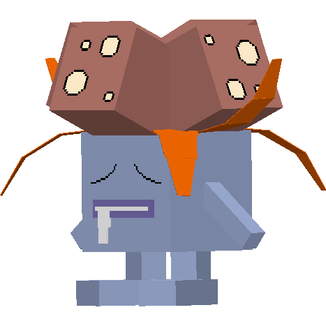
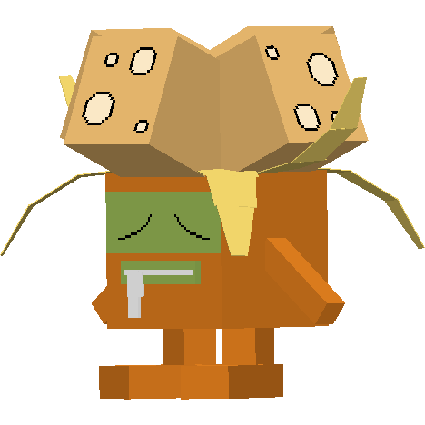

.. _gloom:

Gloom
------

Description
============
| Gloom is a grass/poison Pokémob.
| Gloom evolves into :ref:`vileplume`:
|  -  When given a Leaf Stone.
| 
| Gloom evolves into :ref:`bellossom`:
|  -  When given a Sun Stone.
| 
| Gloom evolves from :ref:`oddish`.