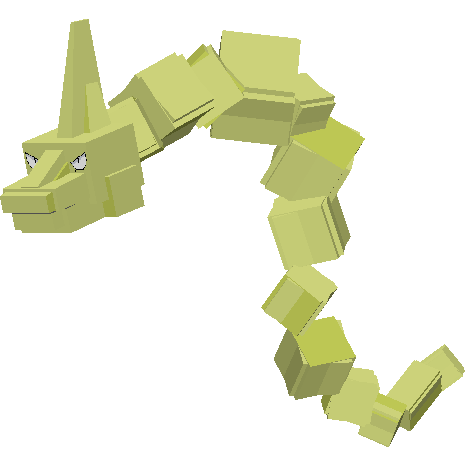

.. _onix:

Onix
-----

.. image:: ../../_images/pokemobs/gen_1/entity_icon/textures/onix.png
    :width: 400
    :alt: Onix

Description
============
| Onix is a rock/ground Pokémob.
| Onix evolves into :ref:`steelix`:
|  -  After being traded.
|  -  When given a MetalCoat.
| 