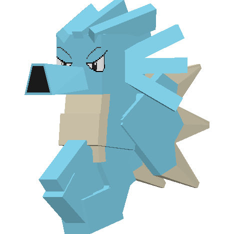
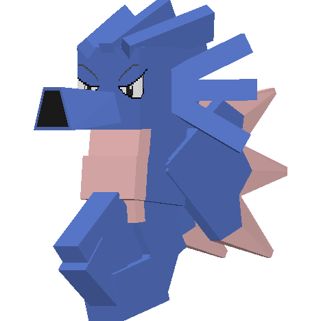

.. _seadra:

Seadra
-------

Description
============
| Seadra is a water Pokémob.
| Seadra evolves into :ref:`kingdra`:
|  -  After being traded.
|  -  When given a Emerald.
| 
| Seadra evolves from :ref:`horsea`.