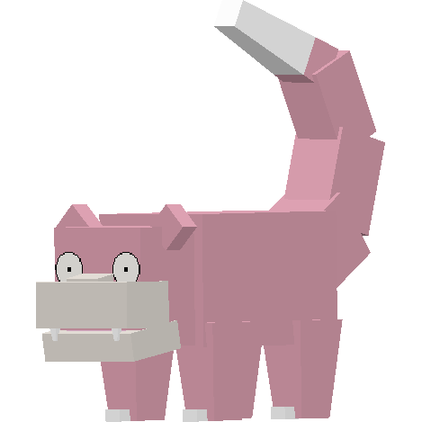
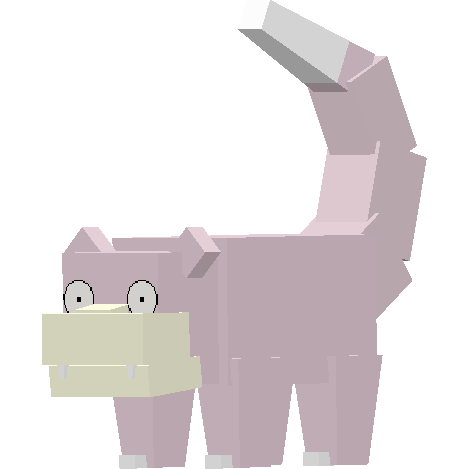

.. _slowpoke:

Slowpoke
---------

Description
============
| Slowpoke is a water/psychic Pokémob.
| Slowpoke evolves into :ref:`slowbro`:
|  -  At Level 37.
| 
| Slowpoke evolves into :ref:`slowking`:
|  -  After being traded.
|  -  When given a King's Rock.
| 