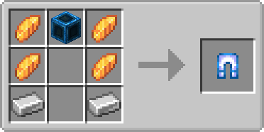

.. _legend_dimensions:

*********************
|Pokecube| Dimensions
*********************

|Pokecube| has two dimensions to be explored by players. On this page, we'll see how to get to these dimensions, how they affect gameplay, |Pokemob| exclusive to these locations

**Ultra Space**
===============
Ultra Space is a very lively dimension, containing new biomes and some exclusives!
To get there, we have two alternatives: create a teleport key or look for a wormhole.

Wormholes
~~~~~~~~~
Wormholes can appear anywhere and in any dimension, you can use it to travel between dimensions, but this travel is random, so you can get stuck in the dimension if you're not prepared.
When a wormhole is generated it appears as a small energy slit:

.. image:: ../_images/legends_wiki/wormhole_spawn.png
   :alt: wormhole

And then it opens! it can transport any kind of entity, so be careful not to throw your |pokemob| in the portal, you could lose it forever!

.. image:: ../_images/legends_wiki/wormhole_open.png
   :alt: wormhole

When the portal depletes its energy it goes into closing mode, then the teleport stops working and it destroys itself.

You can use a :ref:`siphon` next to the portal it will stay open longer.

Craft Ultra Dimensional Key
~~~~~~~~~~~~~~~~~~~~~~~~~~~
To use the Ultra Dimensional Key, we first need to get the resources to craft it.

The first step is to look for meteors. You can find them by map while exploring.

.. image:: https://i.imgur.com/pb1a76F.png
    :alt: meteor

One of the first steps to going to Ultra Space is to find meteors, but wait, not the ones that explode your map in the beginning, clusters of rocks that appear in Mountain biomes **(Extreme Hills and derivatives)**
Inside the meteors, you will find a new ore, called **Cosmic Ore**, this ore can be collected by iron tools. Breaking them, you will get **Cosmic Dust**, and it is this dust that you will need, and it is better to stock up.

Now that you have enough Cosmic Dust and Meteor Blocks, it's time to create the Ultra Key:

> Another way to get Ultra Key is by purchasing from an NPC, specifically, Lusamine. You can find it at :ref:`aether_foundation`

Using Ultra Dimensional Key
~~~~~~~~~~~~~~~~~~~~~~~~~~~

Now that you have Ultra Dimensional Key, it's time to use it. With Cosmic Dust in inventory, it will be used as fuel for your key

The Key consumes a specific amount of Cosmic Dust to function, you can see that amount in the Item ToolTip.
You can set the amount used to teleport, and use Datapacks to change the item used for fuel.

.. image:: https://i.imgur.com/OkHEROn.png
    :alt: key_tooltip

And now, right-click, holding the key and you're done, you're now in Ultra Space!

Biomes and Anomalies
~~~~~~~~~~~~~~~~~~~~
Now that you're in Ultra Space, be cautious! **ALL BIOMES** of this dimension have anomalies in their blocks!

.. image:: ../_images/legends_wiki/ultraspace_topblock_effect.png
    :alt: effects_blocks

> But let's go by parts, what do you have to explore in Ultra Space?

All! From mining to Capture all UBs

There are six biomes in the dimension, and each biome has a unique characteristic, when a unique anomaly.

**Deep Mushroom Caves** - It is a calmer biome, containing blue trees that give light to the environment, giant mushrooms and unique fungi.

* [Anomaly] Slowness in the players

**Temporal Jungle** - Surrounded by tall trees that also emit a weak light, this biome is wide, with floating islands and mountains.

* [Anomaly] Poison in the players

**Crystallized Desert** - it is an arid biome with little vegetation, it also has some crystal constructions.

* [Anomaly] Levitate in the players

.. image:: ../_images/legends_wiki/ultraspace_crystall_desert.png
    :alt: desertc
.. image:: ../_images/legends_wiki/ultraspace_desert_structures.png
    :alt: desertc

**Deep Dark Valley** - A biome taken by darkness, with buildings destroyed and brought in from other dimensions, getting lost in this place is very easy

* [Anomaly] Blindness in the players

**Deep Hills** - It is a valley taken by entities trapped in the blocks you step on, an almost empty place, except for dark energy branches that come out of the ground

* [Anomaly] Fatigue in the players

.. image:: ../_images/legends_wiki/ultraspace_deep_hills.png
    :alt: hiilsc

**Forgotten Forest** - Perhaps the oldest biome in Ultra Space? Its vegetation in shades of yellow bring a feeling that time does not stop.

* [Anomaly] Wither in the players

.. image:: ../_images/legends_wiki/ultraspace_aged_forest.png
    :alt: goldc
	
You also have the chance to find cities in these biomes, the Ultra Cities have trainers you can battle and challenge! 

**Distorted World**
===================

.. image:: ../_images/legends_wiki/distorted_world_b.png
    :alt: world
.. image:: ../_images/legends_wiki/distorted_world_c.png
    :alt: world
	
Distorted World is the dimension of |pokemob| Giratina. In this dimension you can explore and get unique blocks and capture the |pokemob| Giratina.
To access the dimension you need to use the Giratina Mirror, or be lucky to be teleported by Wormhole.

Giratine Mirror
~~~~~~~~~~~~~~~
The safest way to go to this dimension is using the Giratina Mirror, it works the same way as the Ultra Dimensional Key.
The mirror is created from three parts, these parts are conquered by capturing the three Guardians of Lake **Uxie, Mesprit and Azelf**. You can also buy them from the Merchant in the villages.

.. image:: ../_images/legends_wiki/giratina_mirror_view.png
    :alt: mirror

Using the mirror is not complicated, just right click and you will be teleported to the dimension.

> Attention, the Mirror has an internal cooldown, so you cannot spam the teleport. This cooldown can be changed in the settings, but you have a minimum limit for placing it.

**Mining!**
===========
Within these dimensions, you can mine to get unique items. Each dimension has different ores.

Ultra Space
~~~~~~~~~~~
In Ultra Space, you can find variations on overworld ores, from coal to emerald. You'll also find cosmic dust and the main mineral of this dimension, Spectrum Ore.

.. image:: ../_images/legends_wiki/ultraspace_ore_variation.png
    :alt: ores
.. image:: ../_images/legends_wiki/ultraspace_cosmic_dust.png
    :alt: ores
.. image:: ../_images/legends_wiki/ultraspace_spectral_ore.png
    :alt: ores

Crystal fragments are important for some recipes, although they don't appear in caves, they do appear in small concentrations in some biomes. you can also cook
the cacti from the "Crystallized Desert" biome to get some crystals.

.. image:: ../_images/legends_wiki/crystal_shards.png
    :alt: crystal

The setting of Ultra Space is created for you to survive in the dimension for a long time, getting the standard equipment of the overworld. Spectrum Ore is crucial to survive in this dimension.
With it you can build Ultra Armor, which makes the player immune to the effects of biomes, but beware! **You must be fully equipped with armor to avoid the effects!**

Magnetic Stones are bluish stones that appear in abundance in the **Deep Hills**

.. image:: https://i.imgur.com/EvoLMbM.png
    :alt: magnetic

> Recipes Ultra Armor

.. _Distorted World: 

Distorted World
~~~~~~~~~~~~~~~
In the Distorted World, you can enter mirror blocks through the environment, but looking down on the islands, you find the Fractal Ore. It is of little use at the moment, but you can build a very interesting machine.

	
O Cram-o-matic is a robot added in the Sword and Shield game, in |Pokecube| it works in a similar way. You deliver an item to him, and you get a random item.
To craft it, you use the Fractal Shard.

> The default trade items are **[Emerald,Ender Pearl,Diamond]**, you can trade these items for Datapack.
	
Among the traded items, you get Z-Crystals, Random Minecraft Items and Pokepuffs.

	
Pokepuffs are items that give **Atk Bonuses** to the |pokemob| based on its type. The player can also eat it and gain a special effect.

.. image:: ../_images/legends_wiki/pokepuff_items.png
    :alt: robot
.. image:: ../_images/legends_wiki/pokepuff_recipe.png
    :alt: robot

**Distorted Blocks**
====================
In the Distorted World dimension, some blocks have distorted versions, this is caused by the distortion of the mirrors. You can craft these blocks using the mirrors scattered across the dimension.

.. image:: ../_images/legends_wiki/distorted_blocks.png
    :alt: distorted
	
These recipes only work in the dimensions: Distorted World and Ultra Space. But some recipes are stuck in the specific dimension.
To craft you need to choose a block that has a distorted version, Exemple: minecraft planks. Then you go to one of the dimensions, depending on the recipe you want to make, and right-click holding the item, and it will be converted to the distorted block.

.. image:: ../_images/legends_wiki/distorted_recipe.png
    :alt: distorted_recipe

> Blocks that have distorted versions are:

* All Minecraft planks except Nether.
* Terracota
* Glowstone
* Distorted Planks

**BeastCube and UBs**
=====================

Finding UBs is not so complicated, but the hard part is getting blankets in basic pokecubes. The best we can do is create BeastCubes!

> You can also buy BeastCubes from Ultra Space residents, just look for Ultra Cities, they can appear in all Ultra Space biomes

The Beast Cube has a higher chance of capture in the dimension or in other dimensions, in Overworld the capture rate is very low.

Several |pokemob| can appear in Ultra Space, which makes the UBs have their spawn reduced, but does not prevent you from finding several by the biomes.
Facing them can be easy, but you always have to remember that your armor is not repairable, so if it breaks, the |pokemobs| will have the advantage of the terrain next to them, so always be careful.

and here we have the Spawn list of the UBs:

* Deep Mushroom Caves: Nihilego, Blacephalon
* Temporal Jungle: Buzzwole, Poipole
* Crystallized Desert: Pheromosa, Celesteela
* Deep Dark Valley: Guzzlord
* Deep Hills: Xurkitree, Stakataka
* Forgotten Forest: Kartana

.. include:: ../.shared.rst