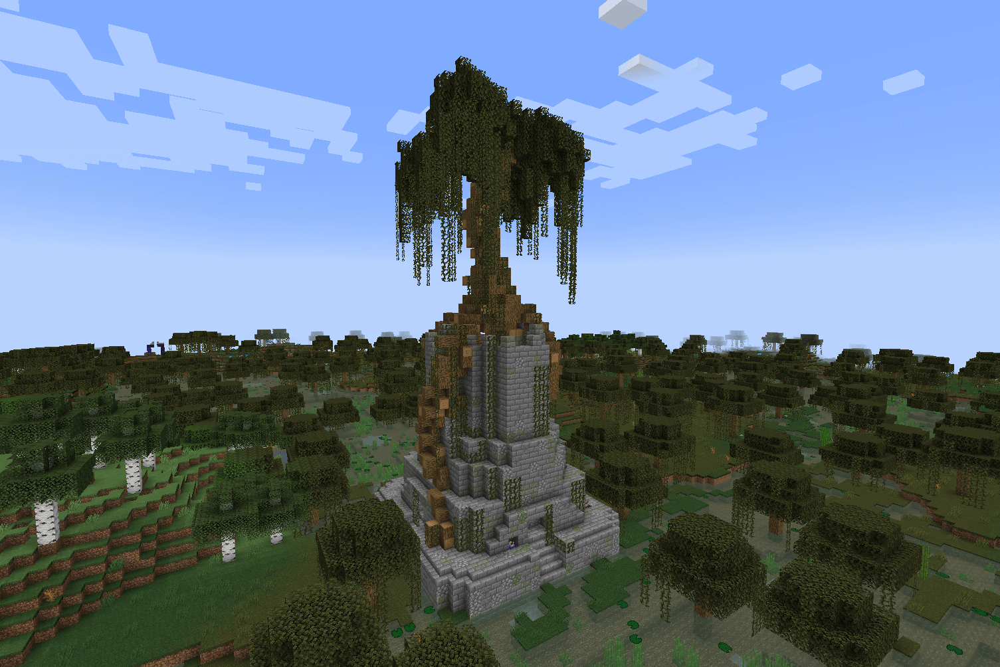
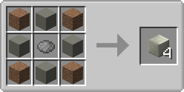
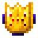
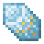
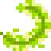
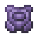
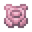

.. _legend_quests:
.. role:: raw-html(raw)
    :format: html

******************
Legends and Quests
******************

**Introduction**
================
The |Pokecube| has modules that complement each other, Legends is one of those modules. :raw-html:` `
|Pokecube| Legends is the part that manages structures, dimensions, & behavior of legendary |pokemob| for spawning and capturing. :raw-html:` `
On this page you will find information about the legendary structures, their spawn forms, items, & exclusive blocks of |Pokecube| Legends. 

For dimensions, visit it by clicking here: :ref:`legend_dimensions`

Items
~~~~~~~~~~~~~
In addition to the structures, the |Pokecube| Legends expansion adds many items to the mod, many with unique functions!

.. dropdown:: Unique Items
    :animate: fade-in-slide-down

    .. grid:: 1

        .. grid-item-card:: Wishing Piece

            - Activates raids. 
            - Raids reactivate if you don't receive this item.

            .. image:: ../_images/legends_wiki/items/wishing_piece.png
                :alt: Wishing Piece

    .. grid:: 1

        .. grid-item-card:: Gigant Shard

            - Triggers Gigantamax! To use it, choose a |pokemob| that has the Gigantamax ability and right-click on it with the item.
            - **It does not go in the** |**pokemob's**| **inventory!** :raw-html:` `
            - If the item disappears from your hand means that it is working, otherwise, check if the chosen |pokemob| has the Gigantamax ability. :raw-html:` `
            - Capturing a |pokemob| in their Gigantamax form does not require the item!

            .. image:: ../_images/legends_wiki/items/gigashard.png
                :alt: Gigant Shard

    .. grid:: 1

        .. grid-item-card:: Z-Crystals

            - Grants Z-Moves.

            .. image:: ../_images/legends_wiki/items/z_ice.png
                :alt: Electric Z-Crystal

    .. grid:: 1

        .. grid-item-card:: Mints

            - Changes your |pokemob's| Nature, just use it in the same way as the Gigant Shard.

            .. image:: ../_images/legends_wiki/items/mint.png
                :alt: Mints

.. dropdown:: Exploration Maps
    :animate: fade-in-slide-down

    - An alternative way to locate legendary structures!
    - Found in Ruins

    .. carousel::
        :show_captions_below:
        :show_controls:
        :show_indicators:
        :show_shadows:

        .. figure:: ../_images/legends_wiki/treasure_map_looking.png
            
            Treasure Map

        .. figure:: ../_images/legends_wiki/treasure_map_legend.png
            
            Ruins: Location of Maps

**Blocks**
~~~~~~~~~~~~~
In addition to the structures, the |Pokecube| Legends expansion adds many blocks to the mod, many with unique functions!

.. dropdown:: Totem Blocks
    :animate: fade-in-slide-down

    * The Totem Blocks are blocks themed after the |pokemob| Tapus of Alola.
    * Each totem grants a special effect.
    * Dye your totems to use for building!
    * Activate by right-clicking while holding anything tagged as ``forge:gems/diamond``.
    * Customize this by changing the item tag ``pokecube_legends:totem_fuel`` using a datapack.

    .. carousel::
        :show_captions_below:
        :show_controls:
        :show_indicators:
        :show_shadows:

        .. figure:: ../_images/legends_wiki/totems_decorative.png

            Totem Tower

        .. figure:: ../_images/legends_wiki/totem_colors.png
        
            Totem Color Variants
    :raw-html:` `

    .. dropdown:: Recipes
        :animate: fade-in-slide-down

        .. carousel::
            :show_captions_below:
            :show_controls:
            :show_indicators:
            :show_shadows:
            
            .. figure:: ../_images/legends_wiki/golem_stone_recipe.png
                
                Golem Stone

            .. figure:: ../_images/legends_wiki/totem_block_recipe.png
                
                Totem Core

            .. figure:: ../_images/legends_wiki/tapu_bulu_recipe.png
                
                Tapu Bulu Totem

            .. figure:: ../_images/legends_wiki/tapu_fini_recipe.png
                
                Tapu Fini Totem
                
            .. figure:: ../_images/legends_wiki/tapu_koko_recipe.png
                
                Tapu Koko Totem

            .. figure:: ../_images/legends_wiki/tapu_lele_recipe.png
                
                Tapu Lele Totem
    
.. dropdown:: Mirage Spots
    :animate: fade-in-slide-down

    Another curious block is the Mirage Spot, but you might know it as Hoopa Portal.
    This block can spawn any |pokemobs| except Legendaries.

    * If you have a Hoopa, it must have the move **Hyperspace Hole** and be **Level 40** or higher.
    * Use the move out of combat to create the portal. 
    * The creation of the portal has a cooldown, so it can't be spammed.
    * If the block is placed in **creative**, the portal creates an internal cooldown and is disabled until the time runs out and is reactivated.
    * This is customizable in **configs** or by **datapacks**.

    .. carousel::
        :show_captions_below:
        :show_controls:
        :show_indicators:
        :show_shadows:

        .. figure:: ../_images/legends_wiki/hoopa_portal_on.png

            Hoopa Portal

        .. figure:: ../_images/legends_wiki/hoopa_portal_off.png

            Open Hoopa Portal

        .. figure:: ../_images/legends_wiki/hoopa_create.png

            Hoopa Portal Creation

**Special Moves**
~~~~~~~~~~~~~~~~~~

.. dropdown:: Dynamax & Gigantamx
    :animate: fade-in-slide-down

        1. Open the controls menu and add a key in the |pokecube| section.
        2. Find or craft the Dynamax Spot block.
        3. Find **Raid Spots** or **Gyms** in towns with a Dynamax Power Spot block.

        - After everything is ready, equip a mega evolution item, press the ``M`` button, and your |pokemob| will Dynamax or Gigantamx.
        - While your |pokemob| is in this form, press the configured key and the moves will be changed to Dynamax or Gigantamx moves.

        .. image:: ../_images/legends_wiki/max_dynamax_block_recipe.png
            :alt: max_spot

.. dropdown:: Z-Moves
    :animate: fade-in-slide-down

        Z-Moves increase the strength of a specific move of your |pokemob|. 

        1. Equip your |pokemob| with a z-crystal corresponding to its move **(Grassium Z = Move Grass)**
        2. Press the configured key and the move will become the Z-Move, **but** the move can only be executed *once*.
        3. To execute it multiple times you need to collect your |pokemob| and throw it back into battle.
        
        - |Pokemob| exclusive Z-Crystals are integrated with base Z-Crytals.
        - The difference is that the specific |pokemob| needs to have the specific move to use the exclusive Z-Move.

        **Example:**

        * Pikachu's Thunderwave Move + Electrium Z = Gigavolt Havoc
        * Pikachu's Thunderbolt Move + Electrium Z = 10,000,000 Volt Thunderbolt

        .. image:: ../_images/legends_wiki/items/z_electric.png
            :alt: max_spot

**Exploration Structures**
==========================
In this expansion, several structures were added, and in this part we'll look at exploration structures.
Exploration structures are buildings that do not have links with legendary |pokemob|, they can be explored by players to get items or special trades.

Raids
~~~~~~

.. dropdown:: Raid Sturctures
    :animate: fade-in-slide-down
    
    Raids are here, and you can get a stronger |pokemob| and Gigantamax it! Just find the Raid Spots and start the battle!

    - Defeated |pokemobs| drop Raid exclusive items.
    - Raid |pokemobs| can only be caught after defeat.
    - Items are random, mixing |pokemob| drops with Raid items.

    .. carousel::
        :show_captions_below:
        :show_controls:
        :show_indicators:
        :show_shadows:

        .. figure:: ../_images/legends_wiki/raid_structure.png

            Raid Structures

        .. figure:: ../_images/legends_wiki/raid_pokemob.png
            
            Dynamax |Pokemob| from Raids

.. dropdown:: Capturing |Pokemobs| from Raids
    :animate: fade-in-slide-down

    .. grid:: 1

        .. grid-item-card::  Capturing

            To capture the |pokemob| of the raid we need two factors:

            - You need to use the Dynamax Cube to capture.
            - The |pokemob| needs to be extremely low on health.

            .. image:: ../_images/legends_wiki/dynamax_ball.png
                :alt: Dynamax Cube

    .. grid:: 1

        .. grid-item-card::  Smithing Recipe

            - 1.20.1+

            .. image:: ../_images/legends_wiki/dynamax_ball_smithing_1.20.png
                :alt: 1.20+ Smithing Recipe: Wishing Stone + |Pokecube| + Ruby = Dynamax Cube 

    .. grid:: 1

        .. grid-item-card::  Crafting Recipe

            - 1.19.2 and older

            .. image:: ../_images/legends_wiki/dynamax_ball_crafting_1.19.png
                :alt: 1.19 & older Smithing Recipe: Wishing Stone + |Pokecube| = Dynamax Cube 

    .. grid:: 1

        .. grid-item-card::  Dynamax Cube

            - You can use any |Pokecube| to create the Dynamax Cube!
            - **Be aware that Dynamax Cube does not use the capture chance of the pokecube you used in the recipe, so if you use a Mastercube for the recipe, it will work like a normal Pokecube!**
            - Currently, the Dynamax Cube will become a common |Pokecube|, in the future it will be modified to return the |Pokecube| used in the recipe!

            .. image:: ../_images/legends_wiki/dynamax_ball_convert.png
                :alt: Dynamax Cube converts to regular |pokecube|

Villain Lairs
~~~~~~~~~~~~~~
The lairs are structures based on the villain teams from the Pokémon games, in this mod you can find 5 secret lairs.
The structures differ depending on their biome, which makes the structure more versatile.

.. _aether_foundation:

.. dropdown:: Aether Foundation
    :animate: fade-in-slide-down

    * Find the Aether Foundation bosses, and battle them!
    * Buy important items from Aether Foundation bosses
    * Considered a Village
    * Found in biomes tagged as ``#minecraft:is_ocean``, such as **Warm Oceans**
    * Found in biomes **not** tagged as ``#forge:is_cold`` or ``#forge:is_snowy``

    .. carousel::
        :show_captions_below:
        :show_controls:
        :show_indicators:
        :show_shadows:

        .. figure:: ../_images/legends_wiki/aether_foundation.png
            
            Aether Foundation

        .. figure:: ../_images/legends_wiki/aether_f_boss_room.png
            
            Battle the Aether Bosses!

.. _elite_four:

.. dropdown:: Elite Four
    :animate: fade-in-slide-down

    Yes, there is an **Elite Four**! But in this case, it's much more complicated to beat them! 

    * Battle the Elite Four!
    * Trainers sell strong items, but they also have strong |pokemobs|, so be warned!
    * Found in any biomes tagged as ``#minecraft:is_overworld``
    * Found in biomes **not** tagged as ``#minecraft:is_beach``, ``#minecraft:is_ocean``, ``#minecraft:is_river``, or ``#forge:is_mushroom``

    .. carousel::
        :show_captions_below:
        :show_controls:
        :show_indicators:
        :show_shadows:

        .. figure:: ../_images/legends_wiki/elite_four.png
            
            Elite Four Tower

            Will you deaf all four?

        .. figure:: ../_images/legends_wiki/elite_four_boss_1.png

            Battle Shauntal!
            
            One of the Elite Four!

        .. figure:: ../_images/legends_wiki/elite_four_boss_2.png

            Battle Grimsley!
            
            One of the Elite Four!

        .. figure:: ../_images/legends_wiki/elite_four_boss_3.png

            Battle Olivia!
            
            One of the Elite Four!

        .. figure:: ../_images/legends_wiki/elite_four_boss_4.png

            Battle Blue!
            
            One of the Elite Four!

.. _team_aqua:

.. dropdown:: Team Aqua
    :animate: fade-in-slide-down

    * Find Archie, and battle him!
    * Found in **Beaches** or **Swamps**
    * Found in biomes tagged as ``#minecraft:is_beach`` or ``#forge:is_swamp``

    .. carousel::
        :show_captions_below:
        :show_controls:
        :show_indicators:
        :show_shadows:

        .. figure:: ../_images/legends_wiki/team_aqua_base.png
            
            Team Aqua... Hideout?

        .. figure:: ../_images/legends_wiki/team_aqua_boss_room.png
            
            Battle Archie!

.. _team_magma:

.. dropdown:: Team Magma
    :animate: fade-in-slide-down
    
    * Find Maxie, and battle him!
    * Found in **Deserts** or **Badlands**
    * Found in biomes tagged as ``#minecraft:is_badlands`` or ``#forge:is_sandy``

    .. carousel::
        :show_captions_below:
        :show_controls:
        :show_indicators:
        :show_shadows:

        .. figure:: ../_images/legends_wiki/team_magma_base.png
            
            Team Magma... Hideout?

        .. figure:: ../_images/legends_wiki/team_magma_boss_room.png
            
            Battle Maxie!

.. _team_rocket:

.. dropdown:: Team Rocket
    :animate: fade-in-slide-down

    * Find Giovanni, and battle him!
    * Team Rocket's Hideout has a look reminiscent of the Red/Blue games
    * Found in **Plains**
    * Found in biomes tagged as ``"#forge:is_plains"``

    .. carousel::
        :show_captions_below:
        :show_controls:
        :show_indicators:
        :show_shadows:

        .. figure:: ../_images/legends_wiki/team_rocket_base_2.png

            Team Rocket Village Hideout

        .. figure:: ../_images/legends_wiki/team_rocket_base.png

            Team Rocket Hideout

        .. figure:: ../_images/legends_wiki/team_rocket_giovanni.png

            Battle Giovanni!

**Legendary Structures**
========================
While exploring the world you will find many different structures. They are the **'Temples of Legendary'**.

- Legendary temples need a special item and completion of a unique quest so you can summon and capture it.
- Not all |pokemobs| have unique structures, some share structures.

Castle of N 
~~~~~~~~~~~~

.. dropdown:: Description
    :animate: fade-in-slide-down

    * Find N, and battle him!
    * Summons :ref:`reshiram` & :ref:`zekrom`
    * Found in **Taigas**
    * Found in biomes tagged as ``#minecraft:is_taiga``

    .. carousel::
        :show_captions_below:
        :show_controls:
        :show_indicators:
        :show_shadows:

        .. figure:: ../_images/legends_wiki/castle_n.png
            
            Castle of N
            
        .. figure:: ../_images/legends_wiki/castle_n_boss_room.png
            
            Battle N!

Celebi Temple
~~~~~~~~~~~~~~

.. dropdown:: Description
    :animate: fade-in-slide-down

    * Summons :ref:`articuno`, :ref:`celebi`, :ref:`diancie`, :ref:`moltres`, & :ref:`zapdos`
    * Found in **Forests**
    * Found in biomes tagged as ``#minecraft:is_forest``, ``#minecraft:is_jungle``, or ``#forge:is_lush``

    .. image:: ../_images/legends_wiki/celebi_temple.png
        :alt: Celebi Temple

Ho-Oh Temple
~~~~~~~~~~~~~

.. dropdown:: Description
    :animate: fade-in-slide-down

    * Summons :ref:`articuno`, :ref:`entei`, :ref:`ho-oh`, :ref:`hoopa_confined`, :ref:`raikou`, :ref:`suicune`, & :ref:`zapdos`
    * Found in **Plains**
    * Found in biomes tagged as ``#forge:is_plains`` or ``#pokecube_world:is_ultraspace/is_plains``

    .. image:: ../_images/legends_wiki/ho_oh_tower.png
        :alt: Ho-oh Temple

Legendary Tree
~~~~~~~~~~~~~~~

.. dropdown:: Description
    :animate: fade-in-slide-down

    * Summons :ref:`articuno`, :ref:`diancie`, :ref:`moltres`, & :ref:`zapdos`
    * Found in **Plains** & **Forests**
    * Found in biomes tagged as ``#minecraft:is_forest``, ``#forge:is_plains``, ``#pokecube_world:is_ultraspace/is_forest``, or ``#pokecube_world:is_ultraspace/is_plains``

    .. image:: ../_images/legends_wiki/legendary_tree.png
        :alt: Legendary tree

Kubfu Dojo
~~~~~~~~~~~

.. dropdown:: Description
    :animate: fade-in-slide-down

    * Summons :ref:`articuno`, :ref:`entei`, :ref:`hoopa_confined`, :ref:`kubfu`, :ref:`moltres`, & :ref:`zapdos`
    * Found in **Plains**
    * Found in biomes tagged as ``#forge:is_plains`` or ``#pokecube_world:is_ultraspace/is_plains``

    .. image:: ../_images/legends_wiki/kubfu_dojo.png
        :alt: Kubfu Dojo

Dark Kubfu Tower
~~~~~~~~~~~~~~~~~

.. dropdown:: Description
    :animate: fade-in-slide-down

    * Contains **Parchment of Darkness**
    * Found in **Extreme Hills**
    * Found in biomes tagged as ``#minecraft:is_hill`` or ``#pokecube_world:is_ultraspace/is_hill``

    .. image:: ../_images/legends_wiki/kubfu_tower_dark.png
        :alt: Dark Kubfu Tower

Water Kubfu Tower
~~~~~~~~~~~~~~~~~~

.. dropdown:: Description
    :animate: fade-in-slide-down

    * Contains **Parchment of Water**
    * Found in **Beaches** & **Stony Shores**
    * Found in biomes tagged as ``#minecraft:is_beach`` or ``#pokecube_world:is_ultraspace/is_beach``

    .. image:: ../_images/legends_wiki/kubfu_tower_water.png
        :alt: Water Kubfu Tower

Sky Pillar
~~~~~~~~~~~

.. dropdown:: Description
    :animate: fade-in-slide-down

    * Summons :ref:`articuno`, :ref:`deoxys`, :ref:`hoopa_confined`, :ref:`latias`, :ref:`latios`, :ref:`jirachi`, :ref:`rayquaza`, & :ref:`zapdos`
    * Found in **Beaches** & **Stony Shores**
    * Found in biomes tagged as ``#minecraft:is_beach`` or ``#pokecube_world:is_ultraspace/is_beach``

    .. image:: ../_images/legends_wiki/sky_pillar.png
        :alt: Sky Pillar

Ruins of Regi
~~~~~~~~~~~~~~

.. dropdown:: Description
    :animate: fade-in-slide-down

    .. dropdown:: Regice Temple
        :animate: fade-in-slide-down

        * Summons :ref:`regice`
        * Found in **snowy** Biomes
        * Found in biomes tagged as ``#forge:is_cold/overworld``

        .. carousel::
            :show_captions_below:
            :show_controls:
            :show_indicators:
            :show_shadows:

            .. figure::  ../_images/legends_wiki/regice_temple.png
                
                Regice Temple

            .. figure:: ../_images/legends_wiki/regice_totem_template.png
                
                Regice Totem Template

    .. dropdown:: Regirock Temple
        :animate: fade-in-slide-down

        * Summons :ref:`regirock`
        * Found in **Deserts**
        * Found in biomes tagged as ``#forge:is_sandy``

        .. carousel::
            :show_captions_below:
            :show_controls:
            :show_indicators:
            :show_shadows:

            .. figure:: ../_images/legends_wiki/regirock_temple.png
                
                Regirock Temple

            .. figure:: ../_images/legends_wiki/regirock_totem_template.png
                
                Regirock Totem Template

    .. dropdown:: Registeel Temple
        :animate: fade-in-slide-down

        * Summons :ref:`registeel`
        * Found in **Extreme Hills** & **Taigas**
        * Found in biomes tagged as ``#minecraft:is_hill`` or ``#minecraft:is_taiga``

        .. carousel::
            :show_captions_below:
            :show_controls:
            :show_indicators:
            :show_shadows:

            .. figure:: ../_images/legends_wiki/registeel_temple.png
                
                Registeel Temple
                
            .. figure:: ../_images/legends_wiki/registeel_totem_template.png
                
                Registeel Totem Template

    .. dropdown:: Regieleki Temple
        :animate: fade-in-slide-down

        * Summons :ref:`regieleki`
        * Found in **Badlands**
        * Found in biomes tagged as ``#minecraft:is_badlands``

        .. carousel::
            :show_captions_below:
            :show_controls:
            :show_indicators:
            :show_shadows:

            .. figure:: ../_images/legends_wiki/regieleki_temple.png
                
                Regieleki Temple
                
            .. figure:: ../_images/legends_wiki/regieleki_totem_template.png
                
                Regieleki Totem Template

    .. dropdown:: Regidrago Temple
        :animate: fade-in-slide-down

        * Summons :ref:`regidrago`
        * Found in the **Nether**
        * Found in biomes tagged as ``#minecraft:is_nether``

        .. carousel::
            :show_captions_below:
            :show_controls:
            :show_indicators:
            :show_shadows:

            .. figure:: ../_images/legends_wiki/regidrago_temple.png
                
                Regidrago Temple

            .. figure:: ../_images/legends_wiki/regidrago_totem_template.png
                
                Regidrago Totem Template

    .. dropdown:: Regigigas Temple
        :animate: fade-in-slide-down

        * Summons :ref:`regigigas`
        * Found in **cold** biomes
        * Found in biomes tagged as ``#forge:is_cold/overworld``

        .. carousel::
            :show_captions_below:
            :show_controls:
            :show_indicators:
            :show_shadows:

            .. figure:: ../_images/legends_wiki/regigigas_temple.png
                
                Regigigas Temple

            .. figure:: ../_images/legends_wiki/regigigas_totem_template.png
                
                Regigigas Totem Template

Kyogre Temple
~~~~~~~~~~~~~~

.. dropdown:: Description
    :animate: fade-in-slide-down

    * Summons :ref:`hoopa_confined`, :ref:`kyogre`, :ref:`manaphy`, :ref:`moltres`, & :ref:`zapdos`
    * Found in **Oceans**
    * Found in biomes tagged as ``#forge:is_water``

    .. image:: ../_images/legends_wiki/kyogre_temple.png
        :alt: Kyogre Temple

Groudon Temple
~~~~~~~~~~~~~~~

.. dropdown:: Description
    :animate: fade-in-slide-down

    * Summons :ref:`entei`, :ref:`groudon`, & :ref:`hoopa_confined`
    * Found in the **Nether**
    * Found in biomes tagged as ``#minecraft:is_nether``

    .. image:: ../_images/legends_wiki/groudon_temple.png
        :alt: Groudon Temple

Lugia Tower
~~~~~~~~~~~~

.. dropdown:: Description
    :animate: fade-in-slide-down

    * Summons :ref:`articuno`, :ref:`hoopa_confined`, :ref:`latias`, :ref:`latios`, :ref:`lugia`, :ref:`moltres`, & :ref:`zapdos`
    * Found in **Beaches** or **Stony Shores**
    * Found in biomes tagged as ``#minecraft:is_beach`` or ``#pokecube_world:is_ultraspace/is_beach``

    .. image:: ../_images/legends_wiki/lugia_tower.png
        :alt: Lugia Tower

Yveltal Ruins
~~~~~~~~~~~~~~

.. dropdown:: Description
    :animate: fade-in-slide-down

    * Summons :ref:`yveltal` & :ref:`zygarde_50`
    * Found in **sandy** biomes
    * Found in biomes tagged as ``#forge:is_sandy`` or ``#pokecube_world:is_ultraspace/is_sandy``

    .. image:: ../_images/legends_wiki/yveltal_temple.png
        :alt: Yveltal Ruins

Xerneas Tree
~~~~~~~~~~~~~

.. dropdown:: Description
    :animate: fade-in-slide-down

    * Summons :ref:`xerneas` & :ref:`zygarde_50`
    * Found in **Dark Forests**
    * Found in biomes tagged as ``#forge:is_spooky`` or ``#pokecube_world:is_ultraspace/is_forest``

    .. image:: ../_images/legends_wiki/xerneas_tree.png
        :alt: Xerneas Tree

Keldeo Altar
~~~~~~~~~~~~~

.. dropdown:: Description
    :animate: fade-in-slide-down

    * Summons :ref:`cobalion`, :ref:`keldeo`, :ref:`terrakion`, & :ref:`virizion`
    * Found in **Extreme Hills**, **Mountains**, & **Taigas**
    * Found in biomes tagged as ``#minecraft:is_hill``, ``#minecraft:is_mountain``, ``#minecraft:is_taiga``, or ``#forge:is_coniferous``

    .. image:: ../_images/legends_wiki/keldeo_temple.png
        :alt: Keldeo Altar

**Nature's Altar** (:ref:`thundurus_incarnate`/:ref:`tornadus_incarnate`/:ref:`landorus_incarnate`)

* Biome: Swamp

**Altar of Time and Space** (:ref:`dialga`/:ref:`palkia`/:ref:`arceus`)

* Dimension: The End

.. image:: ../_images/legends_wiki/time_space_temple.png
    :alt: Space Time Altar

**Tapus Temple**
(:ref:`tapu_koko`/:ref:`tapu_fini`/:ref:`tapu_lele`/:ref:`tapu_bulu`)
 
* Biome: Beach

.. image:: ../_images/legends_wiki/tapus_temple.png
    :alt: tapus_temple
.. image:: ../_images/legends_wiki/tapus_center.png
    :alt: tapus_temple
.. image:: ../_images/legends_wiki/tapus_room.png
    :alt: tapus_temple
	
**Necrozma Tower** (:ref:`necrozma`) 

* Dimension: Ultra Space / Biome: Ultra Dark Valley

**Stone Portal** (:ref:`zacian`/:ref:`zamazenta`)

* Biome: River

.. image:: ../_images/legends_wiki/zacian_temple.png
    :alt: zacian_zamazenta
.. image:: ../_images/legends_wiki/zamazenta_temple.png
    :alt: zacian_zamazenta

**Summoning Blocks**
====================
These blocks are used to summon the legendary. Use the correct key item and spawn the legendary.
Not all blocks have a recipe, those that have can be placed by the player, and those that are not created appear in the structures by the map.

The ones with recipe are:

.. image:: ../_images/legends_wiki/lengedary_blocks_recipes.png
    :alt: regis blocks view
	
**The core block of the Regis**

.. image:: ../_images/legends_wiki/regirock_block_recipe.png
    :alt: Regirock Core Recipe
.. image:: ../_images/legends_wiki/regice_block_recipe.png
    :alt: Regice Core Recipe
.. image:: ../_images/legends_wiki/registeel_block_recipe.png
    :alt: Registeel Core Recipe
.. image:: ../_images/legends_wiki/regieleck_block_recipe.png
    :alt: Regieleki Core Recipe
.. image:: ../_images/legends_wiki/regidrago_block_recipe.png
    :alt: Regidrago Core Recipe

**Victini's Summoning Block**

.. image:: ../_images/legends_wiki/vicktini_block_recipe.png
    :alt: Victini Block

**Trough Block Summoning Block: Glastrier and Spectrier**

.. image:: ../_images/legends_wiki/calyrex_block_recipe.png
    :alt: Horses Block

**Heatran Summoning Block**

.. image:: ../_images/legends_wiki/heatran_block_recipe.png
    :alt: Heatran Recipe

**Magearna Summoning Block**

.. image:: ../_images/legends_wiki/magearna_block_recipe.png
    :alt: Magearna Recipe

**Legendary Summoning Block**

.. image:: ../_images/legends_wiki/legendary_block_recipe.png
    :alt: Legendary Recipe

and the blocks that do not have recipes are:

.. image:: ../_images/legends_wiki/lengedary_blocksno_recipe.png
    :alt: Legendy Blocks No Recipe

.. _make_type_null:

**Laboratory: Making Type Null**
================================

Type: Null is a |pokemob| created in the laboratory, so there's nothing more fair than creating it inside the |Pokecube| too :b

The first step is to find Aether Paradise, is the new structure that appears in the oceans:

.. image:: ../_images/legends_wiki/aether_foundation.png
    :alt: Aether_Paradise

In it, you will find some NPCs to battle, and reaching the top floor you will find the NPC Faba

.. image:: ../_images/legends_wiki/faba_room.png
    :alt: Faba_Pokecube

Defeating him, you can open the trade menu, and there you will find Imprisonment Helmet, the main item to create Type: Null

**Now comes the part you need to pay attention to!**

You will need: Potion of Regeneration II, Imprisonment Helmet, Two |pokemob| eggs

.. image:: ../_images/legends_wiki/typenull_recipe.png
    :alt: typenull_recipe

When items are in place, just power the :ref:`cloner` using an :ref:`siphon` and an electric |pokemob| (Higher levels make this go much faster).

**Making Golens of Regis**
==========================

In order to be able to summon the Regis you need to locate their temples. Each Regi has its own temple with a totem already built, if you play on a server or the temple doesn’t have the totem, you can build it (but this building must be inside the temple!)

**To create the Golem follow the images:**

For the base you will use the Golem Stone:

And to the Top, you will use the Core Blocks:

.. image:: ../_images/legends_wiki/golens_build_1.png
    :alt: Cores Golem Blocks

> You can use any type of Ice for the Ice Golem

To Activate, simply use the Key Item of your respective Golem

.. image:: ../_images/legends_wiki/items/steelcore.png
    :alt: Keys
.. image:: ../_images/legends_wiki/items/rockcore.png
    :alt: Keys
.. image:: ../_images/legends_wiki/items/regisorb.png
    :alt: Keys

> This is true for all blocks that use the key item: if it is out of the correct place of invocation or if it is the block you created and was placed in the wrong place, you will get this message when you try to use a key item in that block.
The correct location is just in the Golem temple area, if you want to remove this restriction, you need to create a Datapack by modifying the Spawn location.

.. image:: https://i.imgur.com/e9Gi6tz.png
    :alt: wrong location alert

**Secondary Spawn**
===================

Some |pokemob|, even though they appear naturally through biomes, can be summoned by items. These items cannot be acquired by Quest, only by purchasing with Merchants and Trainers after being defeated. Currently, not all Legendaries have a Secondary Spawn, but in the future everyone will have this option.

They are for the respective |pokemobs|:

* Articuno
.. image:: ../_images/legends_wiki/items/ice_wing.png
    :alt: Articuno Item

* Articuno Galar Form
.. image:: ../_images/legends_wiki/items/ice_dark_wing.png
    :alt: Articuno Item

* Moltres
.. image:: ../_images/legends_wiki/items/fire_wing.png
    :alt: Moltres Item

* Moltres Galar Form
.. image:: ../_images/legends_wiki/items/dark_fire_wing.png
    :alt: Moltres Item

* Zapdos
.. image:: ../_images/legends_wiki/items/electric_wing.png
    :alt: Zapdos Item

* Zapdos Galar Form
.. image:: ../_images/legends_wiki/items/static_wing.png
    :alt: Zapdos Item

* Entei
.. image:: ../_images/legends_wiki/items/flame_gem.png
    :alt: Entei Item

* Raikou
.. image:: ../_images/legends_wiki/items/thunder_gem.png
    :alt: Raikou Item

* Suicune
.. image:: ../_images/legends_wiki/items/water_gem.png
    :alt: Suicune Item

* Deoxys
.. image:: ../_images/legends_wiki/items/meteor_shard.png
    :alt: Deoxys Item

* Jirachi
.. image:: ../_images/legends_wiki/items/star_core.png
    :alt: Jirachi Item

* Latios/Latias

* Cresselia

* Darkrai
.. image:: ../_images/legends_wiki/items/nightmare_book.png
    :alt: Darkrai Item

* Manaphy
.. image:: ../_images/legends_wiki/items/manaphy_necklace.png
    :alt: Manaphy Item

* Hoopa Confined
.. image:: ../_images/legends_wiki/items/prisonbottle.png
    :alt: Hoopa Item

* Meloetta
.. image:: ../_images/legends_wiki/items/meloetta_ocarina.png
    :alt: Meloetta Item

* Kyurem
.. image:: ../_images/legends_wiki/items/kyurem_core.png
    :alt: Kyurem Item

* Virizion

* Cobalion
.. image:: ../_images/legends_wiki/items/cobalion_sword.png
    :alt: Cobalion Item

* Terrakion
.. image:: ../_images/legends_wiki/items/terrakion_sword.png
    :alt: Terrakion Item

* Diancie
.. image:: ../_images/legends_wiki/items/diamond_gem.png
    :alt: Diancie Item

* Azelf
.. image:: ../_images/legends_wiki/items/azelf_gem.png
    :alt: Azelf Item

* Mesprit
.. image:: ../_images/legends_wiki/items/mesprit_gem.png
    :alt: Mesprit Item

* Uxie
.. image:: ../_images/legends_wiki/items/uxie_gem.png
    :alt: Uxie Item

* Volcanion

* Cosmog
.. image:: ../_images/legends_wiki/items/cosmic_orb.png
    :alt: Cosmog Item

* Kubfu
.. image:: ../_images/legends_wiki/items/kubfu_spawn.png
    :alt: Kubfu Item

* Calyrex
.. image:: ../_images/legends_wiki/items/wooden_crown.png
    :alt: Calyrex Item

**with this addition, these pokémobs have catch rules, just like pokémob that can only be summoned Lugia/Kyogre for example!**

for you to invoke them, get the item from the |pokemob| respective and look for the structure it needs, or place the main block in the requested biome:

* Zapdos/Moltres/Articuno > Lugia Tower
* Zapdos/Moltres/Articuno Galar Form > Legendy Tree
* Entei/Raikou/Suicune > Ho-oh Tower
* Deoxys/Jirachi > Sky Pillar
* Latios > Legendary Block place in Biome: Stone Beach
* Latias > Legendary Block place in Biome: Beach
* Darkrai > Ruins of Yveltal
* Cresselia > Sky Pillar
* Manaphy > Kyogre Temple
* Uxie/Mesprit/Azelf > Zacian/Zamazenta Temple
* Meloetta > Nature Temple
* Kyurem > Legendary Block place in Biome: Snowy (any biome that has snow, except mountain peaks)
* Hoopa > Legendary Block place in Biome Ruins
* Volcanion > Magearna Block place in Biome: Village
* Diancie > Legendary Block place in Biome: Extreme Hills
* Cobalion/Virizion/Terrakion > Keldeo Altar
* Zygarde > Ruins of Yveltal/Xerneas Tree
* Cosmog > Time Space Altar
* Calyrex > Trough Block place in Biome: Taiga

.. _quests_list:

**Legends Pokémob Quests**
============================

Quest is the way for you to have the legendary |pokemob| confidence, and thus capture it. They may change over time and as new Pokémon Generations arrive. The :ref:`watch_description` page in the pokewatch has a button which can give the actual numbers for below. 

* The numbers may vary according to the released pokemon generations or changes by Data Packs or Custom Servers!

Legendary Birds
~~~~~~~~~~~~~~~
* Zapdos - Capture about 20 Electric |pokemobs|.
* Moltre - Capture about 20 Fire |pokemobs|.
* Articuno - Capture about 20 Ice |pokemobs|.
* Zapdos Galar - Capture about 20 Fighting |pokemobs|.
* Moltres Galar - Capture about 20 Dark |pokemobs|.
* Articuno Galar - Capture about 20 Flying |pokemobs|.

Legendary Beasts
~~~~~~~~~~~~~~~~
* Entei - Capture about 20 Fire |pokemobs|.
* Suicune - Capture about 20 Water |pokemobs|.
* Raikou - Capture about 20 Electric |pokemobs|.

Guardian of the skies
~~~~~~~~~~~~~~~~~~~~~
* Ho-oh - Capture :ref:`entei`/:ref:`suicune`/:ref:`raikou`.

Guardian of the seas
~~~~~~~~~~~~~~~~~~~~
* Lugia - Capture :ref:`moltres`/:ref:`articuno`/:ref:`zapdos`.

Guardian of Forests
~~~~~~~~~~~~~~~~~~~
* Celebi - Capture about 40 to 50 Grass |pokemobs|.

Eon Duo
~~~~~~~
* Latios/Latias - Capture about 20 Dragon |pokemobs|.

Shadows and Nightmares
~~~~~~~~~~~~~~~~~~~~~~
* Darkrai - Capture about 20 Dark |pokemobs|.

Crescent moon
~~~~~~~~~~~~~
* Cresselia - Capture about 20 Fairy |pokemobs|.

The beginning of the Golems
~~~~~~~~~~~~~~~~~~~~~~~~~~~
* Registrel/Regice/Regirock/Regieleki/Regidrago - Capture :ref:`relicanth` and :ref:`wailord`.
* Regigigas - Capture the Five Regis.

Weather trio
~~~~~~~~~~~~
* Groudon - Capture about 40 Ground |pokemobs| and Defeat 40 Water |pokemobs|.
* Kyogre - Capture 35 Water |pokemobs| and Defeat 40 Ground |pokemobs|.
* Rayquaza - Capture :ref:`kyogre`/:ref:`groudon`.

Sea Guardian
~~~~~~~~~~~~
* Manaphy - Capture about 20 Water |pokemobs|.

Forces of Nature
~~~~~~~~~~~~~~~~
* Meloetta - Capture about 20 Normal |pokemobs|.
* Thundurus/ Landorus/Tornadus - Capture the /:ref:`meloetta_aria`.

Swords of Justice
~~~~~~~~~~~~~~~~~
* Virizion - Capture about 20 Grass |pokemobs|.
* Cobalion - Capture about 20 Steel |pokemobs|.
* Terrakion - Capture about 20 Rock |pokemobs|.
* Keldeo - Capture :ref:`virizion`/:ref:`terrakion`/:ref:`cobalion`.

Legend of Champions
~~~~~~~~~~~~~~~~~~~
* Victini - Capture about 20 Psychic |pokemobs|.

Core to Core
~~~~~~~~~~~~
* Heatran - Capture about 30 Fire |pokemobs|.

Metal Heart
~~~~~~~~~~~
* Magearna - Capture about 20 Ghost |pokemobs|.
* Volcanion - Capture :ref:`magearna`.

Yin..Yang
~~~~~~~~~
* Zekrom/Reshiram - Capture about 20 Dragon |pokemobs|.
* Kyurem - Capture :ref:`reshiram`/:ref:`zekrom`.

The beginning
~~~~~~~~~~~~~
* Uxie/Mesprit/Azelf - Capture about 20 Psychic |pokemobs|.
* Dialga/Palkia - Capture :ref:`uxie`/:ref:`mesprit`/:ref:`azelf`.
* Giratina - Capture :ref:`dialga`//:ref:`palkia`.
* Arceus - Capture the :ref:`dialga`/:ref:`palkia`/:ref:`giratina`.

Aura trio
~~~~~~~~~
* Xerneas - Capture about 20 Fairy |pokemobs|.
* Yveltal - Capture about 20 Dark |pokemobs|.
* Zygarde - Capture about 20 Ground |pokemobs|`.

The Form from Space
~~~~~~~~~~~~~~~~~~~
* Deoxys - Capture about 20 Psychic |pokemobs|.
* Jirachi - Capture about 20 Steel |pokemobs|.
* Hoopa - Capture about 20 Ghost |pokemobs|.

Heart Diamond
~~~~~~~~~~~~~
* Diancie - Capture about 20 Fairy |pokemobs|.

Light Trio
~~~~~~~~~~
* Cosmog - Capture about 20 Psychic |pokemobs|.
* Necrozma - Capture :ref:`solgaleo`/:ref:`lunala`.

Guardian Deities
~~~~~~~~~~~~~~~~
* Tapu Koko - Capture about 20 Electric |pokemobs|
* Tapu Lele - Capture about 20 Psychic |pokemobs|
* Tapu Bulu - Capture about 20 Grass |pokemobs|
* Tapu Fini - Capture about 20 Water |pokemobs|

Sword and Shield
~~~~~~~~~~~~~~~~
* Zacian/Zamazenta - Capture 20 Steel |pokemobs|.
* Eternatus - Capture :ref:`zacian`/:ref:`zamazenta`.
* Glastrier/Spectrier - Capture :ref:`calyrex`.
* Calyrex - Capture about 20 Electric |pokemobs|.
* Kubfu - Capture about 20 Fighting |pokemobs|.

Quest for Items
~~~~~~~~~~~~~~~
Some quests can give the summoning items of some legendary ones, but don't worry, you can get them by purchasing from Merchant or with a trainer from the map

* Regis - Capture: Relicanth and Wailord. Reward: Regis Cores.
* Regigigas - Capture: All Regis. Reward: Regigigas Orb.
* Uxie,Mesprit,Azelf - Reward: Parts for Giratina Mirror.
* Shaymin - Reward: Gracidea.
* Hoopa - Reward: Prison Bottle.
* Kyurem - Reward: The two DNA to change the shape to Black/White.
* Necrozma - Reward: The two items to change the shape of Solgaleo and Lunala.
* Tapus - Capture and Defeat: Gumshoos, Raticate Alola, Wishiwashi, Salazzle, Lurantis, Vikavolt, Mimikyu, Kommo-o. Reward: Koko,Bulu,Lele,Fini Orb.
* Glastrier/Spectrier - Reward: Regardless of which to capture, you win the item.

> Not all legends are within Quest or Requisition, and these are exactly the ones you use to get stronger legends. You can see if they appear in the world or are stuck in the blocks; To find out, just go to his Pokewatch page and go to Spawn tab, if it is at 0% he can only be summoned or appear in Hoopa Portals.

Default Rewards
~~~~~~~~~~~~~~~
Upon completing the legendary missions you receive some rewards in addition to 'Quest for Items':

* Emerald bonuses for most of the legendary who are captured
* Ho-oh - When capturing you get a Rainbow feather
* Lugia - When capturing you get a Silver feather

**Key items**
=============

The legendary Pokemon that are Spawned by Altars precision beyond the Quest, a Key Item. This key item can be purchased by the Merchant from NPC villages, or by completing Quest where each Quest has its own reward.

> You can see if |pokemob| Legendary needs a quest to be captured by Pokewatch, just go to the pokemob page and then to description, if the |pokemob| needs a mission the following button will appear, if it doesn't, it can be captured normally:

.. image:: ../_images/legends_wiki/pokedex_legendy_check.png
    :alt: Legends Quests

> The items also warn about how to get them, just use SHIFT on the item and it will have a yellow alert:

.. image:: https://i.imgur.com/NPusMjt.png
    :alt: Reward

Each item has its requirement, but if it does not have a yellow warning, it means that the Player can craft it

.. image:: https://i.imgur.com/zJIcSMC.png
    :alt: Reward_none

.. image:: https://i.imgur.com/NPusMjt.png
    :alt: Reward2
.. image:: https://i.imgur.com/dKg0RmY.png
    :alt: Reward3
.. image:: https://i.imgur.com/W7akEoA.png
    :alt: Reward4

> If you try to use the key item without completing the quest, it will give you a warning, stating the requirements to capture the |pokemob| in which you used the item.

.. image:: https://i.imgur.com/JOOiuk7.png
    :alt: Alert key item

Principal Key Items
~~~~~~~~~~~~~~~~~~~

* Dialga
.. image:: ../_images/legends_wiki/items/adamantorb.png
    :alt: Key Items First

* Rayquaza
.. image:: ../_images/legends_wiki/items/ancient_shard.png
    :alt: Key Items First

* Arceus
.. image:: ../_images/legends_wiki/items/azure_flute.png
    :alt: Key Items First

* Thundurus
.. image:: ../_images/legends_wiki/items/blue_rune.png
    :alt: Key Items First

* Kyogre
.. image:: ../_images/legends_wiki/items/blueorb.png
    :alt: Key Items First

* Tapu Bulu
.. image:: ../_images/legends_wiki/items/bulu_orb.png
    :alt: Key Items First

* Zekrom
.. image:: ../_images/legends_wiki/items/darkstone.png
    :alt: Key Items First

* Yveltal
.. image:: ../_images/legends_wiki/items/destructorb.png
    :alt: Key Items First

* Regidraco

* Victini
.. image:: ../_images/legends_wiki/items/emblem.png
    :alt: Key Items First

* Tapu Fini

* Tornadus

* Celebi

* Glastrier
.. image:: ../_images/legends_wiki/items/ice_carrot.png
    :alt: Key Items First

* Regice

* Keldeo
.. image:: ../_images/legends_wiki/items/keldeo_sword.png
    :alt: Key Items First

* Tapu Koko
.. image:: ../_images/legends_wiki/items/koko_orb.png
    :alt: Key Items First

* Kubfu
.. image:: ../_images/legends_wiki/items/kubfu_spawn.png
    :alt: Key Items First

* Tapu Lele

* Xerneas
.. image:: ../_images/legends_wiki/items/lifeorb.png
    :alt: Key Items First

* Necrozma

* Reshiram
.. image:: ../_images/legends_wiki/items/lightstone.png
    :alt: Key Items First

* Palkia
.. image:: ../_images/legends_wiki/items/lustrousorb.png
    :alt: Key Items First

* Heatran
.. image:: ../_images/legends_wiki/items/magma-stone.png
    :alt: Key Items First

* Lugia
.. image:: ../_images/legends_wiki/items/oceanorb.png
    :alt: Key Items First

* Landorus
.. image:: ../_images/legends_wiki/items/orange_rune.png
    :alt: Key Items First

* Ho-oh
.. image:: ../_images/legends_wiki/items/rainboworb.png
    :alt: Key Items First

* Groudon
.. image:: ../_images/legends_wiki/items/redorb.png
    :alt: Key Items First

* Regigias
.. image:: ../_images/legends_wiki/items/regisorb.png
    :alt: Key Items First

* Regirock
.. image:: ../_images/legends_wiki/items/rockcore.png
    :alt: Key Items First

* Zamazenta
.. image:: ../_images/legends_wiki/items/rustedshield.png
    :alt: Key Items First

* Zacian
.. image:: ../_images/legends_wiki/items/rustedsword.png
    :alt: Key Items First

* Spectrier
.. image:: ../_images/legends_wiki/items/shadow_carrot.png
    :alt: Key Items First

* Magearna
.. image:: ../_images/legends_wiki/items/soul_heart.png
    :alt: Key Items First

* Registeel
.. image:: ../_images/legends_wiki/items/steelcore.png
    :alt: Key Items First

* Regieleki

The |pokemob| that you will summon with the item:

* Celebi - Uses the Green Orb to summon it.
* Ho-oh - Uses the Legendary Orb to summon it.
* Lugia - Uses the Ocean Orb to summon it.
* Thundurus - Use the Green Rune to summon it.
* Tornadus - Use the Blue Rune to summon it.
* Landurus - Use the Orange Rune to summon it.
* Keldeo - Uses the Keldeo Sword to summon it.
* Dialga - Uses the Adamant Orb to summon it.
* Plakia - Uses the Lustrous Orb to summon it.
* Arceus - Uses Azure Flute to summon it.
* Groudon - Uses Red Orb to summon it.
* Kyogre - Uses the Blue Orb to summon it.
* Rayquaza - Uses the Ancient Stone to summon it.
* Registeel - Uses Steel Core to summon them
* Regirock - Uses Rock Core to summon them
* Regice - Uses Ice Core to summon them
* Regieleki - Uses Thunder Core to summon them
* Regidrago - Uses Draco Core to summon them.
* Victini - Uses Emblem to summon it.
* Regigias - Use Regigigas Orb to summon it.
* Yveltal - Uses the Destruction Orb to summon it.
* Xerneas - Uses Life Orb to summon it.
* Zamazenta - Uses the Rusted Shield to summon it.
* Zacian - Uses the Rusted Sword to summon him.
* Heatran - Uses Magma Core to summon it.
* Reshiram - Uses Light Stone to summon it.
* Zekrom - Uses Dark Stone to summon it.
* Tapu Koko - Uses Koko Orb to summon it.
* Tapu Lele - Uses Lele Orb to summon it.
* Tapu Fini - Uses Fini Orb to summon it.
* Tapu Bulu - Uses Bulu Orb to summon it.
* Glastrier - Uses Iceroot Carrot to summon it.
* Spectrier - Uses Shaderoot Carrot to summon it.
* Necrozma - Uses Lighting Crystal to summon it.

Those that appear on this list have no recipe:

.. image:: ../_images/legends_wiki/recipe_0.png
    :alt: key item recipe
.. image:: ../_images/legends_wiki/recipe_1.png
    :alt: key item recipe
.. image:: ../_images/legends_wiki/recipe_2.png
    :alt: key item recipe
.. image:: ../_images/legends_wiki/recipe_3.png
    :alt: key item recipe
.. image:: ../_images/legends_wiki/recipe_4.png
    :alt: key item recipe
.. image:: ../_images/legends_wiki/recipe_5.png
    :alt: key item recipe
.. image:: ../_images/legends_wiki/recipe_6.png
    :alt: key item recipe
.. image:: ../_images/legends_wiki/recipe_7.png
    :alt: key item recipe
.. image:: ../_images/legends_wiki/recipe_8.png
    :alt: key item recipe
.. image:: ../_images/legends_wiki/recipe_9.png
    :alt: key item recipe
.. image:: ../_images/legends_wiki/recipe_10.png
    :alt: key item recipe
.. image:: ../_images/legends_wiki/recipe_11.png
    :alt: key item recipe
.. image:: ../_images/legends_wiki/recipe_12.png
    :alt: key item recipe

**Items Evolution/Change Form**
===============================
some legendary items, despite having a quest, are not used to summon the legendary, but to evolve or change it
> Here is a list of items that are acquired by Quest,Localization,Purchase or Crafting

* Scrolls of Elements: Used to evolve :ref:`kubfu` into the Dark and Water styles

.. image:: ../_images/legends_wiki/items/pwater.png
    :alt: Evo Item
.. image:: ../_images/legends_wiki/items/pdark.png
    :alt: Evo Item

* Reins of Unity: Use to change the shape of the :ref:`glastrier`/:ref:`spectrier` for the Mounted Calyrex

.. image:: ../_images/legends_wiki/items/reins_u.png
    :alt: Change Item

* Reveal Glass: Use to change the shapes of the :ref:`thundurus_incarnate`/:ref:`tornadus_incarnate`/:ref:`landorus_incarnate`

.. image:: ../_images/legends_wiki/items/revealglass.png
    :alt: Change Item
.. image:: ../_images/legends_wiki/recipe_15.png
    :alt: key item recipe

* DNA Splicer-A/B: Use to change the shape of the Kyurem

.. image:: ../_images/legends_wiki/items/dnasplicers.png
    :alt: Change Item

* Prison Bottle: Use to change the shapes of the :ref:`hoopa_confined`

.. image:: ../_images/legends_wiki/items/prisonbottle.png
    :alt: Change Item

* Zygarde Cube: Use to change the shapes of the :ref:`zygarde_50`

.. image:: ../_images/legends_wiki/items/zygardecube.png
    :alt: Change Item

* Gracidea: Use to change the shapes of the :ref:`shaymin_land`

.. image:: ../_images/legends_wiki/items/gracidea.png
    :alt: Change Item

* Griseous Orb: Use to change the shapes of the :ref:`giratina`

.. image:: ../_images/legends_wiki/items/griseousorb.png
    :alt: Change Item

* Meteorite : Use to change the shapes of the :ref:`deoxys`

.. image:: ../_images/legends_wiki/items/meteorite.png
    :alt: Change Item

* N-Solarizer/N-Lunarizer: Use to change the shapes of the :ref:`solgaleo` and :ref:`lunala`

.. image:: ../_images/legends_wiki/items/n-solarizer.png
    :alt: Change Item
.. image:: ../_images/legends_wiki/items/n-lunarizer.png
    :alt: Change Item

* Z-Crystal (Psychic): Use to change the shapes of the :ref:`necrozma`
.. image:: ../_images/legends_wiki/items/z_psychic.png
    :alt: Change Item

* Rusted Shield/Rusted Sword: Use to change the shapes of the :ref:`zacian` and :ref:`zamazenta`
.. image:: ../_images/legends_wiki/zacian_zamazenta_items.png
    :alt: Change Item
.. image:: ../_images/legends_wiki/recipe_13.png
    :alt: key item recipe
.. image:: ../_images/legends_wiki/recipe_14.png
    :alt: key item recipe

Can be used by the player too:

.. image:: ../_images/legends_wiki/zacian_zamazenta_items_used.png
    :alt: Change Item

.. include:: ../.shared.rst