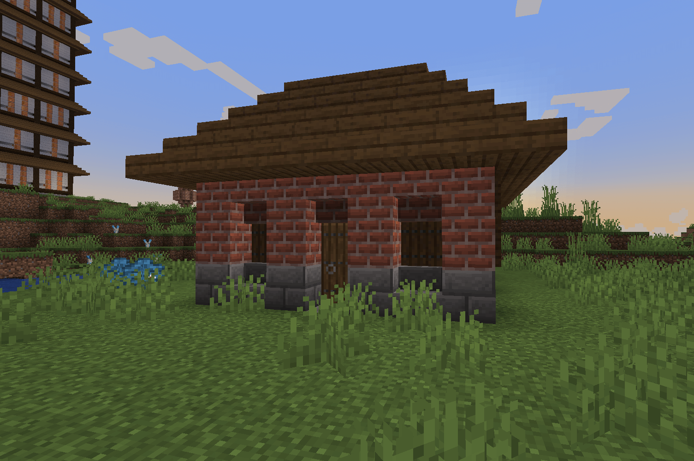

.. _legend_quests:

******************
Legends and Quests
******************

**Extra: Decoration and Exploration Structures**
================================================
The Pokecube adds some decorative blocks and structures for you to explore

Team Rocket's Hideout
~~~~~~~~~~~~~~~~~~~~~~
Team Rocket's hideout is an underground structure that can be found in the biome: Plains
At first glance it looks like just a simple little house, but it is the gateway to the secret base,for you to unlock the door, you need to place a random item inside a secret chest and then the secret door will open revealing the place where you will go down.
inside the structure you will find several trainers from the rocket team and reaching the end of the structure, you face their boss

.. image:: ../_images/legends_wiki/team_rocket_house.png
    :alt: team_rocket

.. image:: ../_images/legends_wiki/giovanni.png
    :alt: team_rocket

Some curiosities:
 * the structure is based on the headquarters of the Red / Blue games;
 * trainers have the pokemon that rocket team trainers have in games;
 * the boss at the end of the base could be Giovanni...

Totens Blocks
~~~~~~~~~~~~~
Totem blocks are decorative blocks with a very interesting utility.
You can see some in the Temple of the Tapus, but they have their own craft, the totems have 4 formats using the Tapus as reference.

.. image:: ../_images/legends_wiki/totem_color.png
    :alt: totem_color

* Craft:

-Totem Block

.. image:: ../_images/legends_wiki/totem_block.png
    :alt: totem_block
	
-Totem Block (Tapu Fini)

.. image:: ../_images/legends_wiki/fini_recipe.png
    :alt: fini_recipe
	
-Totem Block (Tapu Bulu)

.. image:: ../_images/legends_wiki/bulu_recipe.png
    :alt: bulu_recipe
	
-Totem Block (Tapu Lele)

.. image:: ../_images/legends_wiki/lele_recipe.png
    :alt: lele_recipe
	
-Totem Block (Tapu Fini)

.. image:: ../_images/legends_wiki/koko_recipe.png
    :alt: koko_recipe
	
> use the dyes to have color variations for the totems.
	
They also have an offering mechanism, if you deliver an item to the Totem and you receive a potion effect.
The item you offer to the Totem, by default, is a diamond, but you can change that item using datapacks
=======
******************

Strutures
#########

While exploring the world you may find a few different structures, they are the 'Temples of Legendary'. Legendary temples need a key item and a unique quest completed so you can summon it and capture it. But for the most part not all have unique structures, some share the structure.

List of new structures added
~~~~~~~~~~~~~~~~~~~~~~~~~~~~

* Forest Temple (:ref:`celebi`)

.. image:: https://i.imgur.com/Ki90jlX.png
    :alt: Forest Temple

* Ho-oh Temple (:ref:`ho-oh`)

.. image:: https://i.imgur.com/CPj6imX.png
    :alt: Ho-oh Temple

* Legendary tree (:ref:`Kanto Birds Galar Form`)

.. image:: https://i.imgur.com/FHOsKbh.png
    :alt: Legendary tree

* Kubfu Dojo Dark (:ref:`kubfu`)

.. image:: https://i.imgur.com/yuK0vKW.png
    :alt: Kubfu Dojo Dark

* Kubfu Dojo Water (:ref:`kubfu`)

.. image:: https://i.imgur.com/U8Qjqeu.png
    :alt: Kubfu Dojo Water

* Sky Pillar (:ref:`rayquaza`)

.. image:: https://i.imgur.com/w7IulE2.png
    :alt: sky_pillar

* Ruins of Regice (:ref:`regice`)

.. image:: https://i.imgur.com/S4JW9kh.png
    :alt: Ruins of Regice

* Ruins of Regirock (:ref:`regirock`)

.. image:: https://i.imgur.com/BOhi3WL.png
    :alt: Ruins of Regirock

* Ruins of Registeel (:ref:`registeel`)

.. image:: https://i.imgur.com/kydUtVU.png
    :alt: Ruins of Registeel

* Ruins of Regieleki (:ref:`regieleki`)

.. image:: https://i.imgur.com/Z54kcwV.png
    :alt: Ruins of Regieleki

* Ruins of Regidrago (:ref:`regidrago`)

.. image:: https://i.imgur.com/QTQWY1A.png
    :alt: Ruins of Regidrago

* Ruins of Regigigas (:ref:`regigigas`)

.. image:: https://i.imgur.com/Tn6ACv9.png
    :alt: Ruins of Regigigas

* Groudon Altar (:ref:`groudon`)

.. image:: ../_images/legends_wiki/groudon_temple.png
    :alt: Groudon Altar

* Kyogre Altar (:ref:`kyogre`)

.. image:: ../_images/legends_wiki/kyogre_temple.png
    :alt: Kyogre Altar

* Lugia Tower (:ref:`lugia`)

.. image:: https://i.imgur.com/vNFVVeo.png
    :alt: Lugia Tower

* Yveltal Egg (:ref:`yveltal`)

.. image:: https://i.imgur.com/CqrUWEX.png
    :alt: Yveltal Egg

* Xerneas Tree (:ref:`xerneas`)

.. image:: https://i.imgur.com/rjylAOS.png
    :alt: Xerneas Tree

* Keldeo Sword (:ref:`keldeo`)

.. image:: https://i.imgur.com/csrqhU2.png
    :alt: Keldeo Sword

* N's Castle (:ref:`zekrom`/:ref:`reshiram`)

.. image:: https://i.imgur.com/YBOfP50.png
    :alt: tao legendary

* Nature's Altar

(:ref:`thundurus_incarnate`/:ref:`tornadus_incarnate`/:ref:`landorus_incarnate`)

.. image:: https://i.imgur.com/tXuXMKQ.png
    :alt: Thundurus/Tornadus/Landorus Altar

* Altar of Time and Space

(:ref:`dialga`/:ref:`palkia`/:ref:`arceus`)

.. image:: https://vignette.wikia.nocookie.net/pokecube-revival-ptbr/images/9/92/Space_temple.png/revision/latest?cb=20191222022323&path-prefix=pt-br
    :alt: spacetime_altar

* Tapus Temple

(:ref:`tapu_koko`/:ref:`tapu_fini`/:ref:`tapu_lele`/:ref:`tapu_bulu`)

.. image:: ../_images/legends_wiki/tapus_temple.png
    :alt: tapus_temple

* Stone Portal

(:ref:`zacian`/:ref:`zamazenta`)

.. image:: https://i.imgur.com/MoK0pVH.png
    :alt: zacian_zamazenta

Summoning Blocks
~~~~~~~~~~~~~~~~

These blocks are used to summon the legendary. Use the correct key item and spawn the legendary.
Not all blocks have a recipe, those that have can be placed by the player, and those that are not created appear in the structures by the map.

The ones with recipe are:

* The core block of the Regis.

.. image:: https://i.imgur.com/n4nFwkb.png
    :alt: Regirock Core Recipe
.. image:: https://i.imgur.com/E60mPOn.png
    :alt: Regice Core Recipe
.. image:: https://i.imgur.com/pjcyOOd.png
    :alt: Registeel Core Recipe
.. image:: https://i.imgur.com/OocSs7z.png
    :alt: Regielecki Core Recipe
.. image:: https://i.imgur.com/9KUqE1K.png
    :alt: Regidrago Core Recipe
.. image:: https://i.imgur.com/bA6w7KG.png
    :alt: Regigigas Core Recipe

* Victini's Summoning Block.

.. image:: https://i.imgur.com/LleOnJK.png
    :alt: Victini Block
.. image:: https://i.imgur.com/emX2WrL.png
    :alt: Victini Block

* Glastrier and Spectrier Summoning Block.

.. image:: https://i.imgur.com/PXWOLoY.png
    :alt: Horses Block
.. image:: https://i.imgur.com/RdXRiC9.png
    :alt: Horses Block

* Heatran Summoning Block.

.. image:: https://i.imgur.com/wA4YU4s.png
    :alt: Heatran Recipe
.. image:: https://i.imgur.com/CSmWGwp.png
    :alt: Heatran Block

and the blocks that do not have recipes are:

* Legendary Spawn: is used by some legendaries: Groudon / Kyogre / Celebi / Rayquaza / Lugia / Ho-oh

.. image:: https://i.imgur.com/Shvmb3w.png
    :alt: Legendy Block

* Keldeo Summoning Block.

.. image:: https://i.imgur.com/tyHga1l.png
    :alt: keldeo Block

* Yveltal Summoning Block.

.. image:: https://i.imgur.com/78Ad8yn.png
    :alt: Legendy Block

* Xerneas Summoning Block.

.. image:: https://i.imgur.com/wHLRHSc.png
    :alt: Legendy Block

* Thundurus/Tornados/Landorus Summoning Block.

.. image:: https://i.imgur.com/e8r8Ek2.png
    :alt: Legendy Block

* Tao Legendary Spawn: used to summon: Zekrom / Reshiram)

.. image:: https://i.imgur.com/6HDF5ib.png
    :alt: Legendy Block

* Time and Space Spawn: used to summon: Dialga / Palkia / Arceus)

.. image:: https://i.imgur.com/YibXYxO.png
    :alt: Legendy Block
	
* Tapus Core Spawn: use to summon: Tapu Koko / Lele / Fini / Bulu

.. image:: ../_images/legends_wiki/tapus_spawn.png
    :alt: tapus_spawn

Making Type: Null
~~~~~~~~~~~~~~~~~~

Type: Null is a pokemon created in the laboratory, so there's nothing more fair than creating it inside the Pokecube too :b

The first step is to find Aether Paradise, is the new structure that appears in the oceans:

.. image:: https://i.imgur.com/Dgqpt68.png
    :alt: Aether_Paradise

In it, you will find some NPCs to battle, and reaching the top floor you will find the NPC Faba

.. image:: https://i.imgur.com/sI7pTSb.png
    :alt: Faba_Pokecube

Defeating him, you can open the trade menu, and there you will find Imprisonment Helmet, the main item to create Type: Null

>Now comes the part you need to pay attention to!
You will need: Potion of Regeneration, Imprisonment Helmet, Two Pokemob egg

.. image:: https://i.imgur.com/PXL1Y0K.png
    :alt: typenull_recipe

When items are in place, just power Cloning Divece using a Siphon and an electric pokemob (minimum level: 25)

Summoning Regis
~~~~~~~~~~~~~~~

To create the Summon the Regi you have chosen you have two options: Search the Temple or Create your Totem
To create the Totem follow the images:

> For the base you will use the Totem block:

.. image:: https://i.imgur.com/Lfqfjny.png
    :alt: Totem Base Block

> And to the Top, you will use the Core Blocks:

.. image:: https://i.imgur.com/beFe3aH.png
    :alt: Core Blocks

.. image:: https://i.imgur.com/V8op3qw.png
    :alt: Regirock Totem

.. image:: https://i.imgur.com/sWXwl9x.png
    :alt: Registeel Totem

.. image:: https://i.imgur.com/B6njMyJ.png
    :alt: Regice Totem

> You can use any type of Ice for the Totem

.. image:: https://i.imgur.com/BRWpj47.png
    :alt: Regidrago Totem

.. image:: https://i.imgur.com/pi7oobL.png
    :alt: Regieleki Totem

.. image:: https://i.imgur.com/o39sBZH.png
    :alt: Regigigigas Totem

> To Activate, simply use the Key Item of your respective Totem

.. image:: https://i.imgur.com/m7pzAdb.png
    :alt: Keys

> This is true for all blocks that use the key item: if it is out of the correct place of invocation or if it is the block you created and was placed in the wrong place, you will get this message when you try to use a key item in that block.

.. image:: https://i.imgur.com/e9Gi6tz.png
    :alt: wrong location alert

Quests
######

Quest is the way for you to have the legendary pokemon's confidence, and thus capture it. They may change over time and as new Pok�mon Generations arrive.

1. Celebi - Capture about 40 a 50 Pokemob Grass.
2. Entei - Capture about 40 Pokemob Fire.
3. Suicune - Capture about 40 Pokemob Water.
4. Raikou - Capture about 30 Pokemob Electric.
5. Ho-oh - Capture :ref:`entei`/:ref:`suicune`/:ref:`raikou`. (When capturing you get a Rainbow feather)
6. Lugia - Capture :ref:`moltres`/:ref:`articuno`/:ref:`zapdos` >The Galar version can replace that of Kanto. (When capturing you get a Silver feather) 
7. Thundurus/ Landorus/Tornadus - Capture the /:ref:`meloetta_aria`.
8. Keldeo - Capture :ref:`virizion`/:ref:`terrakion`/:ref:`cobalion`.
9. Groudon - Capture about 40 Pokemob Ground and Defeat 40 Pokemob Water.
10. Kyogre - Capture 35 Pokemob Water and Defeat 40 Pokemob Ground.
11. Rayquaza - Capture :ref:`kyogre`/:ref:`groudon`.
12. Registrel/Regice/Regirock/Regieleki/Regidrago - Capture :ref:`relicanth` and :ref:`wailord`.
13. Regigigas - Capture the Five Regis.
14. Dialga/Palkia - Capture :ref:`uxie`/:ref:`mesprit`/:ref:`azelf`.
15. Giratina - Capture :ref:`dialga`//:ref:`palkia`.
16. Arceus - Capture the :ref:`dialga`/:ref:`palkia`/:ref:`giratina`.
17. Victini - Capture about 20 Psychic Pokemob.
18. Volcanion - Capture :ref:`magearna`.
19. Zekrom/Reshiram - Capture about 20 Pokemob Dragon.
20. Kyurem - Capture :ref:`reshiram`/:ref:`zekrom`.
21. Xerneas - Capture about 20 a 30 Pokemob Fairy.
22. Yveltal - Capture about 14 Pokemob Dark.
23. Heatran - Capture about 30 Pokemob Fire.
24. Tapu Koko - Capture about 20 Pokemob Electric
25. Tapu Lele - Capture about 20 Pokemob Psychic
26. Tapu Bulu - Capture about 20 Pokemob Grass
27. Tapu Fini - Capture about 20 Pokemob Water
28. Necrozma - Capture :ref:`solgaleo`/:ref:`lunala`.
29. Zacian/Zamazenta - Capture 18 Pokemob Steel.
30. Eternatus - Capture :ref:`zacian`/:ref:`zamazenta`.
31. Glastrier/Spectrier - Capture :ref:`calyrex`.

**Quest for Items**
-------------------
Some quests can give the summoning items of some legendary ones, but don't worry, you can get them by purchasing from Merchant or with a trainer from the map

1. Regis -Capture: Relicanth and Wailord. Reward: Regice,Registeel,Regirock,Regielecki,Regidrago Core.
2. Regigigas -Capture: All Regis. Reward: Regigigas Orb.
3. Uxie,Mespret,Azelf -Reward: mirror parts of Giratinas.
4. Shaymin -Reward: Gracidea.
5. Hoopa -Reward: Prison Bottle.
6. Kyurem -Reward: The two DNA to change the shape to Black/White.
7. Necrozma -Reward: The two items to change the shape of Solgaleo and Lunala.
8. Tapus -Capture and Defeat: Gumshoos, Raticate Alola, Wishiwashi, Salazzle, Lurantis, Vikavolt, Mimikyu, Kommo-o. Reward: Koko,Bulu,Lele,Fini Orb.
9. Glastrier/Spectrier -Reward: Regardless of which to capture, you win the item.

> Not all legends are within Quest or Requisition, and these are exactly the ones you use to get stronger legends. You can see if they appear in the world or are stuck in the blocks; To find out, just go to his Pokewatch page and go to Spawn tab, if it is at 0% he can only be summoned or appear in Hoopa Portals.

Key items
#########

The legendary Pokemon that are Spawned by Altars precision beyond the Quest, a Key Item. This key item can be purchased by the Merchant from NPC villages, or by completing Quest where each Quest has its own reward.

>You can see the quests from the legends here:

.. image:: https://i.imgur.com/ANAaDGb.png
    :alt: Legends Quests

>The items also warn about how to get them, just use SHIFT on the item and it will have a yellow alert:

.. image:: https://i.imgur.com/NPusMjt.png
    :alt: Reward

Each item has its requirement, but if it does not have a yellow warning, it means that the Player can craft it

.. image:: https://i.imgur.com/zJIcSMC.png
    :alt: Reward_none

.. image:: https://i.imgur.com/NPusMjt.png
    :alt: Reward2
.. image:: https://i.imgur.com/dKg0RmY.png
    :alt: Reward3
.. image:: https://i.imgur.com/W7akEoA.png
    :alt: Reward4

> If you try to use the key item without completing the quest, it will give you a warning, stating the requirements to capture the pokemon in which you used the item.

.. image:: https://i.imgur.com/JOOiuk7.png
    :alt: Alert key item

* Celebi - Uses the Green Orb to summon it.
* Ho-oh - Uses the Legendary Orb to summon it.
* Lugia - Uses the Ocean Orb to summon it.
* Thundurus / Tornadus / Landorus - You use the respective runes to summon each one. (Orange / Green / Blue Rune)
* Keldeo - Uses the Keldeo Sword to summon it.
* Dialga - Uses the Adamant Orb to summon it.
* Plakia - Uses the Lustrous Orb) to summon it.
* Arceus - Uses Azure Flute to summon it.
* Groudon - Uses Red Orb to summon it.
* Kyogre - Uses the Blue Orb to summon it.
* Rayquaza - Uses the Ancient Stone to summon it.
* Registrel / Regirock / Regice / Regieleki / Regidrago - Use your 'Item Core' to summon them. (Ice / rock / steel / drago / thunder core)
* Victini - Uses Emblem to summon it.
* Regigias - Use Orb Regigigas to summon it.
* Yveltal - Uses the Destruction Orb to summon it.
* Xerneas - Uses Life Orb to summon it.
* Zamazenta - Uses the Rusted Shield to summon it.
* Zacian - Uses the Rusted Sword to summon him.
* Heatran - Uses Magma Core to summon it.
* Reshiram - Uses Light Stone to summon it.
* Zekrom - Uses Dark Stone to summon it.
* Tapu Koko - Uses Koko Orb to summon it.
* Tapu Lele - Uses Lele Orb to summon it.
* Tapu Fini - Uses Fini Orb to summon it.
* Tapu Bulu - Uses Bulu Orb to summon it.
* Glastrier - Uses Iceroot Carrot to summon it.
* Spectrier - Uses Shaderoot Carrot to summon it.
* Kanto Birds Galar Form - Appear near Legendary Tree. Need not be invoked.

>Key items that have a recipe:

.. image:: https://i.imgur.com/hfq0wiA.png
    :alt: recipe
.. image:: https://i.imgur.com/ddRAdcA.png
    :alt: recipe
.. image:: https://i.imgur.com/TMXRWzR.png
    :alt: recipe
.. image:: https://i.imgur.com/mErl3xL.png
    :alt: recipe
.. image:: https://i.imgur.com/xcIUh0V.png
    :alt: recipe
.. image:: https://i.imgur.com/Vknr7cF.png
    :alt: recipe
.. image:: https://i.imgur.com/k0XMFYm.png
    :alt: recipe
.. image:: https://i.imgur.com/RzIhcQP.png
    :alt: recipe
.. image:: https://i.imgur.com/pHL4s3i.png
    :alt: recipe
.. image:: https://i.imgur.com/bvmCqnG.png
    :alt: recipe
.. image:: https://i.imgur.com/uHRVqGp.png
    :alt: recipe
.. image:: https://i.imgur.com/vP6GUni.png
    :alt: recipe
.. image:: https://i.imgur.com/YDYO6F5.png
    :alt: recipe

>Key item that has no recipe:

.. image:: https://i.imgur.com/hq6oTds.png
    :alt: no_recipe
.. image:: https://i.imgur.com/NfkEhuf.png
    :alt: no_recipe
.. image:: ../_images/legends_wiki/tapus_spawn.png
    :alt: no_recipe

Key Items (Evolution/ Change Form)
~~~~~~~~~~~~~~~~~~~~~~~~~~~~~~~~~~

some legendary items, despite having a quest, are not used to summon the legendary, but to evolve or change it
>Here is a list of items that are acquired by Quest / Localization / Purchase or Crafting

* Scrolls of Elements: Used to evolve :ref:`kubfu` into the Dark and Water styles

.. image:: https://i.imgur.com/zmK0um4.png
    :alt: Reward4

* Reins of Unity: Use to change the shape of the :ref:`glastrier`/:ref:`spectrier` for the Mounted Calyrex

.. image:: https://i.imgur.com/MrheDAV.png
    :alt: Reward4

* Reveal Glass: Use to change the shapes of Nature's Trio

.. image:: https://i.imgur.com/39oGxJE.png
    :alt: Reward4

* DNA Splicer-A/B: Use to change the shape of the Kyurem

.. image:: https://i.imgur.com/F4fUfcC.png
    :alt: Reward4

* Prison Bottle: Use to change the shapes of the :ref:`hoopa_confined`

.. image:: https://i.imgur.com/B9KKY73.png
    :alt: Reward4

* Zygarde Cube: Use to change the shapes of the :ref:`zygarde_50`

.. image:: https://i.imgur.com/2PuS9kn.png
    :alt: Reward4

* Gracidea: Use to change the shapes of the :ref:`shaymin_land`

.. image:: https://i.imgur.com/XSM0V5s.png
    :alt: Reward4

* Griseous Orb: Use to change the shapes of the :ref:`giratina`

.. image:: https://i.imgur.com/UsOmCGh.png
    :alt: Reward4

* Meteorite : Use to change the shapes of the :ref:`deoxys`

.. image:: https://i.imgur.com/fTYLpgp.png
    :alt: Reward4

* N-Solarizer/N-Lunarizer: Use to change the shapes of the :ref:`solgaleo` and :ref:`lunala`

.. image:: https://i.imgur.com/GmzKAId.png
    :alt: Reward4

* Z-Crystal (Psychic): Use to change the shapes of the :ref:`necrozma`

* Rusted Shield/Rusted Sword: Use to change the shapes of the :ref:`zacian` and :ref:`zamazenta`

.. image:: https://i.imgur.com/3xR4c2T.png
    :alt: Reward4

Legendary and their respective Spawn blocks
###########################################

.. image:: https://i.imgur.com/ZHtzo7s.png
    :alt: legendy
.. image:: https://i.imgur.com/RfMamiX.png
    :alt: legendy
.. image:: https://i.imgur.com/7PtaWhM.png
    :alt: legendy
.. image:: https://i.imgur.com/7iTK6zC.png
    :alt: legendy
.. image:: https://i.imgur.com/Dvfz4tM.png
    :alt: legendy
.. image:: https://i.imgur.com/me8qiG0.png
    :alt: legendy
.. image:: https://i.imgur.com/QiTdpX3.png
    :alt: legendy
.. image:: https://i.imgur.com/WQPbRWu.png
    :alt: legendy
.. image:: https://i.imgur.com/ostVmm9.png
    :alt: legendy
.. image:: https://i.imgur.com/vhgnXX9.png
    :alt: legendy
.. image:: https://i.imgur.com/wgfRymz.png
    :alt: legendy
.. image:: https://i.imgur.com/L8k8W6q.png
    :alt: legendy
.. image:: https://i.imgur.com/j8SbLMc.png
    :alt: legendy
.. image:: https://i.imgur.com/eVdWXZX.png
    :alt: legendy
.. image:: https://i.imgur.com/g9ZPnwH.png
    :alt: legendy
.. image:: https://i.imgur.com/XD26Tim.png
    :alt: legendy
.. image:: https://i.imgur.com/KJOtWOa.png
    :alt: legendy

