.. _legend_quests:

******************
Legends and Quests
******************

**Introduction**
================
The |Pokecube| has bases that complement each other, Legends is one of those bases.
|Pokecube| Legends is the part that manages structures/dimensions and how legendary |pokemob| behave, both in spawn and capture.
On this page you will find information about the structures of the legends, their spawn forms, decorative blocks, exclusive blocks of legends and extra information. 

About dimensions, there is an exclusive page for it, you can see it by clicking here: :ref:`legend_dimensions`

**Exploration Structures**
==========================
In this expansion, several structures were added, and in this part we'll look at exploration structures.
Exploitation structures are buildings that do not have links with legendary |pokemob|, they can be explored by players to get items or special trades.

Raids!
~~~~~~
The Raids are here, and you can get strong |pokemob| and Gigantamax! Just find the Spots and start the battle!

**Raid Block**

.. image:: ../_images/legends_wiki/raid_block.png
   :alt: raid_info

**Raid Structure**

**Raid Dynamax Pokémob**

.. image:: ../_images/legends_wiki/raid_pokemob.png
   :alt: raid_info

* Informações (Mechanics/Itens/Moves)

Defeated |pokemob| drop Raid's exclusive items, but if you catch them, those items will be in the |pokemob| inventory
Items are random, mixing |pokemob| Loot Table with Raid items.

Itens
~~~~~

**Wishing Piece:** is the item you use to activate Raid. But don't worry, Raids are reactivated after a while if you don't get this item.

.. image:: ../_images/legends_wiki/items/shard.png
   :alt: raid_info

**Gigant Shard:** is the item you use to get Gigantamax! To use it, choose a |pokemob| that has Gigantamax and click on it with the item in hand **!DO NOT PUT INTO THE INVENTORY!**,
if the item disappears from your hand it means that it worked, otherwise, check if the chosen |pokemob| has gigantamax. (Capturing |pokemob| in gigantamax form doesn't need to use the item!)

**Mints:** This item can change your |pokemob| Nature, just use it in the same way as the Gigant Shard.

.. image:: ../_images/legends_wiki/items/adamantmint.png
   :alt: raid_info

**Z-Crystal:** are the items that grant the Z-Move.

.. image:: ../_images/legends_wiki/items/z_water.png
   :alt: raid_info

Catch |Pokemob| Raid
~~~~~~~~~~~~~~~~~~

To capture the |pokemob| of the raid we need two factors:

* 1º - The |pokemob| needs to be extremely low on health!
* 2º - You need to use Dynamax Cube to capture!

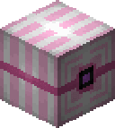

To create a Dynamax Cube you use: 

* You can use any Poke Cube to create the Dynamax Cube!

.. image:: ../_images/legends_wiki/dynamax_ball_crafting.png
   :alt: raid_info

**Be aware that Dynamax Cube doesn't use the capture chance of the Poke Cube you use in the Recipe, so if you use a Master Cube for the recipe, it will work like a normal Poke Cube!**

.. image:: ../_images/legends_wiki/dynamax_catch.png
   :alt: raid_info

> Currently, after capture, the Dynamax Cube will become a common Poke Cube, in the future it will be modified to return the Poke Cube used in the recipe!

Use (Dynamax/Gigantamx/Z-Move)
~~~~~~~~~~~~~~~~~~~~~~~~~~~~~~~~~~~~~

**Dyna/G-Moves:** To use the unique moves of these shapes, first you need to go to the Controls Menu and add a key in the |pokecube| area and then G/Z-Move.
Once this is done, you need to be in an area that allows you to use Dynamax. **Raids** allow by default the use of Dynamax, as well as the **gyms in village**.
But if you want to create a spot outside these places, just create the Max Spot block. 

After everything is ready, just press the **-M-** button **(remember that you need to be equipped with a mega evolution item: hat, ring, etc)** and your |pokemob| becomes Dynamax.
While your |pokemob| is in this form, press the previously configured key and the Moves will be changed to Dynamax Moves.

**Z-Moves:** Z-Moves increase the strength of a specific move of your |pokemob|. To use it, you need to equip z-move in |pokemob| and it needs to have a move corresponding to z-crystal **(Z-Crystal Grass = Move Grass)**
With that in mind, just click the configured key and the move will become the Z-Move, but **ATTENTION!** the move can only be executed once, to execute it multiple times you need to collect your |pokemob| and throw it back into battle.
|Pokemob| exclusive Z-Crystals are integrated with base Z-Crytals, the difference is that the specific |pokemob| needs to have the specific Move to use the exclusive Z-Move.

**An example:**

* Pikachu with Thunderwave, if you use electric Z-move, it will use Gigavolt Havoc

* Pikachu with Thunderbolt, if you use the electric Z-move, it will use 10,000,000 Volt Thunderbolt

Team's Hideout
~~~~~~~~~~~~~~
The hideouts are structures based on the villain teams from the Pokémon games, in the mod you can find three secret bases: Rocket, Magma and Aqua.
The structures differ in their subterranean base, but have a similar top, which makes the structure more versatile when generated in the world.

The Bases only appear in the **Biome: Plain**

* Base Entrance:

.. image:: ../_images/legends_wiki/team_magma_top.png
   :alt: teams_hideout
.. image:: ../_images/legends_wiki/team_rocket_top_1.png
   :alt: teams_hideout
.. image:: ../_images/legends_wiki/team_rocket_top_2.png
   :alt: teams_hideout

* Team Rocket's base has a look reminiscent of the Red/Blue games; At the end of the structure, you can battle Giovanni.

.. image:: ../_images/legends_wiki/team_rocket_room_a.png
   :alt: teams_hideout
.. image:: ../_images/legends_wiki/team_rocket_room_b.png
   :alt: teams_hideout
.. image:: ../_images/legends_wiki/team_rocket_room_c.png
   :alt: teams_hideout
.. image:: ../_images/legends_wiki/team_rocket_giovanni.png
   :alt: teams_hideout

* The Team Magma base looks similar to the Team Rocket base, but with alternate paths, you can battle Maxie.

.. image:: ../_images/legends_wiki/team_magma_room_1.png
   :alt: teams_hideout
.. image:: ../_images/legends_wiki/team_magma_room_2.png
   :alt: teams_hideout

* The Team Aqua base looks similar to the Team Rocket base, but with alternate paths, you can battle Archie.

.. image:: ../_images/legends_wiki/team_magma_room_1.png
   :alt: teams_hideout
.. image:: ../_images/legends_wiki/team_magma_room_2.png
   :alt: teams_hideout

Elite Four
~~~~~~~~~~
Yes, there is an elite four. But in this case, it's much more complicated to beat her! The structure has four trainers, which are rotated when the structure is generated, so you will always have different trainers when you find the building. Trainers sell strong items, but they also have strong |pokemob|, so be warned!
The structure appears in all biomes, except Oceans and Beaches.

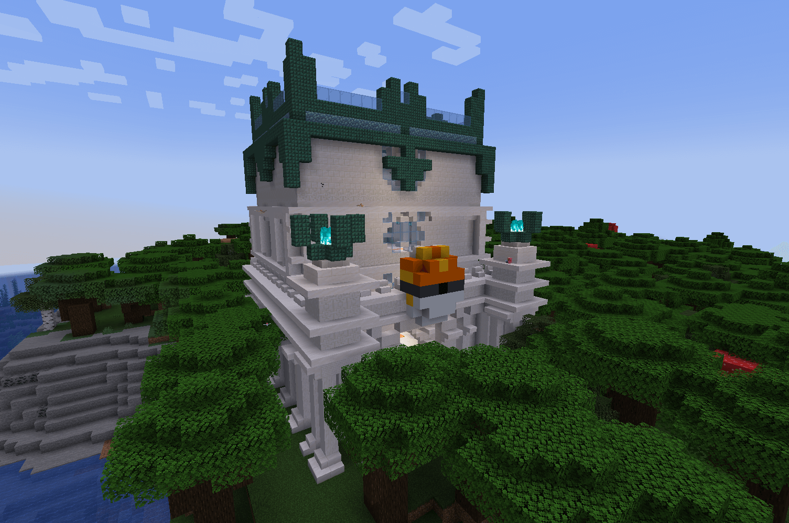
.. image:: ../_images/legends_wiki/elite_four_room_1.png
   :alt: elite_four
.. image:: ../_images/legends_wiki/elite_four_room_top.png
   :alt: elite_four

.. _aether_foundation:

Aether Foundation
~~~~~~~~~~~~~~~~~
The Aether Foundation has more than the function of an exploration structure, you can live in the structure, as it is considered a "Village",
you can battle and buy important items with Organization bosses.

The structure appears in Biome: Warm Ocean.

.. image:: ../_images/legends_wiki/aether_f_merchant.png
   :alt: aether_foundation
.. image:: ../_images/legends_wiki/aether_f_mainroom.png
   :alt: aether_foundation
.. image:: ../_images/legends_wiki/aether_f_labroom.png
   :alt: aether_foundation
.. image:: ../_images/legends_wiki/aether_f_extraroom.png
   :alt: aether_foundation
.. image:: ../_images/legends_wiki/aether_f_underwater_room.png
   :alt: aether_foundation
.. image:: ../_images/legends_wiki/aether_f_bossroom_1.png
   :alt: aether_foundation

**Miscellaneous Blocks**
========================
In addition to the structures, the Legends expansion adds some extra blocks to the mod, some are just aesthetic and some have unique functions!

Totens Blocks
~~~~~~~~~~~~~

.. image:: ../_images/legends_wiki/totens_decoratives.png
   :alt: totens_decoratives
		
The Totem Blocks are decorative blocks themed by the Tapus of Alola |pokemob|.
Each totem has a special function, which can be activated by right-clicking and holding one of the list items:

.. image:: ../_images/legends_wiki/tapus_totems.png
    :alt: totem_items

[Diamond] - The list can be customized by Datapacks!

Each totem gives the player a temporary effect and can be used anywhere:

* Tapu Koko Totem [Speed Effect]

* Tapu Bulu Totem [Resistance Effect]

* Tapu Fini Totem [Health Boost Effect]

* Tapu Lele Totem [Glowing Effect]

Recipes:

**Totem Block**

**Totem Block (Tapu Fini)**

.. image:: ../_images/legends_wiki/fini_recipe.png
    :alt: fini_recipe
	
**Totem Block (Tapu Bulu)**

.. image:: ../_images/legends_wiki/bulu_recipe.png
    :alt: bulu_recipe
	
**Totem Block (Tapu Lele)**

.. image:: ../_images/legends_wiki/lele_recipe.png
    :alt: lele_recipe
	
**Totem Block (Tapu Fini)**

.. image:: ../_images/legends_wiki/koko_recipe.png
    :alt: koko_recipe
	
> use the dyes to have color variations for the totems.

.. image:: ../_images/legends_wiki/totem_color.png
    :alt: totem_color

Mirage Spot
~~~~~~~~~~~
Another curious block is the Mirage Spot, but you might know it as Hoopa Portal.
This block can spawn a random |pokemob| (except Legendary). You currently cannot get it in survival. But one way to get in touch with this block is to have a Hoopa. 

**If you have a Hoopa, it must have Move: Hyperspace Hole and have LV: 40 or higher**

**If your Hoopa meets the requirements you can generate a portal. Just use the move out of combat. The creation of the portal has a cooldown, so it cannot be spammed.**

**If the block is placed in the creative, that is, without being created by Hoopa, the portal creates an internal cooldown and is disabled until the time runs out and is reactivated**

**[Remembering that all these options are customized in mod settings or by Datapacks]**

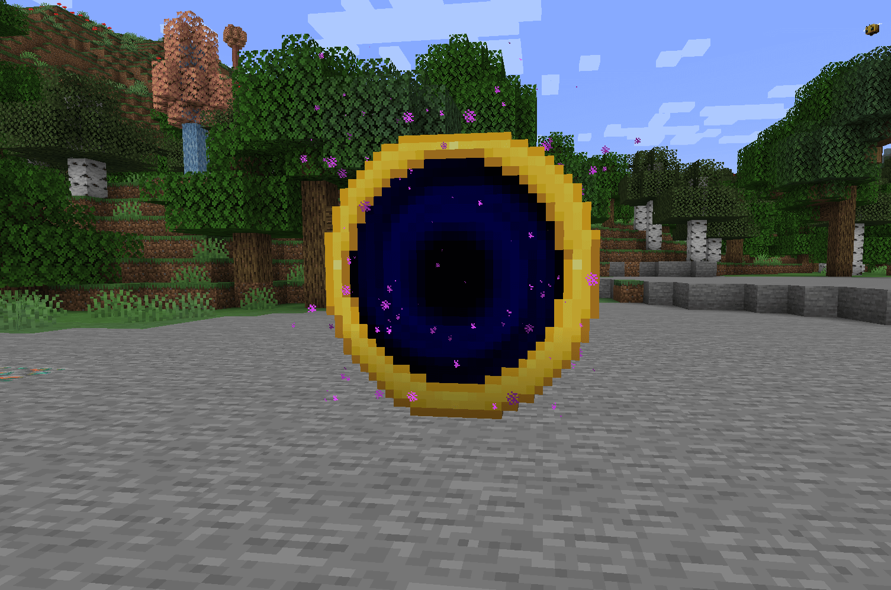

**Legendary Structures**
========================
While exploring the world you may find a few different structures, they are the 'Temples of Legendary'. Legendary temples need a key item and a unique quest completed so you can summon it and capture it. But for the most part not all have unique structures, some share the structure.

List of new structures added
~~~~~~~~~~~~~~~~~~~~~~~~~~~~

**Forest Temple** (:ref:`celebi`)

* Biome: Forest

**Ho-oh Temple** (:ref:`ho-oh`)

* Biome: Plains

.. image:: ../_images/legends_wiki/ho_oh_tower_room_1.png
    :alt: Ho-oh Temple
.. image:: ../_images/legends_wiki/ho_oh_tower_room_2.png
    :alt: Ho-oh Temple

**Legendary Tree** (Articuno/Zapdos/Moltres Galar)

* Biome: Plains

.. image:: ../_images/legends_wiki/legendy_tree.png
    :alt: Legendary tree
.. image:: ../_images/legends_wiki/legendy_tree_base.png
    :alt: Legendary tree

**Kubfu Dojo** (:ref:`kubfu`)

* Biome: Extreme Hills

.. image:: ../_images/legends_wiki/kubfu_dojo_inside.png
    :alt: Kubfu Dojo

**Kubfu Tower Dark** (:ref:`kubfu`)

* Biome: Extreme Hills

**Kubfu Tower Water** (:ref:`kubfu`)

* Biome: Beach

**Sky Pillar** (:ref:`rayquaza`)

* Biome: Ocean

.. image:: ../_images/legends_wiki/sky_pillar_room.png
    :alt: sky_pillar

**Ruins of Regice** (:ref:`regice`)

* Biome: Snown

.. image:: ../_images/legends_wiki/regice_temple_inside.png
    :alt: Ruins of Regice
.. image:: ../_images/legends_wiki/regice_totem_room.png
    :alt: Ruins of Regice

**Ruins of Regirock** (:ref:`regirock`)

* Biome: Desert

.. image:: ../_images/legends_wiki/regirock_temple_inside.png
    :alt: Ruins of Regirock
.. image:: ../_images/legends_wiki/regirock_totem_room.png
    :alt: Ruins of Regirock

**Ruins of Registeel** (:ref:`registeel`)

* Biome: Extreme Hills

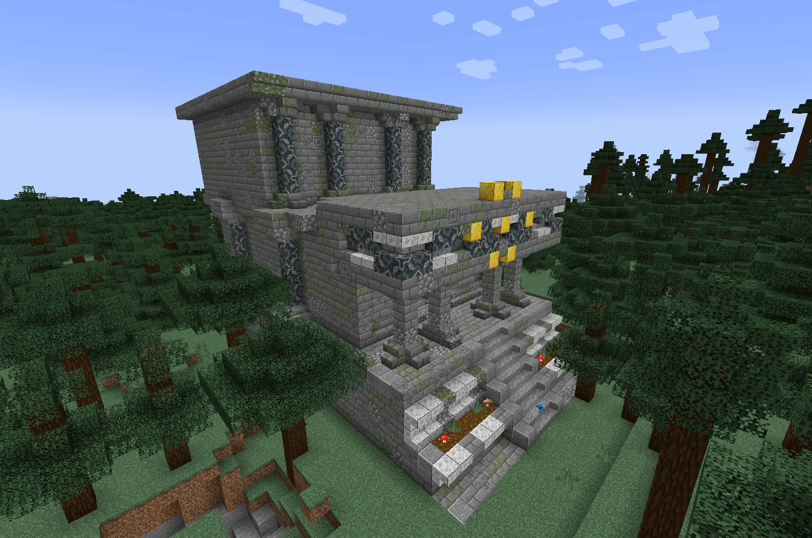
.. image:: ../_images/legends_wiki/registeel_temple_inside.png
    :alt: Ruins of Registeel
.. image:: ../_images/legends_wiki/registeel_totem_room.png
    :alt: Ruins of Registeel

**Ruins of Regieleki** (:ref:`regieleki`)

* Biome: Savanna

.. image:: ../_images/legends_wiki/regielec_temple.png
    :alt: Ruins of Regieleki
.. image:: ../_images/legends_wiki/regielec_temple_inside.png
    :alt: Ruins of Regieleki
.. image:: ../_images/legends_wiki/regielec_totem_room.png
    :alt: Ruins of Regieleki

**Ruins of Regidrago** (:ref:`regidrago`)

* Biome: Badlands

.. image:: ../_images/legends_wiki/regidrago_temple_inside.png
    :alt: Ruins of Regice
.. image:: ../_images/legends_wiki/regidrago_totem_room.png
    :alt: Ruins of Regice

**Ruins of Regigigas** (:ref:`regigigas`)

* Biome: Snow

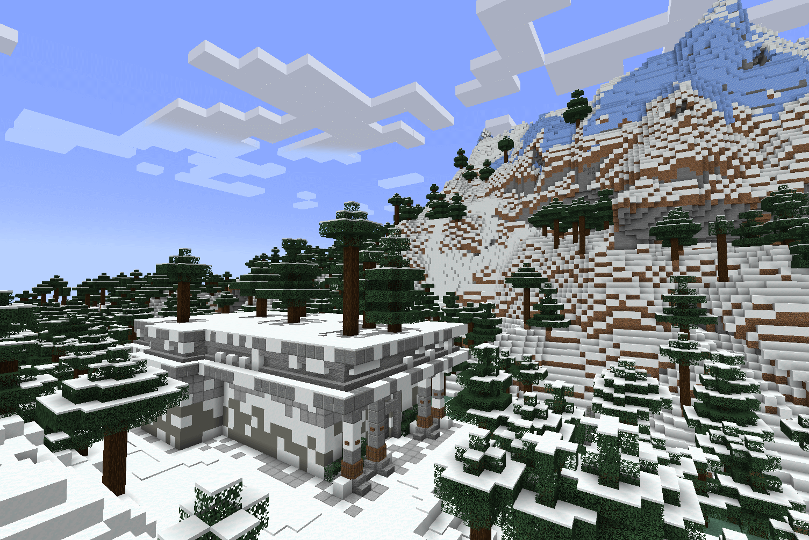
.. image:: ../_images/legends_wiki/regigigas_mainroom.png
    :alt: Ruins of Regice
.. image:: ../_images/legends_wiki/regigigas_totemroom.png
    :alt: Ruins of Regice

**Groudon Altar** (:ref:`groudon`)

* Dimension: Nether

.. image:: ../_images/legends_wiki/groudon_temple.png
    :alt: Groudon Altar

**Kyogre Altar** (:ref:`kyogre`)

* Biome: Ocean

**Lugia Tower** (:ref:`lugia`)

* Biome: Desert

**Xerneas Tree** (:ref:`xerneas`)

* Biome: Dark Oak Forest

**Keldeo Altar** (:ref:`keldeo`)

* Biome: Extreme Hills

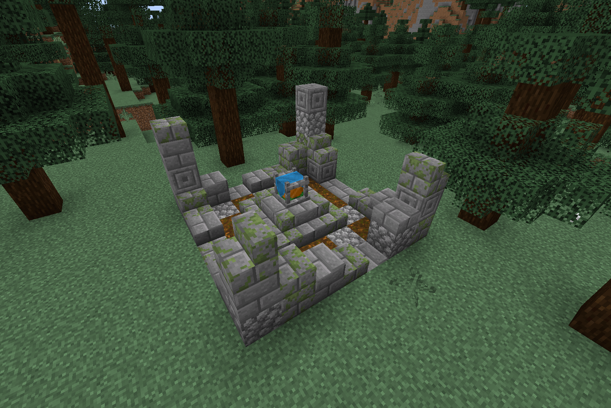

**N's Castle** (:ref:`zekrom`/:ref:`reshiram`)

* Biome: Taiga

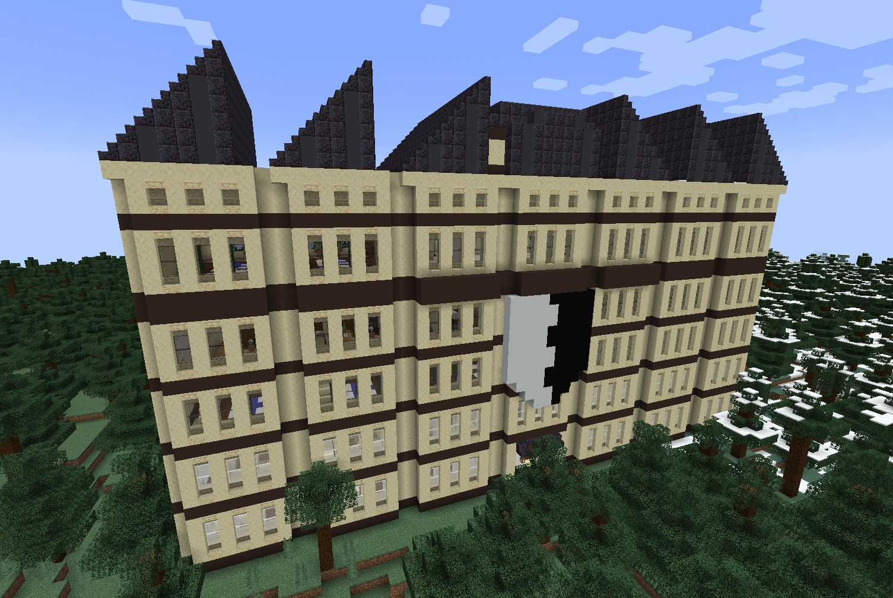
.. image:: ../_images/legends_wiki/castle_n_room_1.png
    :alt: tao legendary
.. image:: ../_images/legends_wiki/castle_n_room_2.png
    :alt: tao legendary

**Nature's Altar** (:ref:`thundurus_incarnate`/:ref:`tornadus_incarnate`/:ref:`landorus_incarnate`)

* Biome: Swamp

.. image:: ../_images/legends_wiki/nature_place.png
    :alt: Thundurus/Tornadus/Landorus Altar

**Altar of Time and Space** (:ref:`dialga`/:ref:`palkia`/:ref:`arceus`)

* Dimension: The End

**Tapus Temple**
(:ref:`tapu_koko`/:ref:`tapu_fini`/:ref:`tapu_lele`/:ref:`tapu_bulu`)
 
* Biome: Beach

.. image:: ../_images/legends_wiki/tapus_temple.png
    :alt: tapus_temple

.. image:: ../_images/legends_wiki/tapus_room.png
    :alt: tapus_temple
	
**Necrozma Tower** (:ref:`necrozma`) 

* Dimension: Ultra Space / Biome: Ultra Dark Valley

.. image:: ../_images/legends_wiki/necrozma_tower.png
    :alt: necrozma_tower

**Stone Portal** (:ref:`zacian`/:ref:`zamazenta`)

* Biome: River

Treasure Maps
~~~~~~~~~~~~~
An alternative way to locate the legendary structures is to search for treasure maps!
They are located in this structure, similar to a ruin.

When you open the chest you will find maps with the location of the structures.

.. image:: ../_images/legends_wiki/treasure_maps.png
    :alt: treasure map

.. image:: ../_images/legends_wiki/treasure_map_looking.png
    :alt: treasure map

**Summoning Blocks**
====================
These blocks are used to summon the legendary. Use the correct key item and spawn the legendary.
Not all blocks have a recipe, those that have can be placed by the player, and those that are not created appear in the structures by the map.

The ones with recipe are:

.. image:: ../_images/legends_wiki/lengedary_blocks_recipes.png
    :alt: regis blocks view
	
**The core block of the Regis**

.. image:: ../_images/legends_wiki/regirock_block_recipe.png
    :alt: Regirock Core Recipe

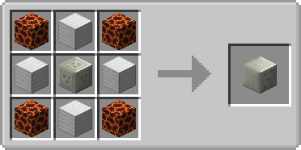

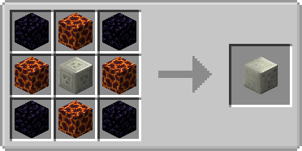
.. image:: ../_images/legends_wiki/regigigas_block_recipe.png
    :alt: Regigigas Core Recipe

**Victini's Summoning Block**

.. image:: ../_images/legends_wiki/vicktini_block_recipe.png
    :alt: Victini Block

**Trough Block Summoning Block: Glastrier and Spectrier**

**Heatran Summoning Block**

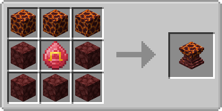

**Magearna Summoning Block**

**Legendary Summoning Block**

.. image:: ../_images/legends_wiki/legendary_block_recipe.png
    :alt: Legendary Recipe

and the blocks that do not have recipes are:

.. image:: ../_images/legends_wiki/lengedary_blocksno_recipe.png
    :alt: Legendy Blocks No Recipe

.. _make_type_null:

**Laboratory: Making Type Null**
================================

Type: Null is a |pokemob| created in the laboratory, so there's nothing more fair than creating it inside the |Pokecube| too :b

The first step is to find Aether Paradise, is the new structure that appears in the oceans:

In it, you will find some NPCs to battle, and reaching the top floor you will find the NPC Faba

.. image:: ../_images/legends_wiki/faba_room.png
    :alt: Faba_Pokecube

Defeating him, you can open the trade menu, and there you will find Imprisonment Helmet, the main item to create Type: Null

**Now comes the part you need to pay attention to!**

You will need: Potion of Regeneration II, Imprisonment Helmet, Two |pokemob| eggs

.. image:: ../_images/legends_wiki/typenull_recipe.png
    :alt: typenull_recipe

When items are in place, just power the :ref:`cloner` using an :ref:`siphon` and an electric |pokemob| (Higher levels make this go much faster).

**Making Golens of Regis**
==========================

In order to be able to summon the Regis you need to locate their temples. Each Regi has its own temple with a totem already built, if you play on a server or the temple doesn’t have the totem, you can build it (but this building must be inside the temple!)

**To create the Golem follow the images:**

For the base you will use the Golem Stone:

.. image:: ../_images/legends_wiki/golem_block_recipe.png
    :alt: Golem Base Block

And to the Top, you will use the Core Blocks:

.. image:: ../_images/legends_wiki/golens_build_1.png
    :alt: Cores Golem Blocks

> You can use any type of Ice for the Ice Golem

To Activate, simply use the Key Item of your respective Golem

.. image:: ../_images/legends_wiki/items/dragocore.png
    :alt: Keys
.. image:: ../_images/legends_wiki/items/thundercore.png
    :alt: Keys
.. image:: ../_images/legends_wiki/items/icecore.png
    :alt: Keys

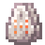
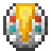

> This is true for all blocks that use the key item: if it is out of the correct place of invocation or if it is the block you created and was placed in the wrong place, you will get this message when you try to use a key item in that block.
The correct location is just in the Golem temple area, if you want to remove this restriction, you need to create a Datapack by modifying the Spawn location.

.. image:: https://i.imgur.com/e9Gi6tz.png
    :alt: wrong location alert

**Secondary Spawn**
===================

Some |pokemob|, even though they appear naturally through biomes, can be summoned by items. These items cannot be acquired by Quest, only by purchasing with Merchants and Trainers after being defeated. Currently, not all Legendaries have a Secondary Spawn, but in the future everyone will have this option.

They are for the respective |pokemobs|:

* Articuno
.. image:: ../_images/legends_wiki/items/ice_wing.png
    :alt: Articuno Item

* Articuno Galar Form
.. image:: ../_images/legends_wiki/items/ice_dark_wing.png
    :alt: Articuno Item

* Moltres
.. image:: ../_images/legends_wiki/items/fire_wing.png
    :alt: Moltres Item

* Moltres Galar Form
.. image:: ../_images/legends_wiki/items/dark_fire_wing.png
    :alt: Moltres Item

* Zapdos
.. image:: ../_images/legends_wiki/items/electric_wing.png
    :alt: Zapdos Item

* Zapdos Galar Form
.. image:: ../_images/legends_wiki/items/static_wing.png
    :alt: Zapdos Item

* Entei
.. image:: ../_images/legends_wiki/items/flame_gem.png
    :alt: Entei Item

* Raikou

* Suicune

* Deoxys

* Jirachi

* Latios/Latias
.. image:: ../_images/legends_wiki/items/soul_dew.png
    :alt: Latios Latias Item

* Cresselia
.. image:: ../_images/legends_wiki/items/lunar_wing.png
    :alt: Cresselia Item

* Darkrai
.. image:: ../_images/legends_wiki/items/nightmare_book.png
    :alt: Darkrai Item

* Manaphy
.. image:: ../_images/legends_wiki/items/manaphy_necklace.png
    :alt: Manaphy Item

* Hoopa Confined
.. image:: ../_images/legends_wiki/items/prisonbottle.png
    :alt: Hoopa Item

* Meloetta
.. image:: ../_images/legends_wiki/items/meloetta_ocarina.png
    :alt: Meloetta Item

* Kyurem
.. image:: ../_images/legends_wiki/items/kyurem_core.png
    :alt: Kyurem Item

* Virizion
.. image:: ../_images/legends_wiki/items/virizion_sword.png
    :alt: Virizion Item

* Cobalion

* Terrakion

* Diancie
.. image:: ../_images/legends_wiki/items/diamond_gem.png
    :alt: Diancie Item

* Azelf
.. image:: ../_images/legends_wiki/items/azelf_gem.png
    :alt: Azelf Item

* Mesprit
.. image:: ../_images/legends_wiki/items/mesprit_gem.png
    :alt: Mesprit Item

* Uxie
.. image:: ../_images/legends_wiki/items/uxie_gem.png
    :alt: Uxie Item

* Volcanion
.. image:: ../_images/legends_wiki/items/steam_core.png
    :alt: Volcanion Item

* Cosmog
.. image:: ../_images/legends_wiki/items/cosmic_orb.png
    :alt: Cosmog Item

* Kubfu
.. image:: ../_images/legends_wiki/items/kubfu_spawn.png
    :alt: Kubfu Item

* Calyrex
.. image:: ../_images/legends_wiki/items/wooden_crown.png
    :alt: Calyrex Item

**with this addition, these pokémobs have catch rules, just like pokémob that can only be summoned Lugia/Kyogre for example!**

for you to invoke them, get the item from the |pokemob| respective and look for the structure it needs, or place the main block in the requested biome:

* Zapdos/Moltres/Articuno > Lugia Tower
* Zapdos/Moltres/Articuno Galar Form > Legendy Tree
* Entei/Raikou/Suicune > Ho-oh Tower
* Deoxys/Jirachi > Sky Pillar
* Latios > Legendary Block place in Biome: Stone Beach
* Latias > Legendary Block place in Biome: Beach
* Darkrai > Ruins of Yveltal
* Cresselia > Sky Pillar
* Manaphy > Kyogre Temple
* Uxie/Mesprit/Azelf > Zacian/Zamazenta Temple
* Meloetta > Nature Temple
* Kyurem > Legendary Block place in Biome: Snowy (any biome that has snow, except mountain peaks)
* Hoopa > Legendary Block place in Biome Ruins
* Volcanion > Magearna Block place in Biome: Village
* Diancie > Legendary Block place in Biome: Extreme Hills
* Cobalion/Virizion/Terrakion > Keldeo Altar
* Zygarde > Ruins of Yveltal/Xerneas Tree
* Cosmog > Time Space Altar
* Calyrex > Trough Block place in Biome: Taiga

.. _quests_list:

**Legends Pokémob Quests**
============================

Quest is the way for you to have the legendary |pokemob| confidence, and thus capture it. They may change over time and as new Pokémon Generations arrive. The :ref:`watch_description` page in the pokewatch has a button which can give the actual numbers for below. 

* The numbers may vary according to the released pokemon generations or changes by Data Packs or Custom Servers!

Legendary Birds
~~~~~~~~~~~~~~~
* Zapdos - Capture about 20 Electric |pokemobs|.
* Moltre - Capture about 20 Fire |pokemobs|.
* Articuno - Capture about 20 Ice |pokemobs|.
* Zapdos Galar - Capture about 20 Fighting |pokemobs|.
* Moltres Galar - Capture about 20 Dark |pokemobs|.
* Articuno Galar - Capture about 20 Flying |pokemobs|.

Legendary Beasts
~~~~~~~~~~~~~~~~
* Entei - Capture about 20 Fire |pokemobs|.
* Suicune - Capture about 20 Water |pokemobs|.
* Raikou - Capture about 20 Electric |pokemobs|.

Guardian of the skies
~~~~~~~~~~~~~~~~~~~~~
* Ho-oh - Capture :ref:`entei`/:ref:`suicune`/:ref:`raikou`.

Guardian of the seas
~~~~~~~~~~~~~~~~~~~~
* Lugia - Capture :ref:`moltres`/:ref:`articuno`/:ref:`zapdos`.

Guardian of Forests
~~~~~~~~~~~~~~~~~~~
* Celebi - Capture about 40 to 50 Grass |pokemobs|.

Eon Duo
~~~~~~~
* Latios/Latias - Capture about 20 Dragon |pokemobs|.

Shadows and Nightmares
~~~~~~~~~~~~~~~~~~~~~~
* Darkrai - Capture about 20 Dark |pokemobs|.

Crescent moon
~~~~~~~~~~~~~
* Cresselia - Capture about 20 Fairy |pokemobs|.

The beginning of the Golems
~~~~~~~~~~~~~~~~~~~~~~~~~~~
* Registrel/Regice/Regirock/Regieleki/Regidrago - Capture :ref:`relicanth` and :ref:`wailord`.
* Regigigas - Capture the Five Regis.

Weather trio
~~~~~~~~~~~~
* Groudon - Capture about 40 Ground |pokemobs| and Defeat 40 Water |pokemobs|.
* Kyogre - Capture 35 Water |pokemobs| and Defeat 40 Ground |pokemobs|.
* Rayquaza - Capture :ref:`kyogre`/:ref:`groudon`.

Sea Guardian
~~~~~~~~~~~~
* Manaphy - Capture about 20 Water |pokemobs|.

Forces of Nature
~~~~~~~~~~~~~~~~
* Meloetta - Capture about 20 Normal |pokemobs|.
* Thundurus/ Landorus/Tornadus - Capture the /:ref:`meloetta_aria`.

Swords of Justice
~~~~~~~~~~~~~~~~~
* Virizion - Capture about 20 Grass |pokemobs|.
* Cobalion - Capture about 20 Steel |pokemobs|.
* Terrakion - Capture about 20 Rock |pokemobs|.
* Keldeo - Capture :ref:`virizion`/:ref:`terrakion`/:ref:`cobalion`.

Legend of Champions
~~~~~~~~~~~~~~~~~~~
* Victini - Capture about 20 Psychic |pokemobs|.

Core to Core
~~~~~~~~~~~~
* Heatran - Capture about 30 Fire |pokemobs|.

Metal Heart
~~~~~~~~~~~
* Magearna - Capture about 20 Ghost |pokemobs|.
* Volcanion - Capture :ref:`magearna`.

Yin..Yang
~~~~~~~~~
* Zekrom/Reshiram - Capture about 20 Dragon |pokemobs|.
* Kyurem - Capture :ref:`reshiram`/:ref:`zekrom`.

The beginning
~~~~~~~~~~~~~
* Uxie/Mesprit/Azelf - Capture about 20 Psychic |pokemobs|.
* Dialga/Palkia - Capture :ref:`uxie`/:ref:`mesprit`/:ref:`azelf`.
* Giratina - Capture :ref:`dialga`//:ref:`palkia`.
* Arceus - Capture the :ref:`dialga`/:ref:`palkia`/:ref:`giratina`.

Aura trio
~~~~~~~~~
* Xerneas - Capture about 20 Fairy |pokemobs|.
* Yveltal - Capture about 20 Dark |pokemobs|.
* Zygarde - Capture about 20 Ground |pokemobs|`.

The Form from Space
~~~~~~~~~~~~~~~~~~~
* Deoxys - Capture about 20 Psychic |pokemobs|.
* Jirachi - Capture about 20 Steel |pokemobs|.
* Hoopa - Capture about 20 Ghost |pokemobs|.

Heart Diamond
~~~~~~~~~~~~~
* Diancie - Capture about 20 Fairy |pokemobs|.

Light Trio
~~~~~~~~~~
* Cosmog - Capture about 20 Psychic |pokemobs|.
* Necrozma - Capture :ref:`solgaleo`/:ref:`lunala`.

Guardian Deities
~~~~~~~~~~~~~~~~
* Tapu Koko - Capture about 20 Electric |pokemobs|
* Tapu Lele - Capture about 20 Psychic |pokemobs|
* Tapu Bulu - Capture about 20 Grass |pokemobs|
* Tapu Fini - Capture about 20 Water |pokemobs|

Sword and Shield
~~~~~~~~~~~~~~~~
* Zacian/Zamazenta - Capture 20 Steel |pokemobs|.
* Eternatus - Capture :ref:`zacian`/:ref:`zamazenta`.
* Glastrier/Spectrier - Capture :ref:`calyrex`.
* Calyrex - Capture about 20 Electric |pokemobs|.
* Kubfu - Capture about 20 Fighting |pokemobs|.

Quest for Items
~~~~~~~~~~~~~~~
Some quests can give the summoning items of some legendary ones, but don't worry, you can get them by purchasing from Merchant or with a trainer from the map

* Regis - Capture: Relicanth and Wailord. Reward: Regis Cores.
* Regigigas - Capture: All Regis. Reward: Regigigas Orb.
* Uxie,Mesprit,Azelf - Reward: Parts for Giratina Mirror.
* Shaymin - Reward: Gracidea.
* Hoopa - Reward: Prison Bottle.
* Kyurem - Reward: The two DNA to change the shape to Black/White.
* Necrozma - Reward: The two items to change the shape of Solgaleo and Lunala.
* Tapus - Capture and Defeat: Gumshoos, Raticate Alola, Wishiwashi, Salazzle, Lurantis, Vikavolt, Mimikyu, Kommo-o. Reward: Koko,Bulu,Lele,Fini Orb.
* Glastrier/Spectrier - Reward: Regardless of which to capture, you win the item.

> Not all legends are within Quest or Requisition, and these are exactly the ones you use to get stronger legends. You can see if they appear in the world or are stuck in the blocks; To find out, just go to his Pokewatch page and go to Spawn tab, if it is at 0% he can only be summoned or appear in Hoopa Portals.

Default Rewards
~~~~~~~~~~~~~~~
Upon completing the legendary missions you receive some rewards in addition to 'Quest for Items':

* Emerald bonuses for most of the legendary who are captured
* Ho-oh - When capturing you get a Rainbow feather
* Lugia - When capturing you get a Silver feather

**Key items**
=============

The legendary Pokemon that are Spawned by Altars precision beyond the Quest, a Key Item. This key item can be purchased by the Merchant from NPC villages, or by completing Quest where each Quest has its own reward.

> You can see if |pokemob| Legendary needs a quest to be captured by Pokewatch, just go to the pokemob page and then to description, if the |pokemob| needs a mission the following button will appear, if it doesn't, it can be captured normally:

.. image:: ../_images/legends_wiki/pokedex_legendy_check.png
    :alt: Legends Quests

> The items also warn about how to get them, just use SHIFT on the item and it will have a yellow alert:

.. image:: https://i.imgur.com/NPusMjt.png
    :alt: Reward

Each item has its requirement, but if it does not have a yellow warning, it means that the Player can craft it

.. image:: https://i.imgur.com/zJIcSMC.png
    :alt: Reward_none

.. image:: https://i.imgur.com/NPusMjt.png
    :alt: Reward2
.. image:: https://i.imgur.com/dKg0RmY.png
    :alt: Reward3
.. image:: https://i.imgur.com/W7akEoA.png
    :alt: Reward4

> If you try to use the key item without completing the quest, it will give you a warning, stating the requirements to capture the |pokemob| in which you used the item.

.. image:: https://i.imgur.com/JOOiuk7.png
    :alt: Alert key item

Principal Key Items
~~~~~~~~~~~~~~~~~~~

* Dialga
.. image:: ../_images/legends_wiki/items/adamantorb.png
    :alt: Key Items First

* Rayquaza
.. image:: ../_images/legends_wiki/items/ancient_shard.png
    :alt: Key Items First

* Arceus
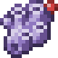

* Thundurus

* Kyogre
.. image:: ../_images/legends_wiki/items/blueorb.png
    :alt: Key Items First

* Tapu Bulu
.. image:: ../_images/legends_wiki/items/bulu_orb.png
    :alt: Key Items First

* Zekrom
.. image:: ../_images/legends_wiki/items/darkstone.png
    :alt: Key Items First

* Yveltal
.. image:: ../_images/legends_wiki/items/destructorb.png
    :alt: Key Items First

* Regidraco
.. image:: ../_images/legends_wiki/items/dragocore.png
    :alt: Key Items First

* Victini
.. image:: ../_images/legends_wiki/items/emblem.png
    :alt: Key Items First

* Tapu Fini
.. image:: ../_images/legends_wiki/items/fini_orb.png
    :alt: Key Items First

* Tornadus
.. image:: ../_images/legends_wiki/items/green_rune.png
    :alt: Key Items First

* Celebi
.. image:: ../_images/legends_wiki/items/greenorb.png
    :alt: Key Items First

* Glastrier
.. image:: ../_images/legends_wiki/items/ice_carrot.png
    :alt: Key Items First

* Regice
.. image:: ../_images/legends_wiki/items/icecore.png
    :alt: Key Items First

* Keldeo

* Tapu Koko
.. image:: ../_images/legends_wiki/items/koko_orb.png
    :alt: Key Items First

* Kubfu
.. image:: ../_images/legends_wiki/items/kubfu_spawn.png
    :alt: Key Items First

* Tapu Lele
.. image:: ../_images/legends_wiki/items/lele_orb.png
    :alt: Key Items First

* Xerneas
.. image:: ../_images/legends_wiki/items/lifeorb.png
    :alt: Key Items First

* Necrozma
.. image:: ../_images/legends_wiki/items/lighting_crystal.png
    :alt: Key Items First

* Reshiram
.. image:: ../_images/legends_wiki/items/lightstone.png
    :alt: Key Items First

* Palkia
.. image:: ../_images/legends_wiki/items/lustrousorb.png
    :alt: Key Items First

* Heatran
.. image:: ../_images/legends_wiki/items/magma-stone.png
    :alt: Key Items First

* Lugia
.. image:: ../_images/legends_wiki/items/oceanorb.png
    :alt: Key Items First

* Landorus
.. image:: ../_images/legends_wiki/items/orange_rune.png
    :alt: Key Items First

* Ho-oh
.. image:: ../_images/legends_wiki/items/rainboworb.png
    :alt: Key Items First

* Groudon
.. image:: ../_images/legends_wiki/items/redorb.png
    :alt: Key Items First

* Regigias

* Regirock

* Zamazenta
.. image:: ../_images/legends_wiki/items/rustedshield.png
    :alt: Key Items First

* Zacian
.. image:: ../_images/legends_wiki/items/rustedsword.png
    :alt: Key Items First

* Spectrier
.. image:: ../_images/legends_wiki/items/shadow_carrot.png
    :alt: Key Items First

* Magearna
.. image:: ../_images/legends_wiki/items/soul_heart.png
    :alt: Key Items First

* Registeel

* Regieleki
.. image:: ../_images/legends_wiki/items/thundercore.png
    :alt: Key Items First

The |pokemob| that you will summon with the item:

* Celebi - Uses the Green Orb to summon it.
* Ho-oh - Uses the Legendary Orb to summon it.
* Lugia - Uses the Ocean Orb to summon it.
* Thundurus - Use the Green Rune to summon it.
* Tornadus - Use the Blue Rune to summon it.
* Landurus - Use the Orange Rune to summon it.
* Keldeo - Uses the Keldeo Sword to summon it.
* Dialga - Uses the Adamant Orb to summon it.
* Plakia - Uses the Lustrous Orb to summon it.
* Arceus - Uses Azure Flute to summon it.
* Groudon - Uses Red Orb to summon it.
* Kyogre - Uses the Blue Orb to summon it.
* Rayquaza - Uses the Ancient Stone to summon it.
* Registeel - Uses Steel Core to summon them
* Regirock - Uses Rock Core to summon them
* Regice - Uses Ice Core to summon them
* Regieleki - Uses Thunder Core to summon them
* Regidrago - Uses Draco Core to summon them.
* Victini - Uses Emblem to summon it.
* Regigias - Use Regigigas Orb to summon it.
* Yveltal - Uses the Destruction Orb to summon it.
* Xerneas - Uses Life Orb to summon it.
* Zamazenta - Uses the Rusted Shield to summon it.
* Zacian - Uses the Rusted Sword to summon him.
* Heatran - Uses Magma Core to summon it.
* Reshiram - Uses Light Stone to summon it.
* Zekrom - Uses Dark Stone to summon it.
* Tapu Koko - Uses Koko Orb to summon it.
* Tapu Lele - Uses Lele Orb to summon it.
* Tapu Fini - Uses Fini Orb to summon it.
* Tapu Bulu - Uses Bulu Orb to summon it.
* Glastrier - Uses Iceroot Carrot to summon it.
* Spectrier - Uses Shaderoot Carrot to summon it.
* Necrozma - Uses Lighting Crystal to summon it.

Those that appear on this list have no recipe:

.. image:: ../_images/legends_wiki/recipe_0.png
    :alt: key item recipe
.. image:: ../_images/legends_wiki/recipe_1.png
    :alt: key item recipe
.. image:: ../_images/legends_wiki/recipe_2.png
    :alt: key item recipe
.. image:: ../_images/legends_wiki/recipe_3.png
    :alt: key item recipe
.. image:: ../_images/legends_wiki/recipe_4.png
    :alt: key item recipe
.. image:: ../_images/legends_wiki/recipe_5.png
    :alt: key item recipe
.. image:: ../_images/legends_wiki/recipe_6.png
    :alt: key item recipe
.. image:: ../_images/legends_wiki/recipe_7.png
    :alt: key item recipe
.. image:: ../_images/legends_wiki/recipe_8.png
    :alt: key item recipe
.. image:: ../_images/legends_wiki/recipe_9.png
    :alt: key item recipe
.. image:: ../_images/legends_wiki/recipe_10.png
    :alt: key item recipe
.. image:: ../_images/legends_wiki/recipe_11.png
    :alt: key item recipe
.. image:: ../_images/legends_wiki/recipe_12.png
    :alt: key item recipe

**Items Evolution/Change Form**
===============================
some legendary items, despite having a quest, are not used to summon the legendary, but to evolve or change it
> Here is a list of items that are acquired by Quest,Localization,Purchase or Crafting

* Scrolls of Elements: Used to evolve :ref:`kubfu` into the Dark and Water styles

.. image:: ../_images/legends_wiki/items/pwater.png
    :alt: Evo Item
.. image:: ../_images/legends_wiki/items/pdark.png
    :alt: Evo Item

* Reins of Unity: Use to change the shape of the :ref:`glastrier`/:ref:`spectrier` for the Mounted Calyrex

.. image:: ../_images/legends_wiki/items/reins_u.png
    :alt: Change Item

* Reveal Glass: Use to change the shapes of the :ref:`thundurus_incarnate`/:ref:`tornadus_incarnate`/:ref:`landorus_incarnate`

.. image:: ../_images/legends_wiki/items/revealglass.png
    :alt: Change Item
.. image:: ../_images/legends_wiki/recipe_15.png
    :alt: key item recipe

* DNA Splicer-A/B: Use to change the shape of the Kyurem

.. image:: ../_images/legends_wiki/items/dnasplicers.png
    :alt: Change Item

* Prison Bottle: Use to change the shapes of the :ref:`hoopa_confined`

.. image:: ../_images/legends_wiki/items/prisonbottle.png
    :alt: Change Item

* Zygarde Cube: Use to change the shapes of the :ref:`zygarde_50`

.. image:: ../_images/legends_wiki/items/zygardecube.png
    :alt: Change Item

* Gracidea: Use to change the shapes of the :ref:`shaymin_land`

.. image:: ../_images/legends_wiki/items/gracidea.png
    :alt: Change Item

* Griseous Orb: Use to change the shapes of the :ref:`giratina`

.. image:: ../_images/legends_wiki/items/griseousorb.png
    :alt: Change Item

* Meteorite : Use to change the shapes of the :ref:`deoxys`

.. image:: ../_images/legends_wiki/items/meteorite.png
    :alt: Change Item

* N-Solarizer/N-Lunarizer: Use to change the shapes of the :ref:`solgaleo` and :ref:`lunala`

.. image:: ../_images/legends_wiki/items/n-solarizer.png
    :alt: Change Item

* Z-Crystal (Psychic): Use to change the shapes of the :ref:`necrozma`
.. image:: ../_images/legends_wiki/items/z_psychic.png
    :alt: Change Item

* Rusted Shield/Rusted Sword: Use to change the shapes of the :ref:`zacian` and :ref:`zamazenta`
.. image:: ../_images/legends_wiki/zacian_zamazenta_items.png
    :alt: Change Item
.. image:: ../_images/legends_wiki/recipe_13.png
    :alt: key item recipe
.. image:: ../_images/legends_wiki/recipe_14.png
    :alt: key item recipe

Can be used by the player too:

.. image:: ../_images/legends_wiki/zacian_zamazenta_items_used.png
    :alt: Change Item

.. include:: ../.shared.rst