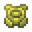

.. _legend_quests:

.. role:: raw-html(raw)
    :format: html

******************
Legends and Quests
******************

Introduction
=============
- |Pokecube| has modules that complement each other, Legends is one of these modules. :raw-html:` `
- |Pokecube| Legends is the part that manages structures, dimensions, & behavior of legendary |pokemob| for spawning and capturing. :raw-html:` `
- On this page you will find information about the legendary structures, their spawn forms, items, & exclusive blocks of |Pokecube| Legends. 
- For the dimensions part of this module, click here: :ref:`legend_dimensions`

Items
~~~~~~

In addition to the structures, the |Pokecube| Legends expansion adds many items to the mod, many with unique functions!

.. dropdown:: Unique Items
    :animate: fade-in-slide-down

    .. grid:: 1

        .. grid-item-card:: Wishing Piece

            - Activates raids. 
            - Raids reactivate if you don't receive this item.

            .. image:: ../_images/legends_wiki/items/wishing_piece.png
                :alt: Wishing Piece

    .. grid:: 1

        .. grid-item-card:: Gigant Shard

            - Triggers Gigantamax! To use it, choose a |pokemob| that has the Gigantamax ability and right-click on it with the item.
            - **It does not go in the** |**pokemob's**| **inventory!** :raw-html:` `
            - If the item disappears from your hand means that it is working, otherwise, check if the chosen |pokemob| has the Gigantamax ability. :raw-html:` `
            - Capturing a |pokemob| in their Gigantamax form does not require the item!

            .. image:: ../_images/legends_wiki/items/gigashard.png
                :alt: Gigant Shard

    .. grid:: 1

        .. grid-item-card:: Z-Crystals

            - Grants Z-Moves.

            .. image:: ../_images/legends_wiki/items/z_ice.png
                :alt: Electric Z-Crystal

    .. grid:: 1

        .. grid-item-card:: Mints

            - Changes your |pokemob's| Nature, just use it in the same way as the Gigant Shard.

            .. image:: ../_images/legends_wiki/items/mint.png
                :alt: Mints

.. dropdown:: Pokepuffs
    :animate: fade-in-slide-down

    - Player edible cakes
    - Discover the effects of each Pokepuff!
    - Increases type damage for |pokemobs|

    .. image:: ../_images/legends_wiki/items/pokepuffs.gif
        :alt: Pokepuffs
    

    .. image:: ../_images/legends_wiki/pokepuff_recipes.gif
        :alt: Pokepuff Recipes

.. dropdown:: Exploration Maps
    :animate: fade-in-slide-down

    - An alternative way to locate legendary structures!
    - Found in Ruins

    .. carousel::
        :show_captions_below:
        :show_controls:
        :show_indicators:
        :show_shadows:

        .. figure:: ../_images/legends_wiki/treasure_map_looking.png
            
            Treasure Map

        .. figure:: ../_images/legends_wiki/treasure_map_legend.png
            
            Ruins: Location of Maps

Blocks
~~~~~~~
In addition to the structures, the |Pokecube| Legends expansion adds many blocks to the mod, many with unique functions!

.. dropdown:: Spawner Blocks
    :animate: fade-in-slide-down

    These blocks are used to summon legendary |pokemobs|. Use the correct summoning item to spawn the legendary |pokemob|.
    Some blocks have a recipe and others are found in structures.

    .. dropdown:: Structure Spawners:
        :animate: fade-in-slide-down
        
        .. image:: ../_images/legends_wiki/legendary_blocks_no_recipe.png
            :alt: Spawners found in structures

    .. _Craftable Spawners:

    .. dropdown:: Craftable Spawners:
        :animate: fade-in-slide-down

        .. image:: ../_images/legends_wiki/legendary_blocks_recipes.png
            :alt: Craftable Spawners
        :raw-html:` `

        .. dropdown:: Regi Recipes
            :animate: fade-in-slide-down
            
            **The core of the Regis**

            - See `Regi Golems`_ for building patterns

            .. carousel::
                :show_captions_below:
                :show_controls:
                :show_indicators:
                :show_shadows:

            
                .. figure:: ../_images/legends_wiki/golem_stone_recipe.png
                    :alt: Golem Stone Recipe
                    
                    Golem Stone

                .. figure:: ../_images/legends_wiki/totem_block_recipe.png
                    :alt: Totem Core Recipe
                    
                    Totem Core

                .. figure:: ../_images/legends_wiki/regirock_block_recipe.png
                    :alt: Regirock Core Recipe
                    
                    Regirock Core

                .. figure:: ../_images/legends_wiki/regice_block_recipe.png
                    :alt: Regice Core Recipe
                    
                    Regice Core

                .. figure:: ../_images/legends_wiki/registeel_block_recipe.png
                    :alt: Registeel Core Recipe
                    
                    Registeel Core

                .. figure:: ../_images/legends_wiki/regieleck_block_recipe.png
                    :alt: Regieleki Core Recipe
                    
                    Regieleki Core

                .. figure:: ../_images/legends_wiki/regidrago_block_recipe.png
                    :alt: Regidrago Core Recipe
                    
                    Regidrago Core

                .. figure:: ../_images/legends_wiki/regigigas_block_recipe.png
                    :alt: Regigigas Core Recipe
                    
                    Regigigas Core

        .. dropdown:: Recipes
            :animate: fade-in-slide-down

            .. carousel::
                :show_captions_below:
                :show_controls:
                :show_indicators:
                :show_shadows:

                .. figure:: ../_images/legends_wiki/vicktini_block_recipe.png
                    :alt: Victini Spawner Recipe
                    
                    Victini Spawner
                    
                    - Spawns Victini

                .. figure:: ../_images/legends_wiki/calyrex_block_recipe.png
                    :alt: Trough Spawner Recipe
                    
                    Trough Spawner
                    
                    - Spawns Glastrier & Spectrier

                .. figure:: ../_images/legends_wiki/heatran_block_recipe.png
                    :alt: Heatran Spawner Recipe
                    
                    Heatran Spawner
                    
                    - Spawns Heatran

                .. figure:: ../_images/legends_wiki/magearna_block_recipe.png
                    :alt: Magearna Spawner Recipe
                    
                    Magearna Spawner
                    
                    - Spawns Magearna

                .. figure:: ../_images/legends_wiki/legendary_block_recipe.gif
                    :alt: Legendary Spawner Recipe
                    
                    Legendary Spawner

                    - Spawns various legendaries :raw-html:` `
                    - Crafted with the Legendary Orb

.. dropdown:: Totem Blocks
    :animate: fade-in-slide-down

    * The Totem Blocks are blocks themed after the |pokemob| Tapus of Alola.
    * Each totem grants a special effect.
    * Dye your totems to use for building!
    * Activate by right-clicking while holding anything tagged as ``forge:gems/diamond``.
    * Customize this by changing the item tag ``pokecube_legends:totem_fuel`` using a datapack.

    .. carousel::
        :show_captions_below:
        :show_controls:
        :show_indicators:
        :show_shadows:

        .. figure:: ../_images/legends_wiki/totems_decorative.png

            Totem Tower

        .. figure:: ../_images/legends_wiki/totem_colors.png
        
            Totem Color Variants
    :raw-html:` `

    .. dropdown:: Recipes
        :animate: fade-in-slide-down

        .. carousel::
            :show_captions_below:
            :show_controls:
            :show_indicators:
            :show_shadows:
            
            .. figure:: ../_images/legends_wiki/golem_stone_recipe.png
                
                Golem Stone

            .. figure:: ../_images/legends_wiki/totem_block_recipe.png
                
                Totem Core

            .. figure:: ../_images/legends_wiki/tapu_bulu_recipe.png
                
                Tapu Bulu Totem

            .. figure:: ../_images/legends_wiki/tapu_fini_recipe.png
                
                Tapu Fini Totem
                
            .. figure:: ../_images/legends_wiki/tapu_koko_recipe.png
                
                Tapu Koko Totem

            .. figure:: ../_images/legends_wiki/tapu_lele_recipe.png
                
                Tapu Lele Totem
    
.. dropdown:: Mirage Spots
    :animate: fade-in-slide-down

    Another curious block is the Mirage Spot, but you might know it as Hoopa Portal.
    This block can spawn any |pokemob| except for Legendaries.

    * If you have a Hoopa, it must have the move **Hyperspace Hole** and be **Level 40** or higher.
    * Use the move out of combat to create the portal. 
    * The creation of the portal has a cooldown, so it can't be spammed.
    * If the block is placed in **creative**, the portal creates an internal cooldown and is disabled until the time runs out and is reactivated.
    * This is customizable in **configs** or by **datapacks**.

    .. carousel::
        :show_captions_below:
        :show_controls:
        :show_indicators:
        :show_shadows:

        .. figure:: ../_images/legends_wiki/hoopa_portal_on.png

            Hoopa Portal

        .. figure:: ../_images/legends_wiki/hoopa_portal_off.png

            Open Hoopa Portal

        .. figure:: ../_images/legends_wiki/hoopa_create.png

            Hoopa Portal Creation

Special Moves
~~~~~~~~~~~~~~

.. dropdown:: Dynamax & Gigantamx
    :animate: fade-in-slide-down

        1. Open the controls menu and add a key in the |pokecube| section.
        2. Find or craft the Dynamax Spot block.
        3. Find **Raid Spots** or **Gyms** in towns with a Dynamax Power Spot block.

        - After everything is ready, equip a mega evolution item, press the ``M`` button, and your |pokemob| will Dynamax or Gigantamx.
        - While your |pokemob| is in this form, press the configured key and the moves will be changed to Dynamax or Gigantamx moves.

        .. image:: ../_images/legends_wiki/max_dynamax_block_recipe.png
            :alt: max_spot

.. dropdown:: Z-Moves
    :animate: fade-in-slide-down

        Z-Moves increase the strength of a specific move of your |pokemob|. 

        1. Equip your |pokemob| with a z-crystal corresponding to its move **(Grassium Z = Move Grass)**
        2. Press the configured key and the move will become the Z-Move, **but** the move can only be executed *once*.
        3. To execute it multiple times you need to collect your |pokemob| and throw it back into battle.
        
        - |Pokemob| exclusive Z-Crystals are integrated with base Z-Crytals.
        - The difference is that the specific |pokemob| needs to have the specific move to use the exclusive Z-Move.

        .. image:: ../_images/legends_wiki/items/z_crystals.gif
            :alt: Z Crystals

        **Example:**

        * Pikachu's Thunderwave Move + Electrium Z = Gigavolt Havoc
        * Pikachu's Thunderbolt Move + Electrium Z = 10,000,000 Volt Thunderbolt

        .. image:: ../_images/legends_wiki/items/z_electric.png
            :alt: Electric Z Crystal

Capturing Legendary Pokémobs
=============================

- Some legendary |pokemobs|, even though they naturally spawn in various biomes, can be summoned by items
- These items can be acquired by crafting, quests, or purchasing from Merchants or Trainers after defeating them
- These pokémobs have catch rules, just like |pokemobs| that can only be summoned

Generation I
~~~~~~~~~~~~~

.. dropdown:: Legendary Birds
    :animate: fade-in-slide-down

    .. grid:: 1

        .. grid-item-card:: Articuno

            See :ref:`articuno`

            - Purchase the **Ice Wing**
            - Capture 20 different Ice type |Pokemobs|
            - Find the `Lugia Tower`_
            
            .. image:: ../_images/legends_wiki/items/ice_wing.gif
                :alt: Articuno Key Item

    .. grid:: 1

        .. grid-item-card:: Galar Articuno

            See :ref:`articuno`

            - Purchase the **Dark Ice Wing**
            - Capture 20 different Flying type |Pokemobs|
            - Find the `Legendary Tree`_
            
            .. image:: ../_images/legends_wiki/items/ice_dark_wing.gif
                :alt: Galar Articuno Key Item

    .. grid:: 1

        .. grid-item-card:: Moltres

            See :ref:`moltres`

            - Purchase the **Fire Wing**
            - Capture 20 different Fire type |Pokemobs|
            - Find the `Lugia Tower`_
            
            .. image:: ../_images/legends_wiki/items/fire_wing.gif
                :alt: Moltres Key Item

    .. grid:: 1

        .. grid-item-card:: Galar Moltres

            See :ref:`moltres`

            - Purchase the **Dark Fire Wing**
            - Capture 20 different Dark type |Pokemobs|
            - Find the `Legendary Tree`_
            
            .. image:: ../_images/legends_wiki/items/dark_fire_wing.gif
                :alt: Moltres Key Item

    .. grid:: 1

        .. grid-item-card:: Zapdos

            See :ref:`zapdos`

            - Purchase the **Electric Wing**
            - Capture 20 different Electric type |Pokemobs|
            - Find the `Lugia Tower`_
            
            .. image:: ../_images/legends_wiki/items/electric_wing.gif
                :alt: Zapdos Key Item

    .. grid:: 1

        .. grid-item-card:: Galar Zapdos

            See :ref:`zapdos`

            - Purchase the **Static Wing**
            - Capture 20 different Fighting type |Pokemobs|
            - Find the `Legendary Tree`_
            
            .. image:: ../_images/legends_wiki/items/static_wing.gif
                :alt: Zapdos Key Item

Generation II
~~~~~~~~~~~~~~

.. dropdown:: Legendary Beasts
    :animate: fade-in-slide-down

    .. grid:: 1

        .. grid-item-card:: Entei

            See :ref:`entei`

            - Purchase the **Flame Gem**
            - Capture 20 different Fire type |Pokemobs|
            - Find the `Ho-Oh Temple`_
            
            .. image:: ../_images/legends_wiki/items/flame_gem.png
                :alt: Entei Key Item

    .. grid:: 1

        .. grid-item-card:: Raikou

            See :ref:`raikou`

            - Purchase the **Thunder Gem**
            - Capture 20 different Electric type |Pokemobs|
            - Find the `Ho-Oh Temple`_
            
            .. image:: ../_images/legends_wiki/items/thunder_gem.png
                :alt: Raikou Key Item

    .. grid:: 1

        .. grid-item-card:: Suicune

            See :ref:`suicune`

            - Purchase the **Water Gem**
            - Capture 20 different Water type |Pokemobs|
            - Find the `Ho-Oh Temple`_
            
            .. image:: ../_images/legends_wiki/items/water_gem.png
                :alt: Suicune Key Item

.. dropdown:: Legendary Gaurdians
    :animate: fade-in-slide-down

    .. grid:: 1

        .. grid-item-card:: Ho-Oh

            See :ref:`ho-oh`

            - Purchase the **Rainbow Orb**
            - Capture :ref:`entei`, :ref:`raikou`, & :ref:`suicune`
            - Find the `Ho-Oh Temple`_
            
            .. image:: ../_images/legends_wiki/items/rainbow_orb.gif
                :alt: Ho-Oh Key Item

    .. grid:: 1

        .. grid-item-card:: Lugia

            See :ref:`lugia`

            - Purchase the **Tidal Bell**
            - Capture :ref:`articuno`, :ref:`moltres`, & :ref:`zapdos`
            - Find the `Lugia Tower`_
            
            .. image:: ../_images/legends_wiki/items/tidal_bell.png
                :alt: Lugia Key Item

    .. grid:: 1

        .. grid-item-card:: Celebi

            See :ref:`celebi`

            - Purchase the **Jade Orb**
            - Capture 70% of different Grass type |Pokemobs|
            - Find the `Celebi Temple`_
            
            .. image:: ../_images/legends_wiki/items/jade_orb.png
                :alt: Celebi Key Item

Generation III
~~~~~~~~~~~~~~~

.. dropdown:: Legendary Giants
    :animate: fade-in-slide-down
    
    See `Regi Golems`_ for more info.

    .. grid:: 1

        .. grid-item-card:: Regirock

            See :ref:`regirock`

            - Earn from a quest or purchase the **Rock Core**
            - Capture :ref:`relicanth` & :ref:`wailord` & receive the **Rock Core** as a reward
            - Find the `Regirock Temple`_
            
            .. image:: ../_images/legends_wiki/items/rock_core.png
                :alt: Regirock Key Item

    .. grid:: 1

        .. grid-item-card:: Regice

            See :ref:`regice`

            - Earn from a quest or purchase the **Ice Core**
            - Capture :ref:`relicanth` & :ref:`wailord` & receive the **Ice Core** as a reward
            - Find the `Regice Temple`_
            
            .. image:: ../_images/legends_wiki/items/ice_core.png
                :alt: Regice Key Item

    .. grid:: 1

        .. grid-item-card:: Registeel

            See :ref:`registeel`

            - Earn from a quest or purchase the **Steel Core**
            - Capture :ref:`relicanth` & :ref:`wailord` & receive the **Steel Core** as a reward
            - Find the `Registeel Temple`_
            
            .. image:: ../_images/legends_wiki/items/steel_core.png
                :alt: Registeel Key Item

    .. grid:: 1

        .. grid-item-card:: Regidrago

            See :ref:`regidrago`

            - Earn from a quest or purchase the **Drago Core**
            - Capture :ref:`relicanth` & :ref:`wailord` & receive the **Drago Core** as a reward
            - Find the `Regidrago Temple`_
            
            .. image:: ../_images/legends_wiki/items/drago_core.png
                :alt: Regidrago Key Item

    .. grid:: 1

        .. grid-item-card:: Regieleki

            See :ref:`regieleki`

            - Earn from a quest or purchase the **Thunder Core**
            - Capture :ref:`relicanth` & :ref:`wailord` & receive the **Thunder Core** as a reward
            - Find the `Regieleki Temple`_
            
            .. image:: ../_images/legends_wiki/items/thunder_core.png
                :alt: Regieleki Key Item

    .. grid:: 1

        .. grid-item-card:: Regigigas

            See :ref:`regigigas`

            - Earn from a quest or purchase the **Regis Core**
            - Capture :ref:`regirock`, :ref:`regice`, :ref:`registeel`, :ref:`regidrago`, & :ref:`regieleki` & receive the **Regis Core** as a reward
            - Find the `Regigigas Temple`_
            
            .. image:: ../_images/legends_wiki/items/regis_orb.png
                :alt: Regigigas Key Item

.. dropdown:: Space Legendaries
    :animate: fade-in-slide-down

    .. grid:: 1

        .. grid-item-card:: Deoxys

            See :ref:`deoxys`

            - Purchase the **Meteor Shard**
            - Capture 20% of different Psychic type |Pokemobs|
            - Find the `Sky Pillar`_
            
            .. image:: ../_images/legends_wiki/items/meteor_shard.png
                :alt: Deoxys Key Item

    .. grid:: 1

        .. grid-item-card:: Jirachi

            See :ref:`jirachi`

            - Purchase the **Star Core**
            - Capture 20% of different Steel type |Pokemobs|
            - Find the `Sky Pillar`_
            
            .. image:: ../_images/legends_wiki/items/star_core.png
                :alt: Jirachi Key Item
                
.. dropdown:: Weather Trio
    :animate: fade-in-slide-down

    .. grid:: 1

        .. grid-item-card:: Groudon

            See :ref:`groudon`

            - Craft or purchase the **Red Orb**
            - Capture more than 25 different Ground type |Pokemobs|
            - Kill more than 50 different Water type |Pokemobs|
            - Find the `Groudon Temple`_
            
            .. image:: ../_images/legends_wiki/items/red_orb.png
                :alt: Groudon Key Item

    .. grid:: 1

        .. grid-item-card:: Kyogre

            See :ref:`kyogre`

            - Craft or Purchase the **Blue Orb**
            - Capture more than 50 different Water type |Pokemobs|
            - Kill more than 25 different Ground type |Pokemobs|
            - Find the `Kyogre Temple`_
            
            .. image:: ../_images/legends_wiki/items/blue_orb.png
                :alt: Kyogre Key Item

    .. grid:: 1

        .. grid-item-card:: Rayquaza

            See :ref:`rayquaza`

            - Purchase the **Ancient Stone**
            - Capture :ref:`groudon` & :ref:`kyogre`
            - Find the `Sky Pillar`_
            
            .. image:: ../_images/legends_wiki/items/ancient_stone.png
                :alt: Rayquaza Key Item

.. dropdown:: Eon Duo
    :animate: fade-in-slide-down

    .. grid:: 1

        .. grid-item-card:: Latios

            See :ref:`latios`

            - Purchase the **Soul Dew**
            - Capture 30% of different Dragon type |Pokemobs|
            - Craft & then right-click the **Legendary Spawner**
            - Must be placed on a **Beach** biome or any biome tagged as ``#pokecube_world:is_beach``
                * This tag includes the **Stony Shore** & the biome tag ``#minecraft:is_beach``
            
            .. image:: ../_images/legends_wiki/items/soul_dew.png
                :alt: Latios Key Item

    .. grid:: 1

        .. grid-item-card:: Latias

            See :ref:`latias`

            - Purchase the **Soul Dew**
            - Capture 30% of different Dragon type |Pokemobs|
            - Craft & then right-click the **Legendary Spawner**
            - Must be placed on a **Beach** biome or any biome tagged as ``#pokecube_world:is_beach``
                * This tag includes the **Stony Shore** & the biome tag ``#minecraft:is_beach``
            
            .. image:: ../_images/legends_wiki/items/soul_dew.png
                :alt: Latias Key Item

Generation IV
~~~~~~~~~~~~~~

.. dropdown:: Mythical Pokémon
    :animate: fade-in-slide-down

    .. grid:: 1

        .. grid-item-card:: Shaymin

            See :ref:`shaymin_land`

            - Earn from a quest or purchase the **Gracidea**
            - Place in Shaymin's inventory in the **Held Item Slot** to transform into Sky :ref:`shaymin_land`
            - **Gracideas** can also be planted
            
            .. image:: ../_images/legends_wiki/items/gracidea.png
                :alt: Gracidea

.. dropdown:: Sea Gaurdians
    :animate: fade-in-slide-down

    .. grid:: 1

        .. grid-item-card:: Manaphy

            See :ref:`manaphy`

            - Purchase the **Prince's Necklace**
            - Capture 40% of different Water type |Pokemobs|
            - Find the `Kyogre Temple`_
            
            .. image:: ../_images/legends_wiki/items/prince_necklace.png
                :alt: Manaphy Key Item

    .. grid:: 1

        .. grid-item-card:: Phione

            See :ref:`phione`

            - Purchase the **Water Gem**
            - Capture 40% of different Water type |Pokemobs|
            - Find the `Kyogre Temple`_
            
            .. image:: ../_images/legends_wiki/items/water_gem.png
                :alt: Phione Key Item

.. dropdown:: Lake Gaurdians
    :animate: fade-in-slide-down

    - Capture all Lake Guardians & receive the **Giratina Mirror Parts** as a reward
            
    .. image:: ../_images/legends_wiki/items/giratina_mirror_head.png
        :alt: Giratina Mirror Head
    
    .. image:: ../_images/legends_wiki/items/giratina_mirror_glass.png
        :alt: Giratina Mirror Glass
    
    .. image:: ../_images/legends_wiki/items/giratina_mirror_body.png
        :alt: Giratina Mirror Body

    .. grid:: 1

        .. grid-item-card:: Azelf

            See :ref:`azelf`

            - Purchase the **Jewel of Willpower**
            - Capture 30% of different Psychic type |Pokemobs| & receive the **Rock Core** as a reward
            - Find the `Zacian Ruined Portal`_ or the `Zamazenta Ruined Portal`_
            
            .. image:: ../_images/legends_wiki/items/jewel_of_willpower.png
                :alt: Azelf Key Item

    .. grid:: 1

        .. grid-item-card:: Mesprit

            See :ref:`mesprit`

            - Purchase the **Jewel of Emotions**
            - Capture 30% of different Psychic type |Pokemobs|
            - Find the `Zacian Ruined Portal`_ or the `Zamazenta Ruined Portal`_
            
            .. image:: ../_images/legends_wiki/items/jewel_of_emotions.png
                :alt: Mesprit Key Item

    .. grid:: 1

        .. grid-item-card:: Uxie

            See :ref:`uxie`

            - Purchase the **Jewel of Wisdom**
            - Capture 30% of different Psychic type |Pokemobs|
            - Find the `Zacian Ruined Portal`_ or the `Zamazenta Ruined Portal`_
            
            .. image:: ../_images/legends_wiki/items/jewel_of_wisdom.png
                :alt: Uxie Key Item

.. dropdown:: Volcano Gaurdian
    :animate: fade-in-slide-down

    .. grid:: 1

        .. grid-item-card:: Heatran

            See :ref:`heatran`

            - Earn in a quest or purchase the **Magma Core**
            - Capture 50% of different Fire type |Pokemobs|
            - Craft & then right-click the **Heatran Spawner**
            - Must be placed in the **Nether**
            
            .. image:: ../_images/legends_wiki/items/magma_core.png
                :alt: Heatran Key Item

.. dropdown:: Creation Trio
    :animate: fade-in-slide-down

    .. grid:: 1

        .. grid-item-card:: Dialga

            See :ref:`dialga`

            - Earn in a quest or purchase the **Adamant Orb**
            - Capture :ref:`azelf`, :ref:`mesprit`, & :ref:`uxie`
            - Find the `Altar of Time & Space`_
            
            .. image:: ../_images/legends_wiki/items/adamant_orb.png
                :alt: Dialga Key Item

    .. grid:: 1

        .. grid-item-card:: Palkia

            See :ref:`palkia`

            - Earn in a quest or purchase the **Lustrous Orb**
            - Capture :ref:`azelf`, :ref:`mesprit`, & :ref:`uxie`
            - Find the `Altar of Time & Space`_
            
            .. image:: ../_images/legends_wiki/items/lustrous_orb.png
                :alt: Palkia Key Item

    .. grid:: 1

        .. grid-item-card:: Giratina

            See :ref:`giratina`

            - Capture :ref:`dialga` & :ref:`palkia`
            - Spawns in the :ref:`Distorted World`
            
            .. image:: ../_images/legends_wiki/items/giratina_mirror.gif
                :alt: Giratina Mirror

.. dropdown:: Arceus
    :animate: fade-in-slide-down

    .. grid:: 1

        .. grid-item-card:: Arceus

            See :ref:`arceus`

            - Earn in a quest or purchase the **Azure Flute**
            - Capture :ref:`dialga`, :ref:`palkia`, & :ref:`giratina`
            - Find the `Altar of Time & Space`_
            
            .. image:: ../_images/legends_wiki/items/azure_flute.png
                :alt: Arceus Key Item

Generation V
~~~~~~~~~~~~~

.. dropdown:: Mythical Pokémon
    :animate: fade-in-slide-down

    .. grid:: 1

        .. grid-item-card:: Victini

            See :ref:`victini`

            - Earn from a quest or purchase the **Emblem**
            - Capture 50% of different Psychic type |Pokemobs|
            - Craft & then right-click the **Victini Spawner**
            - Must be placed in a **Village**
            
            .. image:: ../_images/legends_wiki/items/emblem.png
                :alt: Victini Key Item

.. dropdown:: Forces of Nature
    :animate: fade-in-slide-down

    .. grid:: 1

        .. grid-item-card:: Meloetta

            See :ref:`meloetta_aria`

            - Purchase the **Melody Ocarina**
            - Capture 40% of different Normal type |Pokemobs|
            - Find `Nature's Place`_
            
            .. image:: ../_images/legends_wiki/items/melody_ocarina.png
                :alt: Meloetta Key Item

    .. grid:: 1

        .. grid-item-card:: Thundurus

            See :ref:`thundurus_incarnate`

            - Craft or purchase the **Blue Rune**
            - Capture :ref:`meloetta_aria`
            - Find `Nature's Place`_
            - Right-click with the **Reveal Glass** to transform into Therian :ref:`thundurus_incarnate`
            
            .. image:: ../_images/legends_wiki/items/blue_rune.png
                :alt: Thundurus Key Item
            
            .. image:: ../_images/legends_wiki/items/reveal_glass.png
                :alt: Reveal Glass

    .. grid:: 1

        .. grid-item-card:: Tornadus

            See :ref:`tornadus_incarnate`

            - Craft or purchase the **Green Rune**
            - Capture :ref:`meloetta_aria`
            - Find `Nature's Place`_
            - Right-click with the **Reveal Glass** to transform into Therian :ref:`tornadus_incarnate`
            
            .. image:: ../_images/legends_wiki/items/green_rune.png
                :alt: Tornadus Key Item
            
            .. image:: ../_images/legends_wiki/items/reveal_glass.png
                :alt: Reveal Glass

    .. grid:: 1

        .. grid-item-card:: Landorus

            See :ref:`landorus_incarnate`

            - Craft or purchase the **Orange Rune**
            - Capture :ref:`meloetta_aria`
            - Find `Nature's Place`_
            - Right-click with the **Reveal Glass** to transform into Therian :ref:`landorus_incarnate`
            
            .. image:: ../_images/legends_wiki/items/orange_rune.png
                :alt: Landorus Key Item
            
            .. image:: ../_images/legends_wiki/items/reveal_glass.png
                :alt: Reveal Glass

    .. grid:: 1

        .. grid-item-card:: Enamorus

            See :ref:`enamorus_incarnate`

            - Purchase the **Ancient Stone**
            - Capture :ref:`meloetta_aria`
            - Find `Nature's Place`_
            - Right-click with the **Reveal Glass** to transform into Therian :ref:`enamorus_incarnate`
            
            .. image:: ../_images/legends_wiki/items/ancient_stone.png
                :alt: Enamorus Key Item
            
            .. image:: ../_images/legends_wiki/items/reveal_glass.png
                :alt: Reveal Glass

.. dropdown:: Swords of Justice
    :animate: fade-in-slide-down

    .. grid:: 1

        .. grid-item-card:: Cobalion

            See :ref:`cobalion`

            - Purchase **Cobalion's Sword of Justice**
            - Capture 30% of different Steel type |Pokemobs|
            - Find the `Keldeo Altar`_
            
            .. image:: ../_images/legends_wiki/items/cobalion_sword.png
                :alt: Cobalion Key Item

    .. grid:: 1

        .. grid-item-card:: Terrakion

            See :ref:`terrakion`

            - Purchase **Terrakion's Sword of Justice**
            - Capture 30% of different Rock type |Pokemobs|
            - Find the `Keldeo Altar`_
            
            .. image:: ../_images/legends_wiki/items/terrakion_sword.png
                :alt: Terrakion Key Item

    .. grid:: 1

        .. grid-item-card:: Virizion

            See :ref:`virizion`

            - Purchase **Virizion's Sword of Justice**
            - Capture 30% of different Grass type |Pokemobs|
            - Find the `Keldeo Altar`_
            
            .. image:: ../_images/legends_wiki/items/virizion_sword.png
                :alt: Virizion Key Item

    .. grid:: 1

        .. grid-item-card:: Keldeo

            See :ref:`keldeo`

            - Purchase **Keldeo's Sword of Justice**
            - Capture :ref:`cobalion`, :ref:`terrakion`, & :ref:`virizion`
            - Find the `Keldeo Altar`_
            
            .. image:: ../_images/legends_wiki/items/keldeo_sword.png
                :alt: Keldeo Key Item

.. dropdown:: Tao Trio
    :animate: fade-in-slide-down
        
    .. grid:: 1

        .. grid-item-card:: Reshiram

            See :ref:`reshiram`

            - Earn from a quest or purchase the **Light Stone**
            - Capture 50% of different Dragon type |Pokemobs|
            - Find the `Castle of N`_
            
            .. image:: ../_images/legends_wiki/items/light_stone.png
                :alt: Reshiram Key Item
        
    .. grid:: 1

        .. grid-item-card:: Zekrom

            See :ref:`zekrom`

            - Earn from a quest or purchase the **Dark Stone**
            - Capture 50% of different Dragon type |Pokemobs|
            - Find the `Castle of N`_
            
            .. image:: ../_images/legends_wiki/items/dark_stone.png
                :alt: Zekrom Key Item
        
    .. grid:: 1

        .. grid-item-card:: Kyurem

            See :ref:`kyurem`

            - Purchase the **DNA Stone**
            - Capture :ref:`reshiram` & :ref:`zekrom`
            - Craft & then right-click the **Legendary Spawner**
            - Must be placed in a **Snowy** biome or any biome tagged as ``#forge:is_snowy``
            - Place **DNA Splicer A** in Kyurem's inventory in the **Held Item Slot** to transform into Black :ref:`kyurem`
            - Place **DNA Splicer B** in Kyurem's inventory in the **Held Item Slot** to transform into White :ref:`kyurem`
            
            .. image:: ../_images/legends_wiki/items/dna_stone.png
                :alt: Kyurem Key Item
            
            .. image:: ../_images/legends_wiki/items/dna_splicer_a.png
                :alt: Black Kyurem Splicer
            
            .. image:: ../_images/legends_wiki/items/dna_splicer_b.png
                :alt: White Kyurem Splicer

Generation VI
~~~~~~~~~~~~~~

.. dropdown:: Mythical Pokémon
    :animate: fade-in-slide-down

    .. grid:: 1

        .. grid-item-card:: Diancie

            See :ref:`diancie`

            - Purchase the **Pink Diamond**
            - Capture 30% of different Fairy type |Pokemobs|
            - Craft & then right-click the **Legendary Spawner**
            - Must be placed on a **Hills** biome or any biome tagged as ``#minecraft:is_hill``
            
            .. image:: ../_images/legends_wiki/items/pink_diamond.png
                :alt: Diancie Key Item

    .. grid:: 1

        .. grid-item-card:: Volcanion

            See :ref:`volcanion`

            - Purchase the **Steam Core**
            - Capture :ref:`magearna`
            - Craft & then right-click the **Magearna Spawner**
            - Must be placed in a **Village**
            
            .. image:: ../_images/legends_wiki/items/steam_core.png
                :alt: Volcanion Key Item

    .. grid:: 1

        .. grid-item-card:: Hoopa Confined

            See :ref:`hoopa_confined`

            - Earn from a quest or purchase the **Prison Bottle**
            - Capture 30% of different Ghost type |Pokemobs|
            - Find the `Sky Pillar`_
            
            .. image:: ../_images/legends_wiki/items/prison_bottle.png
                :alt: Hoopa Key Item
                
.. dropdown:: Aura Trio
    :animate: fade-in-slide-down

    .. grid:: 1

        .. grid-item-card:: Xerneas

            See :ref:`xerneas`
            
            - Craft or purchase the **Life Orb**
            - Capture 40% of different Fairy type |Pokemobs|
            - Find the `Xerneas' Tree`_

            .. image:: ../_images/legends_wiki/items/life_orb.png
                :alt: Xerneas Key Item

    .. grid:: 1

        .. grid-item-card:: Yveltal

            See :ref:`yveltal`
            
            - Craft or purchase the **Destruction Orb**
            - Capture 50% of different Dark type |Pokemobs|
            - Find the `Yveltal Ruins`_

            .. image:: ../_images/legends_wiki/items/destruction_orb.png
                :alt: Yveltal Key Item

    .. grid:: 1

        .. grid-item-card:: Zygarde

            See :ref:`zygarde_50`
            
            - Earn from a quest or purchase the **Zygarde Cube**
            - Capture 20% of different Ground type |Pokemobs|
            - Find the `Yveltal Ruins`_ or the `Xerneas' Tree`_

            .. image:: ../_images/legends_wiki/items/zygarde_cube.png
                :alt: Zygarde Key Item

.. dropdown:: Lunar Duo
    :animate: fade-in-slide-down

    .. grid:: 1

        .. grid-item-card:: Cresselia

            See :ref:`cresselia`

            - Purchase the **Lunar Wing**
            - Capture 30% of different Fairy type |Pokemobs|
            - Find the `Sky Pillar`_
            
            .. image:: ../_images/legends_wiki/items/lunar_wing.png
                :alt: Cresselia Key Item

    .. grid:: 1

        .. grid-item-card:: Darkrai

            See :ref:`darkrai`

            - Purchase the **Nightmare Book**
            - Capture 30% of different Dark type |Pokemobs|
            - Find the `Yveltal Ruins`_
            
            .. image:: ../_images/legends_wiki/items/nightmare_book.gif
                :alt: Darkrai Key Item

Generation VII
~~~~~~~~~~~~~~~

.. dropdown:: Guardian Deities
    :animate: fade-in-slide-down

    .. grid:: 1

        .. grid-item-card:: Tapu Koko

            See :ref:`tapu_koko`

            - Guardian of **Melemele Island**
            - Purchase the **Tapu-Koko Orb**
            - Capture 20% of different Electric type |Pokemobs|
            - Find the `Tapu Center`_
            
            .. image:: ../_images/legends_wiki/items/koko_orb.png
                :alt: Tapu Koko Key Item

    .. grid:: 1

        .. grid-item-card:: Tapu Lele

            See :ref:`tapu_lele`

            - Guardian of **Akala Island**
            - Purchase the **Tapu-Lele Orb**
            - Capture 20% of different Psychic type |Pokemobs|
            - Find the `Tapu Center`_
            
            .. image:: ../_images/legends_wiki/items/lele_orb.png
                :alt: Tapu Lele Key Item

    .. grid:: 1

        .. grid-item-card:: Tapu Bulu

            See :ref:`tapu_bulu`

            - Guardian of **Ula'ula Island**
            - Purchase the **Tapu-Bulu Orb**
            - Capture 30% of different Grass type |Pokemobs|
            - Find the `Tapu Center`_
            
            .. image:: ../_images/legends_wiki/items/bulu_orb.png
                :alt: Tapu Bulu Key Item

    .. grid:: 1

        .. grid-item-card:: Tapu Fini

            See :ref:`tapu_fini`

            - Guardian of **Poni Island**
            - Purchase the **Tapu-Fini Orb**
            - Capture 30% of different Water type |Pokemobs|
            - Find the `Tapu Center`_
            
            .. image:: ../_images/legends_wiki/items/fini_orb.png
                :alt: Tapu Fini Key Item

    .. grid:: 1

        .. grid-item-card:: Cosmog

            See :ref:`cosmog`

            - Guardian of **Ultra Space**
            - Purchase the **Cosmic Orb**
            - Capture 30% of different Psychic type |Pokemobs|
            - Find the `Altar of Time & Space`_
            
            .. image:: ../_images/legends_wiki/items/cosmic_orb.gif
                :alt: Cosmog Key Item

.. dropdown:: Light Trio
    :animate: fade-in-slide-down

    .. grid:: 1

        .. grid-item-card:: Solgaleo

            See :ref:`solgaleo`

            - Evolve from :ref:`cosmog`
            - Place the **N-Solarizer** in Solgaleo's inventory in the **Held Item Slot** to transform into Dusk Mane :ref:`necrozma`
            
            .. image:: ../_images/legends_wiki/items/n-solarizer.png
                :alt: Solgaleo's N-Solarizer

    .. grid:: 1

        .. grid-item-card:: Lunala

            See :ref:`lunala`

            - Evolve from :ref:`cosmog`
            - Place the **N-Lunarizer** in Lunala's inventory in the **Held Item Slot** to transform into Dawn Wings :ref:`necrozma`
            
            .. image:: ../_images/legends_wiki/items/n-lunarizer.png
                :alt: Lunala's N-Lunarizer

    .. grid:: 1

        .. grid-item-card:: Necrozma

            See :ref:`necrozma`

            - Purchase the **Lighting Crystal**
            - Capture :ref:`solgaleo` & :ref:`lunala`
            - Find the `Necrozma Tower`_
            
            .. image:: ../_images/legends_wiki/items/lighting_crystal.png
                :alt: Necrozma Key Item

Generation VIII
~~~~~~~~~~~~~~~~

.. dropdown:: Hero Duo
    :animate: fade-in-slide-down

    .. grid:: 1

        .. grid-item-card:: Zacian

            See :ref:`zacian`

            - Loot or purchase the **Rusted Sword**
            - Crafts into **Zacian's Sword** or use to summon **Zacian**
            - Capture 60% of different Steel type |Pokemobs|
            - Find the `Zacian Ruined Portal`_

            .. image:: ../_images/legends_wiki/items/rusted_sword.png
                :alt: Zacian Key Item

            .. image:: ../_images/legends_wiki/items/zacian_sword.png
                :alt: Zacian's Sword

    .. grid:: 1

        .. grid-item-card:: Zamazenta

            See :ref:`zamazenta`

            - Loot or purchase the **Rusted Sword**
            - Crafts into **Zamazenta's Shield** or use to summon **Zamazenta**
            - Capture 60% of different Steel type |Pokemobs|
            - Find the `Zamazenta Ruined Portal`_

            .. image:: ../_images/legends_wiki/items/rusted_shield.png
                :alt: Zamazenta Key Item

            .. image:: ../_images/legends_wiki/items/zamazenta_shield.png
                :alt: Zamazenta's Shield

.. dropdown:: Unity Trio
    :animate: fade-in-slide-down

    .. grid:: 1

        .. grid-item-card:: Calyrex

            See :ref:`calyrex`

            - Purchase the **Wooden Crown**
            - Capture 40% of different Grass type |Pokemobs|
            - Craft & then right-click the **Trough Spawner**
            - Must be placed in a **Taiga Forest** or any biome tagged as ``#minecraft:is_taiga``

            .. image:: ../_images/legends_wiki/items/wooden_crown.png
                :alt: Calyrex Key Item

    .. grid:: 1

        .. grid-item-card:: Spectrier

            See :ref:`spectrier`

            - Earn from a quest or purchase the **Shaderoot Carrot**
            - Capture :ref:`calyrex`
            - Craft & then right-click the **Trough Spawner**
            - Must be placed in a **Snowy** biome or any biome tagged as ``#forge:is_snowy``
            - Place the **Reins of Unity** in Spectrier's inventory in the **Held Item Slot** to transform into Shadow Rider :ref:`calyrex`

            .. image:: ../_images/legends_wiki/items/shaderoot_carrot.png
                :alt: Spectrier Key Item

            .. image:: ../_images/legends_wiki/items/reins_of_unity.png
                :alt: Reins of Unity

    .. grid:: 1

        .. grid-item-card:: Glastrier

            See :ref:`glastrier`

            - Earn from a quest or purchase the **Iceroot Carrot**
            - Capture :ref:`calyrex`
            - Craft & then right-click the **Trough Spawner**
            - Must be placed in a **Snowy** biome or any biome tagged as ``#forge:is_snowy``
            - Place the **Reins of Unity** in Glastrier's inventory in the **Held Item Slot** to transform into Ice Rider :ref:`calyrex`

            .. image:: ../_images/legends_wiki/items/iceroot_carrot.png
                :alt: Glastrier Key Item

            .. image:: ../_images/legends_wiki/items/reins_of_unity.png
                :alt: Reins of Unity

.. dropdown:: Isle of Armor
    :animate: fade-in-slide-down

    .. grid:: 1

        .. grid-item-card:: Kubfu

            See :ref:`kubfu`

            - Purchase the **Gray Scarf**
            - Capture 30% of different **Fighting** type |Pokemobs|
            - Find the `Kubfu Dojo`_, `Dark Kubfu Tower`_, & `Water Kubfu Tower`_
            - Right-click with the **Scroll of Darkness** while **happy** and in the `Dark Kubfu Tower`_ to evolve Kubfu into Single Strike Style :ref:`urshifu_single`
            - Right-click with the **Scroll of Waters** while **happy** and in the `Water Kubfu Tower`_ to evolve Kubfu into Rapid Strike Style :ref:`urshifu_single`

            .. image:: ../_images/legends_wiki/items/gray_scarf.png
                :alt: Kubfu Key Item

            .. image:: ../_images/legends_wiki/items/scroll_of_darkness.png
                :alt: Single Strike Style Urshifu Evolve Item

            .. image:: ../_images/legends_wiki/items/scroll_of_waters.png
                :alt: Rapid Strike Style Urshifu Evolve Item

.. dropdown:: Eternatus
    :animate: fade-in-slide-down

    .. grid:: 1

        .. grid-item-card:: Eternatus

            See :ref:`eternatus`

            - Capture :ref:`zacian` & :ref:`zamazenta`
            - Spawns in **Ultra Space**

            .. image:: ../_images/legends_wiki/items/ultra_key.png
                :alt: Ultra Dimensional Key

Exploration Structures
=======================
In this expansion, several structures were added, and in this part we'll look at exploration structures.
Exploration structures are buildings that do not have links with legendary |pokemob|, they can be explored by players to get items or special trades.

Raids
~~~~~~

.. dropdown:: Raid Sturctures
    :animate: fade-in-slide-down
    
    Raids are here, and you can get a stronger |pokemob| and Gigantamax it! Just find the Raid Spots and start the battle!

    - Defeated |pokemobs| drop Raid exclusive items.
    - Raid |pokemobs| can only be caught after defeat.
    - Items are random, mixing |pokemob| drops with Raid items.

    .. carousel::
        :show_captions_below:
        :show_controls:
        :show_indicators:
        :show_shadows:

        .. figure:: ../_images/legends_wiki/raid_structure.png

            Raid Structures

        .. figure:: ../_images/legends_wiki/raid_pokemob.png
            
            Dynamax |Pokemob| from Raids

.. dropdown:: Capturing |Pokemobs| from Raids
    :animate: fade-in-slide-down

    .. grid:: 1

        .. grid-item-card::  Capturing

            To capture the |pokemob| of the raid we need two factors:

            - You need to use the Dynamax Cube to capture.
            - The |pokemob| needs to be extremely low on health.

            .. image:: ../_images/legends_wiki/dynamax_ball.png
                :alt: Dynamax Cube

    .. grid:: 1

        .. grid-item-card::  Smithing Recipe

            - 1.20.1+

            .. image:: ../_images/legends_wiki/dynamax_ball_smithing_1.20.png
                :alt: 1.20+ Smithing Recipe: Wishing Stone + |Pokecube| + Ruby = Dynamax Cube 

    .. grid:: 1

        .. grid-item-card::  Crafting Recipe

            - 1.19.2 and older

            .. image:: ../_images/legends_wiki/dynamax_ball_crafting_1.19.png
                :alt: 1.19 & older Smithing Recipe: Wishing Stone + |Pokecube| = Dynamax Cube 

    .. grid:: 1

        .. grid-item-card::  Dynamax Cube

            - You can use any |Pokecube| to create the Dynamax Cube!
            - **Be aware that Dynamax Cube does not use the capture chance of the pokecube you used in the recipe, so if you use a Mastercube for the recipe, it will work like a normal Pokecube!**
            - Currently, the Dynamax Cube will become a common |Pokecube|, in the future it will be modified to return the |Pokecube| used in the recipe!

            .. image:: ../_images/legends_wiki/dynamax_ball_convert.png
                :alt: Dynamax Cube converts to regular |pokecube|

Villain Lairs
~~~~~~~~~~~~~~
The lairs are structures based on the villain teams from the Pokémon games, in this mod you can find 5 secret lairs.
The structures differ depending on their biome, which makes the structure more versatile.

.. _aether_foundation: 

Aether Foundation
------------------

.. dropdown:: Aether Foundation
    :animate: fade-in-slide-down

    * Find the Aether Foundation bosses, and battle them!
    * Buy important items from Aether Foundation bosses
    * Considered a Village
    * Found in biomes tagged as ``#minecraft:is_ocean``, such as **Warm Oceans**
    * Found in biomes **not** tagged as ``#forge:is_cold`` or ``#forge:is_snowy``

    .. carousel::
        :show_captions_below:
        :show_controls:
        :show_indicators:
        :show_shadows:

        .. figure:: ../_images/legends_wiki/aether_foundation.png
            
            Aether Foundation

        .. figure:: ../_images/legends_wiki/aether_f_boss_room.png
            
            Battle the Aether Bosses!

.. _elite_four:

.. dropdown:: Elite Four
    :animate: fade-in-slide-down

    Yes, there is an **Elite Four**! But in this case, it's much more complicated to beat them! 

    * Battle the Elite Four!
    * Trainers sell strong items, but they also have strong |pokemobs|, so be warned!
    * Found in any biomes tagged as ``#minecraft:is_overworld``
    * Found in biomes **not** tagged as ``#minecraft:is_beach``, ``#minecraft:is_ocean``, ``#minecraft:is_river``, or ``#forge:is_mushroom``

    .. carousel::
        :show_captions_below:
        :show_controls:
        :show_indicators:
        :show_shadows:

        .. figure:: ../_images/legends_wiki/elite_four.png
            
            Elite Four Tower

            Will you deaf all four?

        .. figure:: ../_images/legends_wiki/elite_four_boss_1.png

            Battle Shauntal!
            
            One of the Elite Four!

        .. figure:: ../_images/legends_wiki/elite_four_boss_2.png

            Battle Grimsley!
            
            One of the Elite Four!

        .. figure:: ../_images/legends_wiki/elite_four_boss_3.png

            Battle Olivia!
            
            One of the Elite Four!

        .. figure:: ../_images/legends_wiki/elite_four_boss_4.png

            Battle Blue!
            
            One of the Elite Four!

.. _team_aqua:

.. dropdown:: Team Aqua
    :animate: fade-in-slide-down

    * Find Archie, and battle him!
    * Found in **Beaches** or **Swamps**
    * Found in biomes tagged as ``#minecraft:is_beach`` or ``#forge:is_swamp``

    .. carousel::
        :show_captions_below:
        :show_controls:
        :show_indicators:
        :show_shadows:

        .. figure:: ../_images/legends_wiki/team_aqua_base.png
            
            Team Aqua... Hideout?

        .. figure:: ../_images/legends_wiki/team_aqua_boss_room.png
            
            Battle Archie!

.. _team_magma:

.. dropdown:: Team Magma
    :animate: fade-in-slide-down
    
    * Find Maxie, and battle him!
    * Found in **Deserts** or **Badlands**
    * Found in biomes tagged as ``#minecraft:is_badlands`` or ``#forge:is_sandy``

    .. carousel::
        :show_captions_below:
        :show_controls:
        :show_indicators:
        :show_shadows:

        .. figure:: ../_images/legends_wiki/team_magma_base.png
            
            Team Magma... Hideout?

        .. figure:: ../_images/legends_wiki/team_magma_boss_room.png
            
            Battle Maxie!

.. _team_rocket:

.. dropdown:: Team Rocket
    :animate: fade-in-slide-down

    * Find Giovanni, and battle him!
    * Team Rocket's Hideout has a look reminiscent of the Red/Blue games
    * Found in **Plains**
    * Found in biomes tagged as ``"#forge:is_plains"``

    .. carousel::
        :show_captions_below:
        :show_controls:
        :show_indicators:
        :show_shadows:

        .. figure:: ../_images/legends_wiki/team_rocket_base_2.png

            Team Rocket Village Hideout

        .. figure:: ../_images/legends_wiki/team_rocket_base.png

            Team Rocket Hideout

        .. figure:: ../_images/legends_wiki/team_rocket_giovanni.png

            Battle Giovanni!

Legendary Structures
=====================
While exploring the world you will find many different structures. They are the **'Temples of Legendary'**.

- Legendary temples need a special item and completion of a unique quest so you can summon and capture it.
- Not all |pokemobs| have unique structures, some share structures.

.. _Castle of N:

Castle of N 
~~~~~~~~~~~~

.. dropdown:: Description
    :animate: fade-in-slide-down

    * Find N, and battle him!
    * Summons :ref:`reshiram` & :ref:`zekrom`
    * Found in **Taigas**
    * Found in biomes tagged as ``#minecraft:is_taiga``

    .. carousel::
        :show_captions_below:
        :show_controls:
        :show_indicators:
        :show_shadows:

        .. figure:: ../_images/legends_wiki/castle_n.png
            
            Castle of N
            
        .. figure:: ../_images/legends_wiki/castle_n_boss_room.png
            
            Battle N!

.. _Celebi Temple:

Celebi Temple
~~~~~~~~~~~~~~

.. dropdown:: Description
    :animate: fade-in-slide-down

    * Summons :ref:`articuno`, :ref:`celebi`, :ref:`diancie`, :ref:`moltres`, & :ref:`zapdos`
    * Found in **Forests**
    * Found in biomes tagged as ``#minecraft:is_forest``, ``#minecraft:is_jungle``, or ``#forge:is_lush``

    .. image:: ../_images/legends_wiki/celebi_temple.png
        :alt: Celebi Temple

.. _Ho-Oh Temple:

Ho-Oh Temple
~~~~~~~~~~~~~

.. dropdown:: Description
    :animate: fade-in-slide-down

    * Summons :ref:`articuno`, :ref:`entei`, :ref:`ho-oh`, :ref:`hoopa_confined`, :ref:`raikou`, :ref:`suicune`, & :ref:`zapdos`
    * Found in **Plains**
    * Found in biomes tagged as ``#forge:is_plains`` or ``#pokecube_world:is_ultraspace/is_plains``

    .. image:: ../_images/legends_wiki/ho_oh_tower.png
        :alt: Ho-oh Temple

.. _Legendary Tree:

Legendary Tree
~~~~~~~~~~~~~~~

.. dropdown:: Description
    :animate: fade-in-slide-down

    * Summons :ref:`articuno`, :ref:`diancie`, :ref:`moltres`, & :ref:`zapdos`
    * Found in **Plains** & **Forests**
    * Found in biomes tagged as ``#minecraft:is_forest``, ``#forge:is_plains``, ``#pokecube_world:is_ultraspace/is_forest``, or ``#pokecube_world:is_ultraspace/is_plains``

    .. image:: ../_images/legends_wiki/legendary_tree.png
        :alt: Legendary tree

.. _Kubfu Dojo:

Kubfu Dojo
~~~~~~~~~~~

.. dropdown:: Description
    :animate: fade-in-slide-down

    * Summons :ref:`articuno`, :ref:`entei`, :ref:`hoopa_confined`, :ref:`kubfu`, :ref:`moltres`, & :ref:`zapdos`
    * Found in **Plains**
    * Found in biomes tagged as ``#forge:is_plains`` or ``#pokecube_world:is_ultraspace/is_plains``

    .. image:: ../_images/legends_wiki/kubfu_dojo.png
        :alt: Kubfu Dojo

.. _Dark Kubfu Tower:

Dark Kubfu Tower
~~~~~~~~~~~~~~~~~

.. dropdown:: Description
    :animate: fade-in-slide-down

    * Contains **Parchment of Darkness**
    * Found in **Extreme Hills**
    * Found in biomes tagged as ``#minecraft:is_hill`` or ``#pokecube_world:is_ultraspace/is_hill``

    .. image:: ../_images/legends_wiki/kubfu_tower_dark.png
        :alt: Dark Kubfu Tower

.. _Water Kubfu Tower:

Water Kubfu Tower
~~~~~~~~~~~~~~~~~~

.. dropdown:: Description
    :animate: fade-in-slide-down

    * Contains **Parchment of Water**
    * Found in **Beaches** & **Stony Shores**
    * Found in biomes tagged as ``#minecraft:is_beach`` or ``#pokecube_world:is_ultraspace/is_beach``

    .. image:: ../_images/legends_wiki/kubfu_tower_water.png
        :alt: Water Kubfu Tower

.. _Sky Pillar:

Sky Pillar
~~~~~~~~~~~

.. dropdown:: Description
    :animate: fade-in-slide-down

    * Summons :ref:`articuno`, :ref:`deoxys`, :ref:`hoopa_confined`, :ref:`latias`, :ref:`latios`, :ref:`jirachi`, :ref:`rayquaza`, & :ref:`zapdos`
    * Found in **Beaches** & **Stony Shores**
    * Found in biomes tagged as ``#minecraft:is_beach`` or ``#pokecube_world:is_ultraspace/is_beach``

    .. image:: ../_images/legends_wiki/sky_pillar.png
        :alt: Sky Pillar

.. _Ruins of Regi:

Ruins of Regi
~~~~~~~~~~~~~~

.. dropdown:: Description
    :animate: fade-in-slide-down

    .. _Regice Temple:

    .. dropdown:: Regice Temple
        :animate: fade-in-slide-down

        * Summons :ref:`regice`
        * Found in **snowy** Biomes
        * Found in biomes tagged as ``#forge:is_cold/overworld``

        .. carousel::
            :show_captions_below:
            :show_controls:
            :show_indicators:
            :show_shadows:

            .. figure::  ../_images/legends_wiki/regice_temple.png
                
                Regice Temple

            .. figure:: ../_images/legends_wiki/regice_totem_template.png
                
                Regice Totem Template

    .. _Regirock Temple:

    .. dropdown:: Regirock Temple
        :animate: fade-in-slide-down

        * Summons :ref:`regirock`
        * Found in **Deserts**
        * Found in biomes tagged as ``#forge:is_sandy``

        .. carousel::
            :show_captions_below:
            :show_controls:
            :show_indicators:
            :show_shadows:

            .. figure:: ../_images/legends_wiki/regirock_temple.png
                
                Regirock Temple

            .. figure:: ../_images/legends_wiki/regirock_totem_template.png
                
                Regirock Totem Template

    .. _Registeel Temple:

    .. dropdown:: Registeel Temple
        :animate: fade-in-slide-down

        * Summons :ref:`registeel`
        * Found in **Extreme Hills** & **Taigas**
        * Found in biomes tagged as ``#minecraft:is_hill`` or ``#minecraft:is_taiga``

        .. carousel::
            :show_captions_below:
            :show_controls:
            :show_indicators:
            :show_shadows:

            .. figure:: ../_images/legends_wiki/registeel_temple.png
                
                Registeel Temple
                
            .. figure:: ../_images/legends_wiki/registeel_totem_template.png
                
                Registeel Totem Template

    .. _Regieleki Temple:

    .. dropdown:: Regieleki Temple
        :animate: fade-in-slide-down

        * Summons :ref:`regieleki`
        * Found in **Badlands**
        * Found in biomes tagged as ``#minecraft:is_badlands``

        .. carousel::
            :show_captions_below:
            :show_controls:
            :show_indicators:
            :show_shadows:

            .. figure:: ../_images/legends_wiki/regieleki_temple.png
                
                Regieleki Temple
                
            .. figure:: ../_images/legends_wiki/regieleki_totem_template.png
                
                Regieleki Totem Template

    .. _Regidrago Temple:

    .. dropdown:: Regidrago Temple
        :animate: fade-in-slide-down

        * Summons :ref:`regidrago`
        * Found in the **Nether**
        * Found in biomes tagged as ``#minecraft:is_nether``

        .. carousel::
            :show_captions_below:
            :show_controls:
            :show_indicators:
            :show_shadows:

            .. figure:: ../_images/legends_wiki/regidrago_temple.png
                
                Regidrago Temple

            .. figure:: ../_images/legends_wiki/regidrago_totem_template.png
                
                Regidrago Totem Template

    .. _Regigigas Temple:

    .. dropdown:: Regigigas Temple
        :animate: fade-in-slide-down

        * Summons :ref:`regigigas`
        * Found in **cold** biomes
        * Found in biomes tagged as ``#forge:is_cold/overworld``

        .. carousel::
            :show_captions_below:
            :show_controls:
            :show_indicators:
            :show_shadows:

            .. figure:: ../_images/legends_wiki/regigigas_temple.png
                
                Regigigas Temple

            .. figure:: ../_images/legends_wiki/regigigas_totem_template.png
                
                Regigigas Totem Template

.. _Kyogre Temple:

Kyogre Temple
~~~~~~~~~~~~~~

.. dropdown:: Description
    :animate: fade-in-slide-down

    * Summons :ref:`hoopa_confined`, :ref:`kyogre`, :ref:`manaphy`, :ref:`moltres`, & :ref:`zapdos`
    * Found in **Oceans**
    * Found in biomes tagged as ``#forge:is_water``

    .. image:: ../_images/legends_wiki/kyogre_temple.png
        :alt: Kyogre Temple

.. _Groudon Temple:

Groudon Temple
~~~~~~~~~~~~~~~

.. dropdown:: Description
    :animate: fade-in-slide-down

    * Summons :ref:`entei`, :ref:`groudon`, & :ref:`hoopa_confined`
    * Found in the **Nether**
    * Found in biomes tagged as ``#minecraft:is_nether``

    .. image:: ../_images/legends_wiki/groudon_temple.png
        :alt: Groudon Temple

.. _Lugia Tower:

Lugia Tower
~~~~~~~~~~~~

.. dropdown:: Description
    :animate: fade-in-slide-down

    * Summons :ref:`articuno`, :ref:`hoopa_confined`, :ref:`latias`, :ref:`latios`, :ref:`lugia`, :ref:`moltres`, & :ref:`zapdos`
    * Found in **Beaches** or **Stony Shores**
    * Found in biomes tagged as ``#minecraft:is_beach`` or ``#pokecube_world:is_ultraspace/is_beach``

    .. image:: ../_images/legends_wiki/lugia_tower.png
        :alt: Lugia Tower

.. _Yveltal Ruins:

Yveltal Ruins
~~~~~~~~~~~~~~

.. dropdown:: Description
    :animate: fade-in-slide-down

    * Summons :ref:`yveltal` & :ref:`zygarde_50`
    * Found in **sandy** biomes
    * Found in biomes tagged as ``#forge:is_sandy`` or ``#pokecube_world:is_ultraspace/is_sandy``

    .. image:: ../_images/legends_wiki/yveltal_temple.png
        :alt: Yveltal Ruins

.. _Xerneas' Tree:

Xerneas Tree
~~~~~~~~~~~~~

.. dropdown:: Description
    :animate: fade-in-slide-down

    * Summons :ref:`xerneas` & :ref:`zygarde_50`
    * Found in **Dark Forests**
    * Found in biomes tagged as ``#forge:is_spooky`` or ``#pokecube_world:is_ultraspace/is_forest``

    .. image:: ../_images/legends_wiki/xerneas_tree.png
        :alt: Xerneas' Tree

.. _Keldeo Altar:

Keldeo Altar
~~~~~~~~~~~~~

.. dropdown:: Description
    :animate: fade-in-slide-down

    * Summons :ref:`cobalion`, :ref:`keldeo`, :ref:`terrakion`, & :ref:`virizion`
    * Found in **Extreme Hills**, **Mountains**, & **Taigas**
    * Found in biomes tagged as ``#minecraft:is_hill``, ``#minecraft:is_mountain``, ``#minecraft:is_taiga``, or ``#forge:is_coniferous``

    .. image:: ../_images/legends_wiki/keldeo_temple.png
        :alt: Keldeo Altar

.. _Nature's Place:

Nature's Place
~~~~~~~~~~~~~~~

.. dropdown:: Description
    :animate: fade-in-slide-down

    * Summons :ref:`landorus_incarnate`, :ref:`meloetta_aria`, :ref:`thundurus_incarnate`, & :ref:`tornadus_incarnate`
    * Found in **Swamps**
    * Found in biomes tagged as ``#forge:is_swamp``

    .. image:: ../_images/legends_wiki/nature_place.png
        :alt: Nature's Place

.. _Altar of Time & Space:

Altar of Time & Space
~~~~~~~~~~~~~~~~~~~~~~

.. dropdown:: Description
    :animate: fade-in-slide-down

    * Summons :ref:`arceus`, :ref:`dialga`, & :ref:`palkia`
    * Found in **The End**
    * Found in biomes tagged as ``#minecraft:is_end``

    .. image:: ../_images/legends_wiki/time_space_temple.png
        :alt: Altar of Time & Space

.. _Tapu Center:

Tapu Center
~~~~~~~~~~~~

.. dropdown:: Description
    :animate: fade-in-slide-down

    * Summons :ref:`tapu_bulu`, :ref:`tapu_fini`, :ref:`tapu_koko`, & :ref:`tapu_lele`
    * Found in **Beaches** & **Stony Shores**
    * Found in biomes tagged as ``#minecraft:is_beach``

    .. image:: ../_images/legends_wiki/tapus_center.png
        :alt: Tapu Center

.. _Zacian Ruined Portal:

Zacian Ruined Portal
~~~~~~~~~~~~~~~~~~~~~

.. dropdown:: Description
    :animate: fade-in-slide-down

    * Summons :ref:`zacian`
    * Found in **Dark Forests**
    * Found in biomes tagged as ``#forge:is_spooky`` or ``#pokecube_world:is_ultraspace/is_taiga``

    .. image:: ../_images/legends_wiki/zacian_temple.png
        :alt: Zacian Ruined Portal

.. _Zamazenta Ruined Portal:

Zamazenta Ruined Portal
~~~~~~~~~~~~~~~~~~~~~~~~

.. dropdown:: Description
    :animate: fade-in-slide-down

    * Summons :ref:`zamazenta`
    * Found in **Dark Forests**
    * Found in biomes tagged as ``#forge:is_spooky`` or ``#pokecube_world:is_ultraspace/is_taiga``

    .. image:: ../_images/legends_wiki/zamazenta_temple.png
        :alt: Zamazenta Ruined Portal
	
.. _Necrozma Tower:

Necrozma Tower
~~~~~~~~~~~~~~~

.. dropdown:: Description
    :animate: fade-in-slide-down

    * Summons :ref:`necrozma`
    * Found in **Ultra Space**
    * Found in biomes tagged as ``#pokecube_world:is_ultraspace/is_deltas``

    .. image:: ../_images/legends_wiki/necrozma_tower.png
        :alt: Necrozma Tower

.. _Built Pokémobs:

Built Pokémobs
===============

.. _Type-Null:

Type: Null 
~~~~~~~~~~~

.. dropdown:: Description
    :animate: fade-in-slide-down
    
    Type: Null is a |pokemob| created in the laboratory, so there's nothing more fair than creating it inside of |Pokecube| too.

    1. Find the :ref:`aether_foundation` in Warm Oceans
    2. Find Faba, and battle him!
    3. Trade for the Imprisonment Helmet 
    4. Craft a :ref:`cloner` and a :ref:`siphon`
    5. To power the :ref:`cloner`, use the :ref:`siphon` with an electric |pokemob|.
    6. Mutate a |Pokemob| Egg using a Potion of Regeneration II, the Imprisonment Helmet, & another |Pokemob| Egg.
    
    - The Imprisonment Helmet can also be worn by the player

    .. image:: ../_images/legends_wiki/aether_foundation.png
        :alt: Aether Foundation
    :raw-html:` `

    .. image:: ../_images/legends_wiki/type_null_recipe.png
        :alt: Type Null Mutation Recipe

.. _Regi Golems:

Regi Golems
~~~~~~~~~~~~

.. dropdown:: Description
    :animate: fade-in-slide-down

    - In order to be able to summon the various Regis, you need to locate their temples. :raw-html:` `
    - Each Regi has its own temple with a totem already built. :raw-html:` `
    - If you play on a server or the temple doesn’t have the totem, you can build it, but it **must** be built inside the temple.

    .. _Building Regi Golems:

    .. grid:: 1

        .. grid-item-card:: Building the Regi Golems

            - Build it with Golem Stone and one of the golem cores
            - See `Craftable Spawners`_ for recipes

            .. dropdown:: Building Pattern
                :animate: fade-in-slide-down

                .. image:: ../_images/legends_wiki/golem_patterns.png
                    :alt: Golem Core Blocks
                :raw-html:` `

                - :ref:`regice` requires any type of ice or snow
                - :ref:`regidrago` requires obsidian
                - :ref:`regieleki` requires redstone blocks
                - :ref:`regigigas` requires any type of end stone
                - :ref:`regirock` requires any type of terracotta
                - :ref:`registeel` requires iron blocks

            .. dropdown:: Block Tags
                :animate: fade-in-slide-down

                The blocks used to build the golems use blocks tags, which can be customized using datapacks.

                - :ref:`regice` accepts any block tagged as ``#pokecube_legends:arceus_approved/regice``
                
                    * This tag includes the block tags ``#minecraft:snow`` & ``#minecraft:ice``
                
                - :ref:`regidrago` accepts any block tagged as ``#pokecube_legends:arceus_approved/regidrago``
                
                    * This tag includes the block tags ``#forge:obsidian``
                
                - :ref:`regieleki` accepts any block tagged as ``#pokecube_legends:arceus_approved/regieleki``
                
                    * This tag includes the block tags ``#forge:storage_blocks/redstone``
                
                - :ref:`regigigas` accepts any block tagged as ``#pokecube_legends:arceus_approved/regigigas``
                
                    * This tag includes the block tags ``#forge:end_stones``
                
                - :ref:`regirock` accepts any block tagged as ``#pokecube_legends:arceus_approved/regirock``
                
                    * This tag includes the block tags ``#minecraft:terracotta``
                
                - :ref:`registeel` accepts any block tagged as ``#pokecube_legends:arceus_approved/registeel``
                
                    * This tag includes the block tags ``#forge:storage_blocks/iron``

    .. grid:: 1

        .. grid-item-card:: Activating the Regi Golems
            
            - Right-click the Golem Core with the **Key Item** to summon the Regi Golem
            - If Golem Core you created was placed in the wrong area, you will get the message below when you use a key item on that block.
            - If you want to remove this restriction, you will need to create a datapack to modify the spawn location.
            ``Regirock does not spawn in this location``

            **Key Items:**
            
            .. image:: ../_images/legends_wiki/items/drago_core.png
                :alt: Drago Core Key
            .. image:: ../_images/legends_wiki/items/thunder_core.png
                :alt: Thunder Core Key
            .. image:: ../_images/legends_wiki/items/ice_core.png
                :alt: Ice Core Key
            .. image:: ../_images/legends_wiki/items/steel_core.png
                :alt: Steel Core Key
            .. image:: ../_images/legends_wiki/items/rock_core.png
                :alt: Rock Core Key
            .. image:: ../_images/legends_wiki/items/regis_orb.png
                :alt: Regigigas Core Key

.. _quests_list:

Legendary Pokémob Quests
=========================

Quest is the way for you to have the legendary |pokemob| confidence, and thus capture it. They may change over time and as new Pokémon Generations arrive. The :ref:`watch_description` page in the pokewatch has a button which can give the actual numbers for below. 

* The numbers may vary according to the released pokemon generations or changes by Data Packs or Custom Servers!

Quest for Items
~~~~~~~~~~~~~~~
Some quests can give the summoning items of some legendary ones, but don't worry, you can get them by purchasing from Merchant or with a trainer from the map

* Shaymin - Reward: Gracidea.
* Hoopa - Reward: Prison Bottle.
* Kyurem - Reward: The two DNA to change the shape to Black/White.
* Necrozma - Reward: The two items to change the shape of Solgaleo and Lunala.
* Tapus - Capture and Defeat: Gumshoos, Raticate Alola, Wishiwashi, Salazzle, Lurantis, Vikavolt, Mimikyu, Kommo-o. Reward: Koko,Bulu,Lele,Fini Orb.
* Glastrier/Spectrier - Reward: Regardless of which to capture, you win the item.

> Not all legends are within Quest or Requisition, and these are exactly the ones you use to get stronger legends. You can see if they appear in the world or are stuck in the blocks; To find out, just go to his Pokewatch page and go to Spawn tab, if it is at 0% he can only be summoned or appear in Hoopa Portals.

Default Rewards
~~~~~~~~~~~~~~~
Upon completing the legendary missions you receive some rewards in addition to 'Quest for Items':

* Emerald bonuses for most of the legendary who are captured
* Ho-oh - When capturing you get a Rainbow feather
* Lugia - When capturing you get a Silver feather

**Key items**
=============

The legendary Pokemon that are Spawned by Altars precision beyond the Quest, a Key Item. This key item can be purchased by the Merchant from NPC villages, or by completing Quest where each Quest has its own reward.

> You can see if |pokemob| Legendary needs a quest to be captured by Pokewatch, just go to the pokemob page and then to description, if the |pokemob| needs a mission the following button will appear, if it doesn't, it can be captured normally:

.. image:: ../_images/legends_wiki/pokedex_legendy_check.png
    :alt: Legends Quests

> The items also warn about how to get them, just use SHIFT on the item and it will have a yellow alert:

.. image:: https://i.imgur.com/NPusMjt.png
    :alt: Reward

Each item has its requirement, but if it does not have a yellow warning, it means that the Player can craft it

.. image:: https://i.imgur.com/zJIcSMC.png
    :alt: Reward_none

.. image:: https://i.imgur.com/NPusMjt.png
    :alt: Reward2
.. image:: https://i.imgur.com/dKg0RmY.png
    :alt: Reward3
.. image:: https://i.imgur.com/W7akEoA.png
    :alt: Reward4

> If you try to use the key item without completing the quest, it will give you a warning, stating the requirements to capture the |pokemob| in which you used the item.

.. image:: https://i.imgur.com/JOOiuk7.png
    :alt: Alert key item

Principal Key Items
~~~~~~~~~~~~~~~~~~~

* Dialga
.. image:: ../_images/legends_wiki/items/adamantorb.png
    :alt: Key Items First

* Rayquaza
.. image:: ../_images/legends_wiki/items/ancient_shard.png
    :alt: Key Items First

* Arceus
.. image:: ../_images/legends_wiki/items/azure_flute.png
    :alt: Key Items First

* Thundurus
.. image:: ../_images/legends_wiki/items/blue_rune.png
    :alt: Key Items First

* Kyogre
.. image:: ../_images/legends_wiki/items/blueorb.png
    :alt: Key Items First

* Tapu Bulu

* Zekrom
.. image:: ../_images/legends_wiki/items/darkstone.png
    :alt: Key Items First

* Yveltal

* Regidraco
.. image:: ../_images/legends_wiki/items/dragocore.png
    :alt: Key Items First

* Victini

* Tapu Fini
.. image:: ../_images/legends_wiki/items/fini_orb.png
    :alt: Key Items First

* Tornadus
.. image:: ../_images/legends_wiki/items/green_rune.png
    :alt: Key Items First

* Celebi
.. image:: ../_images/legends_wiki/items/greenorb.png
    :alt: Key Items First

* Glastrier
.. image:: ../_images/legends_wiki/items/ice_carrot.png
    :alt: Key Items First

* Regice
.. image:: ../_images/legends_wiki/items/icecore.png
    :alt: Key Items First

* Keldeo
.. image:: ../_images/legends_wiki/items/keldeo_sword.png
    :alt: Key Items First

* Tapu Koko

* Kubfu
.. image:: ../_images/legends_wiki/items/kubfu_spawn.png
    :alt: Key Items First

* Tapu Lele
.. image:: ../_images/legends_wiki/items/lele_orb.png
    :alt: Key Items First

* Xerneas
.. image:: ../_images/legends_wiki/items/lifeorb.png
    :alt: Key Items First

* Necrozma
.. image:: ../_images/legends_wiki/items/lighting_crystal.png
    :alt: Key Items First

* Reshiram
.. image:: ../_images/legends_wiki/items/lightstone.png
    :alt: Key Items First

* Palkia
.. image:: ../_images/legends_wiki/items/lustrousorb.png
    :alt: Key Items First

* Heatran
.. image:: ../_images/legends_wiki/items/magma-stone.png
    :alt: Key Items First

* Lugia

* Landorus

* Ho-oh
.. image:: ../_images/legends_wiki/items/rainboworb.png
    :alt: Key Items First

* Groudon
.. image:: ../_images/legends_wiki/items/redorb.png
    :alt: Key Items First

* Regigias
.. image:: ../_images/legends_wiki/items/regisorb.png
    :alt: Key Items First

* Regirock
.. image:: ../_images/legends_wiki/items/rockcore.png
    :alt: Key Items First

* Zamazenta
.. image:: ../_images/legends_wiki/items/rustedshield.png
    :alt: Key Items First

* Zacian
.. image:: ../_images/legends_wiki/items/rustedsword.png
    :alt: Key Items First

* Spectrier
.. image:: ../_images/legends_wiki/items/shadow_carrot.png
    :alt: Key Items First

* Magearna

* Registeel
.. image:: ../_images/legends_wiki/items/steelcore.png
    :alt: Key Items First

* Regieleki
.. image:: ../_images/legends_wiki/items/thundercore.png
    :alt: Key Items First

The |pokemob| that you will summon with the item:

* Celebi - Uses the Green Orb to summon it.
* Ho-oh - Uses the Legendary Orb to summon it.
* Lugia - Uses the Ocean Orb to summon it.
* Thundurus - Use the Green Rune to summon it.
* Tornadus - Use the Blue Rune to summon it.
* Landurus - Use the Orange Rune to summon it.
* Keldeo - Uses the Keldeo Sword to summon it.
* Dialga - Uses the Adamant Orb to summon it.
* Plakia - Uses the Lustrous Orb to summon it.
* Arceus - Uses Azure Flute to summon it.
* Groudon - Uses Red Orb to summon it.
* Kyogre - Uses the Blue Orb to summon it.
* Rayquaza - Uses the Ancient Stone to summon it.
* Registeel - Uses Steel Core to summon them
* Regirock - Uses Rock Core to summon them
* Regice - Uses Ice Core to summon them
* Regieleki - Uses Thunder Core to summon them
* Regidrago - Uses Draco Core to summon them.
* Victini - Uses Emblem to summon it.
* Regigias - Use Regigigas Orb to summon it.
* Yveltal - Uses the Destruction Orb to summon it.
* Xerneas - Uses Life Orb to summon it.
* Zamazenta - Uses the Rusted Shield to summon it.
* Zacian - Uses the Rusted Sword to summon him.
* Heatran - Uses Magma Core to summon it.
* Reshiram - Uses Light Stone to summon it.
* Zekrom - Uses Dark Stone to summon it.
* Tapu Koko - Uses Koko Orb to summon it.
* Tapu Lele - Uses Lele Orb to summon it.
* Tapu Fini - Uses Fini Orb to summon it.
* Tapu Bulu - Uses Bulu Orb to summon it.
* Glastrier - Uses Iceroot Carrot to summon it.
* Spectrier - Uses Shaderoot Carrot to summon it.
* Necrozma - Uses Lighting Crystal to summon it.

Those that appear on this list have no recipe:

.. image:: ../_images/legends_wiki/recipe_0.png
    :alt: key item recipe
.. image:: ../_images/legends_wiki/recipe_1.png
    :alt: key item recipe
.. image:: ../_images/legends_wiki/recipe_2.png
    :alt: key item recipe
.. image:: ../_images/legends_wiki/recipe_3.png
    :alt: key item recipe
.. image:: ../_images/legends_wiki/recipe_4.png
    :alt: key item recipe
.. image:: ../_images/legends_wiki/recipe_5.png
    :alt: key item recipe
.. image:: ../_images/legends_wiki/recipe_6.png
    :alt: key item recipe
.. image:: ../_images/legends_wiki/recipe_7.png
    :alt: key item recipe
.. image:: ../_images/legends_wiki/recipe_8.png
    :alt: key item recipe
.. image:: ../_images/legends_wiki/recipe_9.png
    :alt: key item recipe
.. image:: ../_images/legends_wiki/recipe_10.png
    :alt: key item recipe
.. image:: ../_images/legends_wiki/recipe_11.png
    :alt: key item recipe
.. image:: ../_images/legends_wiki/recipe_12.png
    :alt: key item recipe

**Items Evolution/Change Form**
===============================
some legendary items, despite having a quest, are not used to summon the legendary, but to evolve or change it
> Here is a list of items that are acquired by Quest,Localization,Purchase or Crafting

* Scrolls of Elements: Used to evolve :ref:`kubfu` into the Dark and Water styles

.. image:: ../_images/legends_wiki/items/pwater.png
    :alt: Evo Item
.. image:: ../_images/legends_wiki/items/pdark.png
    :alt: Evo Item

* Reins of Unity: Use to change the shape of the :ref:`glastrier`/:ref:`spectrier` for the Mounted Calyrex

.. image:: ../_images/legends_wiki/items/reins_u.png
    :alt: Change Item

* Reveal Glass: Use to change the shapes of the :ref:`thundurus_incarnate`/:ref:`tornadus_incarnate`/:ref:`landorus_incarnate`

.. image:: ../_images/legends_wiki/items/revealglass.png
    :alt: Change Item
.. image:: ../_images/legends_wiki/recipe_15.png
    :alt: key item recipe

* DNA Splicer-A/B: Use to change the shape of the Kyurem

.. image:: ../_images/legends_wiki/items/dnasplicers.png
    :alt: Change Item

* Prison Bottle: Use to change the shapes of the :ref:`hoopa_confined`

.. image:: ../_images/legends_wiki/items/prisonbottle.png
    :alt: Change Item

* Zygarde Cube: Use to change the shapes of the :ref:`zygarde_50`

.. image:: ../_images/legends_wiki/items/zygardecube.png
    :alt: Change Item

* Gracidea: Use to change the shapes of the :ref:`shaymin_land`

.. image:: ../_images/legends_wiki/items/gracidea.png
    :alt: Change Item

* Griseous Orb: Use to change the shapes of the :ref:`giratina`

.. image:: ../_images/legends_wiki/items/griseousorb.png
    :alt: Change Item

* Meteorite : Use to change the shapes of the :ref:`deoxys`

* N-Solarizer/N-Lunarizer: Use to change the shapes of the :ref:`solgaleo` and :ref:`lunala`

.. image:: ../_images/legends_wiki/items/n-lunarizer.png
    :alt: Change Item

* Z-Crystal (Psychic): Use to change the shapes of the :ref:`necrozma`

* Rusted Shield/Rusted Sword: Use to change the shapes of the :ref:`zacian` and :ref:`zamazenta`
.. image:: ../_images/legends_wiki/zacian_zamazenta_items.png
    :alt: Change Item
.. image:: ../_images/legends_wiki/recipe_13.png
    :alt: key item recipe
.. image:: ../_images/legends_wiki/recipe_14.png
    :alt: key item recipe

Can be used by the player too:

.. image:: ../_images/legends_wiki/zacian_zamazenta_items_used.png
    :alt: Change Item

.. include:: ../.shared.rst