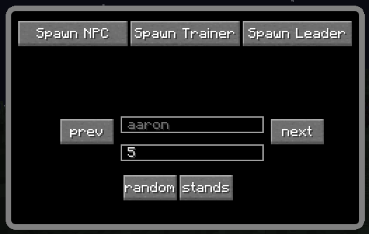
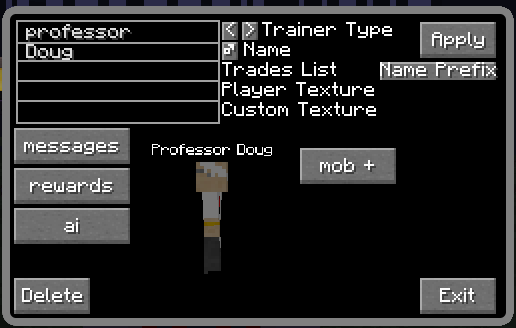
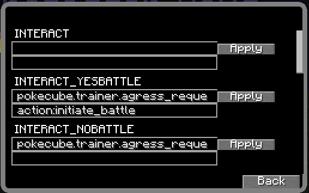

**************************
Spawning and Editing NPCs
**************************

Spawning and editing of NPCs in |Pokecube| is best done with the Trainer Editor gui. This can be enabled by assigning the ``EditTrainer`` hotkey in the vanilla minecraft controls menu, and then accessed by pressing the assigned key.

This gui has 3 main modes:

-   :ref:`npc_spawn`
-   :ref:`npc_edit`
-   :ref:`pokemob_edit`

.. _npc_spawn:

NPC Spawning
############

   
   The gui for spawning in NPCs and Trainers

This gui opens if ``EditTrainer`` is pressed while the player is not looking at an NPC or |pokemob|. It is used to spawn in the initial NPC.

There are three buttons along the top, which spawn in the respective type of NPC. The NPC is spawned at the current location of the player. The ``prev`` and ``next`` buttons will cycle the type of NPC spawned.
The Text field below the types is the level to use for randomly assigned |pokemobs| for this NPC, these can be changed later via :ref:`npc_edit`.
The lower two buttons define some extra initialization for the NPC, the left button will assign the gender, and the right button will toggle whether the trainer moves around by default. These can also be changed later via :ref:`npc_edit`.

Spawn NPC
---------

This summons a generic NPC, these are generally non-agressive, though can have |pokemobs| to defend themselves. Important types for these are as follows:

-   ``professor`` - This will be like the spawn professor, able to give first |pokemobs|
-   ``healer`` - This spawns like the nurse in pokecenters, offering healing services
-   ``trader`` - This would be like the merchants in pokecenters

Spawn Trainer
-------------

This summons a Trainer NPC, which will offer battles for emeralds, and have similar behaviour to the ones found around villages, or spawning randomly. The type selected will determine the texture and automatically assigned |pokemobs| for the trainer.

Spawn Leader
------------

This summons an Gym Leader NPC, the gym leader will have a random badge asigned, and will only let each player defeat them once.

.. _npc_edit:

NPC Editing
###########

   
   The gui for editing NPCs and Trainers

This gui will open if ``EditTrainer`` is pressed while the player is looking at an NPC. This allows editing various aspects of the NPC.

.. _edit_npc_main:

Main Window
-----------

The main window allows changing the name, type, gender and trades of the NPC, as well as deleting it. It also then has buttons which change to other pages which allow editing different values.

If the NPC has any |pokemobs|, then you can edit them via the ``mob #`` buttons, where the ``#`` would be a number from 1 to 6, representing the "order" of the |pokemob| in the NPC's party. This button will bring up :ref:`edit_npc_pokemob`

If the NPC has less than 6 |pokemobs|, an addtional |pokemob| can be added by clicking the ``mob +`` button, this will then open :ref:`add_npc_pokemob`.

.. _edit_npc_pokemob:

Editing |Pokemobs|
------------------

.. figure:: ../_images/trainer_editor/edit_pokemob.png
   :alt: NPC's |Pokemob| Editing
   :name: edit_pokemob
   :width: 600
   
   The gui for editing |Pokemobs|

This display allows editing various aspects of the |pokemob| owned by the NPC. In general you type in the required value, and then press ``apply`` for it to save. For ``Ability`` and ``Nature``, you can use the arrows to cycle through valid options, though ability does also let you type the name of any other valid ability in there. For valid moves, see :ref:`poketm` for how to identify valid move names.

The ``delete`` button will remove this |pokemob| from the NPC, and ``back`` will return to the :ref:`edit_npc_main`

.. _add_npc_pokemob:

Adding |Pokemobs|
-----------------

It should be mentioned, that you can also add and remove |pokemobs| from the NPC by shift right clicking them with a ``pokedex``, this will bring up their 6-slot inventory, and you can add/remove |pokecubes| from here as needed. If you take a |pokecube| out, it will assign ownership to you, and if you put one in, it will assign ownership to the NPC. This gui is an alternate way to access this behaviour.

.. figure:: ../_images/trainer_editor/add_pokemob.png
   :alt: NPC's Pokemob Adding
   :name: add_pokemob
   :width: 600
   
   The gui for adding Pokemobs

This gui mostly differs from :ref:`edit_npc_pokemob` by the ``Add New`` button replacing ``delete``. In this gui, you can fill out the various values, then press ``Add New`` to create the |pokemob| and add it to the NPC's party.

.. _edit_npc_ai:

Editing AI
----------

.. figure:: ../_images/trainer_editor/edit_ai.png
   :alt: NPC AI Editing
   :name: edit_ai
   :width: 600
   
   The gui for editing NPC AI

This screen allows editing some of the AI related aspects of the NPC. It has values related to Cooldowns, as well as some allowed states for the NPC. It also is where you can specify the times for the NPC to stay in specified locations. Information about the format for the Guard Locations can be found :ref:`Here<poke_rt_tab>`

Editing Messages
----------------

   
   The gui for editing NPC Messages

This screen allows for editing the various chat messages sent when the player interacts with the NPC, it can also apply commands. The general format for each interaction is:

-   Name Of Action
-   Message to send on Action - This will be sent as a ``TranslationTextComponent`` to the client, so can be localized via resourcepacks
-   Command to run on Action
-   Apply button - Press this to apply changes to the action

Editing Rewards
---------------

.. figure:: ../_images/trainer_editor/edit_reward.png
   :alt: NPC Reward Editing
   :name: edit_reward
   :width: 600
   
   The gui for editing NPC Rewards

This is the list of rewards the trainer will give when defeated. The main text box is the nbt-format for the item it will give. The text box to the right of that is the probability of the NPC giving this reward. To save the edits to the reward, use the ``Apply`` button. You can delete a reward by pressing the ``x`` button followed by the ``Y`` button. You can add additional rewards by entering values into the last (blank) item box, and then pressing ``Apply`` for that entry.

.. _pokemob_edit:

|Pokemob| Editing
#################

This gui will open if ``EditTrainer`` is pressed while the player is looking at a |Pokemob|. This then brings up a page similar to :ref:`edit_npc_pokemob`. In this case, the ``back`` button will just close the gui, and there is no ``delete`` button. Otherwise this gui acts the same as :ref:`edit_npc_pokemob`.

.. include:: ../.shared.rst